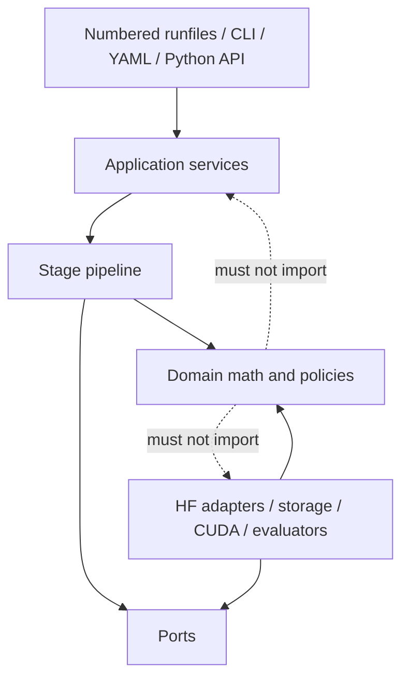

# System Architecture

> Concrete dataclasses for calibration statistics, objectives, plans, factorization attempts, scales, outliers, layer/block results, activation streams, packed models, and evaluation results are specified in [Domain Objects and Stage Contracts](02-domain-and-stage-contracts.md).

## 1. Architectural style

The rewrite uses a functional core with an imperative shell:

- the **domain layer** contains tensor mathematics, policies, typed identities, and results;
- the **application layer** coordinates use cases and stage transitions;
- the **ports layer** defines interfaces for models, storage, devices, events, and evaluators;
- the **infrastructure layer** implements Hugging Face integration, safetensors, CUDA kernels, disk stores, and CLI behavior.

Dependencies point toward the domain. A CUDA backend may depend on a domain packed-state schema; the factorizer must not depend on CUDA backend dispatch.



The dotted relationships are prohibited dependencies, not runtime calls.

## 2. Major components

### Domain

The domain layer owns concepts that are true regardless of CLI, filesystem, model family, or execution hardware:

- tensor and layer identities;
- calibration statistics;
- reconstruction objectives;
- ADMM and alternative factorization algorithms;
- rank and bit-budget allocation;
- retry decisions;
- outlier selection;
- scale fitting;
- quantized training state;
- packed-state metadata;
- numerical metrics and invariants.

Domain functions receive explicit random generators and never access global output directories, environment variables, log files, or model repositories.

### Application

Application services express user-visible operations:

- inspect and resolve a recipe;
- calibrate a model;
- construct a quantization plan;
- quantize or resume a run;
- pack a trainable result;
- evaluate and benchmark;
- compare runs;
- render a report.

The application layer owns stage ordering and transactions, but delegates resource placement and persistence through ports.

Numbered experiment runfiles are intentionally retained as thin input adapters. They construct the same canonical configuration and call the same application service as YAML/CLI/Python callers; they do not own a separate pipeline.

### Model adapters

A model adapter contains all architecture-specific knowledge:

```python
class ModelAdapter(Protocol):
    family: str

    def decoder_block_count(self, source: ModelSource) -> int: ...
    def block_spec(self, index: int) -> BlockSpec: ...
    def quantizable_layers(self, block: nn.Module) -> list[LayerRef]: ...
    def construct_block(self, index: int, device: DeviceLike) -> nn.Module: ...
    def load_block(self, source: ModelSource, index: int, device: DeviceLike) -> nn.Module: ...
    def run_prefix(self, batch: TokenBatch, store: ActivationStore) -> BlockInputs: ...
    def run_block(self, block: nn.Module, inputs: BlockInputs) -> BlockOutputs: ...
    def run_suffix(self, inputs: BlockOutputs) -> LogitBatch: ...
    def lm_head(self, model_or_source: object) -> LinearRef: ...
```

Implementations initially cover the model families supported by the current code: Llama-compatible, Qwen, Gemma, and OPT. All adapter implementations run through the same contract suite. Generic pipeline code must not contain branches such as `if model_type == "opt"`.

### Execution engine

The execution engine runs the stage graph under a declared resource plan. It owns:

- device placement and transfers;
- activation-store selection;
- source-weight loading and prefetch;
- workspace reservations;
- stage and loop-unit commits;
- cache lookup;
- cancellation and resume;
- worker/distributed coordination;
- structured resource telemetry.

It does not choose ranks or decide whether a reconstruction error deserves a retry; those are domain policies.

### Artifact store

The artifact store owns immutable committed outputs and mutable temporary work. It supports local directories first, with an interface that permits object storage later. It provides:

- content hashes and semantic identities;
- atomic writes;
- schema metadata;
- leases for in-progress work;
- cache lookup;
- garbage-collection reachability;
- local memory-mapped tensor access.

### Inference runtime

The inference runtime is a separately installable package surface. It owns:

- packed linear modules;
- binary tensor layouts;
- backend capability discovery and dispatch;
- model conversion/loading;
- KV cache and generation loop integration;
- reference and optimized kernels;
- runtime profiling and benchmarks.

It must not import calibration datasets, optimizers, ADMM, or experiment orchestration.

### Evaluation and reporting

Evaluators consume a model artifact and an immutable evaluation specification. Reporters consume structured results. This separation permits the same measurements to be rendered as console output, Markdown, JSON, or an experiment dashboard without parsing logs.

## 3. Pipeline and stage graph

The default stage graph is:

```mermaid
flowchart LR
    R["Resolve recipe"] --> S["Resolve source"]
    S --> D["Prepare dataset"]
    D --> C["Calibrate"]
    C --> P["Plan ranks/outliers"]
    P --> B["Quantize blocks"]
    B --> K["Optional global tuning"]
    K --> X["Pack/export"]
    X --> V["Validate artifact"]
    V --> E["Evaluate"]
    E --> M["Report/compare"]
```



Each stage declares:

- typed inputs and outputs;
- semantic cache key;
- resource estimate;
- executor capabilities;
- commit granularity;
- validation function;
- compatible schema versions;
- events and metrics emitted.

Stages are not arbitrary shell commands. They are application components with deterministic contracts.

## 4. Core contracts

The abbreviated contracts below introduce the boundary. The complete normative object graph, including `TensorRef`-based persistence and the stage input/output matrix, is in [Domain Objects and Stage Contracts](02-domain-and-stage-contracts.md).

```python
@dataclass(frozen=True)
class BlockId:
    index: int


@dataclass(frozen=True)
class LayerId:
    block: BlockId
    path: str


@dataclass(frozen=True)
class LayerPlan:
    layer: LayerId
    source_shape: tuple[int, int]
    rank: int
    outliers: OutlierPlan
    objective: ObjectiveSpec
    retry: RetryPolicy
    bit_cost: BitCost


@dataclass
class MaterializedFactorizationOutput:
    factors: MaterializedTrainableFactors
    reconstruction: ReconstructionMetrics
    convergence: ConvergenceMetrics
    elapsed_seconds: float


class Factorizer(Protocol):
    name: str
    version: str

    def factorize(
        self,
        weight: torch.Tensor,
        objective: ReconstructionObjective,
        plan: LayerPlan,
        generator: torch.Generator,
    ) -> MaterializedFactorizationOutput: ...
```

The pure factorizer returns stage-owned tensors in `MaterializedFactorizationOutput`. The factorization stage persists those tensors and returns the immutable `TensorRef`-based `FactorizationResult` defined in the [domain contract reference](02-domain-and-stage-contracts.md#8-factorization-objects). The orchestration layer may ask a retry policy for another `LayerPlan`, but the factorizer does not know global budgets, artifact storage, or model mutation.

## 5. Training versus packed state

The rewrite eliminates a single module that repeatedly changes parameters into buffers and latent tensors into hardened tensors.

```text
SourceLinear
    │ factorize
    ▼
TrainableNanoQuantState ── block/QAT tuning ──► FrozenNanoQuantState
                                                  │ pack
                                                  ▼
                                           PackedNanoQuantState
                                                  │ load
                                                  ▼
                                         PackedNanoQuantLinear
```

Rules:

- conversion functions are explicit and validated;
- packed state is immutable;
- training state is never accepted by the deployment loader;
- the reference backend can execute frozen or unpacked packed state for validation;
- optimized backends consume only supported packed-layout versions;
- saving does not depend on transient `nn.Module` registration state.

## 6. Proposed package layout

```text
src/nanoquant/
  domain/
    ids.py
    tensors.py
    metrics.py
    calibration.py
    planning.py
    factorization/
    objectives/
    allocation/
    outliers/
    scale_fit/
    policies/

  application/
    inspect_recipe.py
    calibrate.py
    plan.py
    quantize.py
    pack.py
    evaluate.py
    benchmark.py
    compare.py
    report.py

  ports/
    model_source.py
    model_adapter.py
    artifact_store.py
    activation_store.py
    executor.py
    event_sink.py
    evaluator.py
    runtime_backend.py

  infrastructure/
    huggingface/
    safetensors/
    storage/
    executors/
    events/
    evaluators/

  runtime/
    model.py
    linear.py
    packed_state.py
    dispatch.py
    reference.py
    cuda/
    generation/

  cli/
    main.py
    commands/

recipes/
tests/
  unit/
  property/
  contract/
  integration/
  cuda/
  performance/
```

## 7. Dependency rules

These rules should be checked by an import-linter test:

1. `domain` imports only the Python standard library, tensor library abstractions, and domain modules.
2. `ports` may import domain types but no infrastructure implementations.
3. `application` imports domain and ports, not concrete Hugging Face or CUDA modules.
4. `infrastructure` implements ports and may import domain schemas.
5. `runtime` does not import calibration, planning, factorization, tuning, datasets, or experiment reporting.
6. `cli` contains no algorithm decisions.
7. Model-family names occur in adapter registration and adapter tests, not generic pipeline code.

## 8. Extension points

Registries are explicit mappings constructed at composition time, not global decorators triggered by import side effects:

```python
components = Components(
    adapters={"llama": LlamaAdapter(), "gemma": GemmaAdapter()},
    factorizers={"nanoquant-admm": NanoQuantADMM()},
    allocators={"uniform": UniformAllocator(), "sensitivity": SensitivityAllocator()},
    backends=[CudaBinaryBackend(), TorchReferenceBackend()],
)
```

A plugin is appropriate only when a component has a stable contract and independent release need. Basic strategy selection does not justify a dynamic plugin system during the first rewrite phase.

## 9. Error model

Expected failures use typed errors containing context and remediation:

```python
class WorkspaceExhausted(NanoQuantError):
    stage: str
    requested_bytes: int
    available_bytes: int
    resource: str
    fallback_options: tuple[str, ...]
```

Exceptions are converted to structured failure events at the application boundary. Domain code never prints and infrastructure code never suppresses an exception merely to continue with a materially different algorithm.

## 10. Architecture fitness checks

The test suite should continuously verify that:

- forbidden import edges are absent;
- every registered strategy has a version and serializable configuration;
- every stage output passes schema and semantic validation;
- runtime installation can import and infer without training extras;
- every adapter passes the common contract;
- all generated run reports can be rebuilt from structured artifacts alone.
