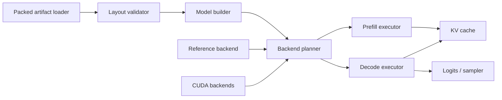

# High-Performance Inference Runtime

## 1. Objective

The deployment runtime must make NanoQuant's storage reduction visible as real end-to-end speed. The current test framework reaches roughly 20 generated tokens/second in the observed setup, while an optimized llama.cpp implementation reportedly reaches roughly 400 tokens/second. That gap is large enough that the rewrite must treat inference as a product with its own architecture, benchmarks, and correctness gates.

The numbers are not assumed to be directly comparable until the protocol in [requirements](01-requirements.md#4-performance-acceptance-protocol) is applied. Differences in model, quantization, context length, batch, sampling, cache, compilation, and measurement boundaries can dominate the result.

## 2. Current code and optimized runtime references

The rewrite uses two current local codebases as explicit references:

- research/quantization application: `D:\dev\research\NanoQuant-OfficalCode\`;
- modified NanoQuant-capable llama.cpp: `D:\dev\research\llama.cpp\`.

The modified llama.cpp CUDA implementation is [ggml/src/ggml-cuda/nanoquant.cu](../../../llama.cpp/ggml/src/ggml-cuda/nanoquant.cu), currently located at `D:\dev\research\llama.cpp\ggml\src\ggml-cuda\nanoquant.cu`.

It is a concrete packing, kernel, integration, profiling, and performance reference. The implementation includes decode-specialized warp kernels, packed sign-word/vector loads, warp broadcasts, branchless sign-bit application, sign-aware FMA, multiple accumulators, dtype-specialized paths, and fused first-stage projections. Benchmark JSON and Nsight artifacts in the modified repository show the history of decode and prefill optimization attempts.

Before changing formats or kernels, the rewrite records the llama.cpp source revision/patch hash, CUDA source hash, conversion format, exact model artifact, commands, JSON samples, hardware, and profiles. The observed approximately 400 tokens/second target must be tied to one such captured workload; intermediate repository benchmarks remain valid evidence for their own recorded workloads.

See [Lessons Carried Forward](12-lessons-carried-forward.md#5-preserve-the-modified-llamacpp-implementation-as-a-runtime-reference).

## 3. Separate runtime package surface

Deployment code must be importable without the research stack:

```text
nanoquant-runtime dependencies:
  torch
  safetensors
  compiled backend package(s)
  tokenizer/generation integration as an optional extra

not required:
  datasets
  lm-eval
  ADMM
  optimizers
  calibration code
  experiment reporting
```

The runtime consumes only a validated `PackedModelArtifact`. It does not mutate training state or pack weights during the first request.

## 4. Runtime architecture



The backend planner resolves every quantized layer before inference and emits a dispatch report. Unsupported layers either fail under strict mode or use a named fallback that is included in the report and benchmark result.

## 5. Runtime representations

### Frozen logical state

This is backend-independent and sufficient to reconstruct the quantized operation:

- logical factor shapes and rank;
- binary signs;
- pre/mid/post scales;
- bias;
- outlier indices, values, scales, and dtype;
- source layer identity;
- numerical format version.

### Packed backend state

This is immutable and backend-specific:

- bit packing order;
- tiling and interleave layout;
- padding and original dimensions;
- alignment;
- backend and layout versions;
- optional fused metadata;
- content hash.

Packing happens during artifact creation, not during normal model loading. A model artifact may contain multiple packed layouts only when the storage/performance tradeoff is justified and reported.

## 6. Backend contract

```python
class RuntimeBackend(Protocol):
    name: str
    version: str

    def capabilities(self) -> BackendCapabilities: ...
    def supports(self, op: QuantizedLinearSpec, workload: WorkloadSpec) -> SupportResult: ...
    def prepare(self, packed: PackedLayerState, device: DeviceLike) -> PreparedLayer: ...
    def linear(self, x: torch.Tensor, layer: PreparedLayer) -> torch.Tensor: ...
```

Implementation status (2026-07-15): `nanoquant.runtime` now owns this protocol without importing the research
application, infrastructure, configuration, or domain packages. `QuantizedLinearSpec`, `WorkloadSpec`, and
`BackendCapabilities` cover the declared format, device, dtype, shape/rank alignment, workload regime,
outlier/bias, deterministic, and workload-bound axes. Capability failures use stable `NQ-INF-*` codes.
`plan_backends()` resolves every layer before inference, records each rejected backend and reason, reports named
fallbacks, and rejects the first fallback in strict mode. `prepare_plan()` requires an exact layer inventory and
returns prepared dispatches whose hot `linear()` call does not repeat capability discovery. Self-contained dense
and factorized PyTorch reference backends provide the first deployment consumers. The versioned `nanoquant-v1`
logical artifact is also implemented as a bounded descriptor plus block-aligned safetensors shards, with hash/header
validation and per-layer lazy loading. A CPU-only offline exporter now selects the latest complete committed run
identity, validates its source/config identity, selects the active global-tuning state by default, and streams one
frozen block at a time into that artifact. Its companion validator freshly checks the source artifact graph and
compares every exported tensor with the selected frozen state. The accepted 26-block Gemma run exported 182 layers
and passed exact comparison across 1,274 tensors (2,657,404,528 tensor bytes). Dense-reconstruction and factorized
reference execution also agreed across all 182 real layer shapes with maximum absolute error 0.015625 under the
declared 0.03125 BF16 tolerance.

The first deployment packed layout is versioned as `llama.cpp-i32-lsb-v1`. It stores canonical I32
least-significant-bit-first sign words in block-aligned safetensors shards, binds the result to the exact logical
descriptor hash, supports inspection without eager payload loading, and has an unpack-once correctness backend.
On the accepted 26-block Gemma artifact, all 1,274 tensors across 182 layers reconstructed exactly and packed versus
logical reference execution matched exactly across 459,264 output elements. Packed shard bytes were 87,072,592,
3.2764% of the logical shard bytes.
The exact mapping, padding/alignment rules, salient constraints, bias boundary, and modified llama.cpp provenance are
defined in [19-nanoquant-packed-layout-v1.md](19-nanoquant-packed-layout-v1.md). Shared/model-shell conversion,
tokenizer/config packaging, native CUDA execution, and generation remain separate open M6 items.

`SupportResult` includes a reason code when false. Capability matching covers:

- GPU architecture;
- CUDA/runtime version;
- input and accumulation dtype;
- in/out/rank alignment;
- batch and token regime;
- outlier encoding;
- scale layout;
- prefill versus decode;
- deterministic support.

Backend selection is performed once per workload class where possible, not through repeated Python conditionals inside every token step.

## 7. Reference implementations

Three paths provide progressively stronger validation:

1. **Logical reconstruction reference:** reconstruct the dense effective weight and use `torch.nn.functional.linear`. Slow but easiest to audit.
2. **Factorized PyTorch reference:** execute scales, binary factors, bias, and outlier path as separate PyTorch operations without a custom kernel.
3. **Optimized packed backend:** execute the production layout and fused kernels.

Tests compare (2) with (1), then (3) with (2). This localizes errors to quantized math versus packing/kernel behavior.

## 8. Prefill and decode are different workloads

The runtime maintains separate plans and kernels:

- **Prefill:** matrix-matrix operations, many prompt tokens, larger tiles, throughput-oriented.
- **Decode:** usually matrix-vector or very small matrix operations, one new token per sequence, latency and memory-bandwidth oriented.

A single generic kernel is unlikely to be optimal for both. Reports must never combine them into one tokens/second number.

For decode, the performance model must account for:

- bytes read per generated token;
- the two factor operations introduced by low-rank binary representation;
- scale and outlier bandwidth;
- kernel-launch count;
- occupancy at actual ranks and shapes;
- cache update and attention time;
- full-vocabulary logits and sampling overhead.

The goal is not merely a fast isolated GEMV. The generation loop must keep the GPU busy and avoid losing kernel gains to Python or synchronization gaps.

## 9. Generation engine

The generation engine owns:

- prompt batching and padding policy;
- static or paged KV-cache allocation;
- position and attention metadata updates;
- compiled/eager decode-step selection;
- logits processing and sampling;
- stopping conditions;
- streaming output callbacks outside timed GPU work;
- deterministic test mode.

Hot-loop rules:

- no `.item()`, implicit tensor truth test, or device-to-host copy per layer;
- no weight packing, layout conversion, or module discovery per token;
- no allocator cleanup per token;
- no repeated capability checks per layer per token;
- no logging that synchronizes CUDA;
- sampling remains on device when practical;
- host-visible stopping checks are batched or explicitly measured;
- cache tensors are preallocated or use a bounded allocator.

## 10. Fusion opportunities

After profiles establish the cost, optimized backends may fuse:

- input scale with the first binary operation;
- middle scale with factor accumulation;
- post scale and bias with output write;
- salient outlier gather/matmul with output accumulation;
- adjacent normalization/linear operations where model semantics and reuse justify it;
- QKV projections sharing the same input;
- generation sampling stages.

Fusion is accepted only with reference parity, shape coverage, and an end-to-end benefit. A faster microkernel that forces expensive layout conversion elsewhere is not an improvement.

## 11. Performance investigation plan

Before rewriting kernels, capture an end-to-end trace and answer:

1. What fraction of time is GPU kernels versus CPU gaps?
2. Which layers use custom kernels, and which fall back?
3. How many kernel launches occur per layer and per token?
4. Are weights already packed and resident before timing begins?
5. Is input/output dtype conversion occurring around every quantized layer?
6. Are outlier paths launching many small operations?
7. Does sampling or full-vocabulary projection dominate?
8. Does KV-cache construction or object management synchronize the device?
9. What memory bandwidth do binary kernels achieve relative to hardware limits?
10. Are ranks/padding producing excessive wasted computation?
11. Is compilation specialized to the actual static decode shapes?
12. Do console output, energy monitoring, or benchmark bookkeeping enter the timed region?

The trace should account for at least 90% of wall time before major optimization work is chosen.

## 12. Benchmark suites

### Kernel suite

Measures logical operations across real model shapes:

- first-factor and second-factor operations;
- fused factorized linear;
- outlier variants;
- relevant dtypes;
- ranks at allocation boundaries;
- aligned and padded shapes;
- batch/token counts representing prefill and decode.

Outputs latency distribution, achieved bandwidth, launch count, workspace, and numerical error.

### Layer and block suite

Measures complete packed linears and transformer blocks using captured real shapes. This exposes scale, outlier, normalization, attention, and dispatch overhead hidden by kernel-only tests.

### Generation suite

Uses a fixed matrix such as:

```text
batch sizes:          1, 4, 8
prompt tokens:        32, 128, 512, 2048
generated tokens:     32, 128, 512
sampling:             greedy and fixed top-k profile
cache:                cold allocation and warmed steady state
```

Metrics:

- time to first token;
- prefill tokens/second;
- inter-token latency median/p90/p99;
- decode tokens/second per sequence and aggregate;
- end-to-end wall time;
- peak VRAM and host memory;
- energy per generated token where available;
- fallback layer count;
- generated-output parity/hash under deterministic settings.

## 13. Apples-to-apples reference comparison

The llama.cpp comparison uses the same:

- source model semantics and as-close-as-possible quantized size/quality point;
- hardware and power state;
- prompt token IDs;
- generated length;
- batch size;
- context and KV-cache precision;
- greedy or equivalent sampling;
- included/excluded tokenization and startup work;
- warm-up and repetition count.

If quantization formats differ materially, report both model quality and effective BPW beside throughput. A 400 tokens/second result at a different quality or memory point is informative but not a direct regression threshold.

## 14. Performance gates

- Microbenchmarks reject statistically significant regressions above their configured threshold.
- End-to-end decode must not regress more than 10% from the accepted NanoQuant baseline.
- Strict benchmark mode fails on an unexpected fallback.
- A backend release must cover all shapes present in its declared supported model set.
- Performance results are accepted only from designated stable hosts.
- Compiler or driver changes establish a new baseline rather than being mixed silently with the old one.

## 15. Optimization order

1. Establish correct reference paths and a trustworthy benchmark.
2. Remove packing, discovery, transfers, and synchronization from hot loops.
3. Ensure all intended layers dispatch to an optimized backend.
4. Specialize prefill and decode plans.
5. Reduce launches through justified fusion.
6. Improve kernel bandwidth/occupancy for dominant real shapes.
7. Optimize cache, attention, logits, and sampling once quantized linears no longer dominate.
8. Re-run quality, memory, and full generation gates after every layout change.
