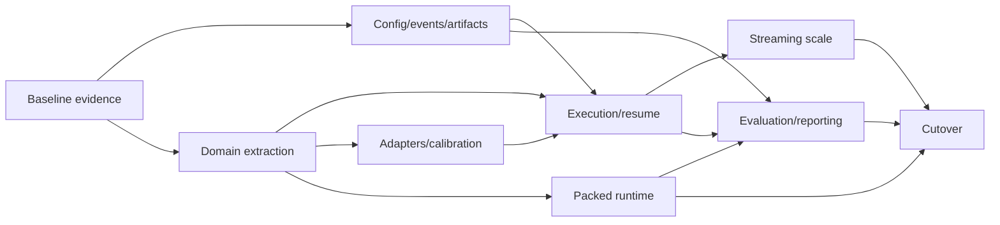

# Delivery and Migration Roadmap

> The executable checkbox checklist for these phases is [Rewrite Implementation Task List](13-implementation-task-list.md).

## 1. Strategy

The rewrite should be clean architecturally but incremental operationally. A single big-bang replacement would make it difficult to distinguish architectural bugs from algorithm changes and could invalidate established results.

Use a strangler approach:

1. freeze representative legacy behavior and performance as evidence;
2. build the new contracts and infrastructure alongside it;
3. move one coherent capability at a time behind parity tests;
4. run old and new implementations on captured fixtures and small models;
5. cut over workflows only after their acceptance gates pass;
6. remove legacy paths after artifacts and recipes have migration support.

Algorithm changes are generally kept out of parity milestones. Improvements become separate experiments after the corresponding subsystem is trustworthy.

## 2. Current-to-new ownership map

| Current area | Rewrite destination |
| --- | --- |
| CLI dataclasses and manual config merge | `config` schema plus thin `cli` adapters |
| `modules/quant_config.py` and Hub config duplicate | removed after schema migration |
| `core/admm_nq.py`, `core/admm_dbf.py` | `domain/factorization` |
| rank calculation/retry helpers | `domain/allocation` and `domain/policies` |
| `core/importance.py` | calibration strategies plus model/executor ports |
| `core/compress_block.py` | factorization/objective/outlier/tuning domain services plus block application workflow |
| `core/compress_model.py` | pipeline execution and optional global-tuning service |
| `modules/linear.py` | separate trainable logical module/state and packed runtime module/state |
| `modules/auto_model.py`, `modules/hub.py` | application API plus Hugging Face infrastructure adapter |
| `utils/load_utils.py` architecture branches | model adapters and model-source readers |
| `utils/data_utils.py` | versioned dataset preparation service |
| `utils/eval_utils.py` | evaluator implementations and registry |
| `kernel/utils.py` | runtime packers/backend dispatch |
| `kernel/test_decode.py` | runtime generation engine plus benchmark application |
| numbered experiment programs | thin numbered zero-argument runfiles using canonical `RunConfig`, plus manifests and optional YAML views |
| CSV/Markdown writes inside compression | event sink, result artifacts, and report renderer |

## 3. Phase 0: Freeze evidence

Deliverables:

- choose one tiny/synthetic, one 1B, and representative captured layer/block cases;
- record current resolved configurations despite their multiple sources;
- save source revisions and calibration selections;
- capture current layer factors, reconstruction metrics, block losses, effective BPW, checkpoints, and evaluation output;
- establish the current inference protocol and reproduce the observed throughput;
- capture the modified `D:\dev\research\llama.cpp\ggml\src\ggml-cuda\nanoquant.cu` revision/hash, conversion path, benchmark JSON, and representative profiles;
- preserve the per-layer weight error and `Final Error Before Model-Level KD` block table from `outputs/019-phase1-weight-errors.md` as a golden reporting fixture;
- capture end-to-end and CUDA profiles;
- document known correctness quirks intentionally preserved for parity versus defects explicitly fixed first.

Exit criteria:

- repeatable legacy baselines exist;
- comparisons do not depend on old console-log parsing alone;
- performance workload is sufficiently specified to reproduce.

## 4. Phase 1: Foundations

Implement:

- canonical configuration schema and recipe resolver;
- numbered zero-argument runfile adapter and launcher provenance capture;
- run manifest, run directory, and environment capture;
- structured event envelope and local JSONL/console sinks;
- artifact descriptor, content hashing, atomic local store;
- component interfaces and dependency-boundary tests;
- tiny deterministic model and offline pipeline fixtures.

Initially, an application adapter may still invoke legacy quantization functions. The goal is to make every new attempt self-describing before replacing the math pipeline.

Exit criteria:

- one recipe resolves identically through CLI and Python;
- a legacy-backed run produces a valid new manifest/report;
- artifact and event failure-injection tests pass;
- no secrets appear in environment capture.

## 5. Phase 2: Pure domain extraction

Move and test, in order:

1. metrics and reconstruction objectives;
2. rank/BPW allocation and retry policy;
3. outlier selection and accounting;
4. ADMM implementations and schedules;
5. scale fitting;
6. trainable/frozen logical NanoQuant state.

Legacy orchestration calls the new domain components through compatibility adapters. This yields numerical parity before changing control flow.

Exit criteria:

- captured layer fixtures match accepted legacy metrics/tensors within tolerance;
- domain packages have no model, filesystem, CLI, or logging imports;
- property tests cover budgets, packing-independent reconstruction, and deterministic retries.

## 6. Phase 3: Model adapters and calibration

Implement:

- model-source port and safetensors reader;
- Llama, Qwen, Gemma, and OPT adapters;
- prefix/block/suffix execution contracts;
- versioned dataset selection;
- calibration strategies emitting canonical artifacts;
- CUDA/RAM activation stores;
- objective builders consuming calibration artifacts.

Exit criteria:

- adapter contract suite passes for every supported family;
- source and streamed block execution match source-model behavior;
- legacy/new calibration comparisons are understood and recorded;
- a captured block can run without loading the complete model.

## 7. Phase 4: Resident pipeline and resume

Implement:

- stage engine and resident executor;
- block/layer workflow using new domain services;
- layer and block atomic commits;
- deterministic logical seeds;
- cache lookup/invalidation;
- resume and fork;
- pack-independent frozen model artifact;
- summary and comparison reports.

Exit criteria:

- tiny and 1B resident runs complete end to end;
- interrupted runs at every injected boundary equal uninterrupted controls;
- completed layers are not rerun;
- parity recipe meets quality and BPW tolerances;
- single-layer/block replay meets initial feedback-time targets.

## 8. Phase 5: Streaming and 70B scale

Implement:

- memory-mapped activation store;
- block-aligned source streaming;
- resource planner and reservations;
- prefetch/double-buffered transfer;
- bounded Hessian representations;
- streamed calibration mode;
- disk-space/resource preflight;
- optional distributed executor boundary.

Exit criteria:

- resident and streaming results agree on the same small recipe;
- tests force disk-backed activations under small artificial memory budgets;
- peak memory remains within the declared block/workspace bound;
- a large-model metadata dry run produces accurate estimates;
- a real large-model canary resumes after interruption and produces loadable packed blocks.

## 9. Phase 6: Deployment runtime

Implement:

- frozen-to-packed conversion and versioned layout;
- separate packed runtime model/linear classes;
- reference logical and factorized backends;
- capability-based backend planner;
- prefill and decode execution paths;
- generation/KV-cache engine;
- kernel, layer, block, and generation benchmark suites;
- clean runtime-only installation.

Then optimize from the recorded profile:

- remove hot-loop packing, transfers, discovery, and synchronization;
- eliminate unintended fallback coverage gaps;
- specialize prefill versus decode;
- fuse dominant scale/outlier operations;
- tune real-shape kernels;
- address attention/logits/sampling bottlenecks revealed afterward.

Exit criteria:

- all optimized paths pass reference parity;
- runtime loads without research dependencies;
- apples-to-apples comparison with llama.cpp/reference is published;
- NanoQuant reaches the agreed relative throughput gate or has an accepted, measured explanation and follow-up plan;
- no per-token memory growth or unexpected device-host synchronization remains.

## 10. Phase 7: Evaluation and research workflow

Implement:

- evaluator registry and immutable specifications;
- smoke/quick/standard/full tiers;
- held-out partition and overlap validation;
- paired comparisons and uncertainty;
- promotion gates;
- fixture capture/replay commands;
- Pareto and cost reporting;
- baseline registry;
- required pre-KD/post-KD final-block error views matching the established Experiment 019 semantics.

Exit criteria:

- a candidate can progress from layer replay to full evaluation without ad hoc scripts;
- clearly bad artifacts stop at quick tier;
- close candidates escalate with an explicit inconclusive result;
- evaluation implementations pass known-result and batching tests;
- reports state purpose, evidence tier, result, cost, and recommendation.

## 11. Phase 8: Cutover and cleanup

Tasks:

- migrate supported old numbered experiments to thin zero-argument runfiles using canonical `RunConfig`, with YAML views where useful;
- provide old checkpoint import or a precise re-quantization requirement;
- publish operator and contributor guides from tested commands;
- switch default CLI and Python API;
- preserve experiment numbers/chronology, archive only copied legacy orchestration, and document replacement run IDs;
- remove duplicate configs, orchestration paths, mutable packed/training module behavior, and log-parsing tools;
- establish support/deprecation windows.

Exit criteria:

- all definition-of-done items in the design index pass;
- no supported workflow requires a legacy module;
- old artifacts within the support window have a tested path;
- release comparison includes correctness, quality, performance, memory, and quantization cost.

## 12. Workstream dependencies

Runtime kernel work can proceed in parallel once logical packed-state contracts and baseline shapes are stable. Evaluation work can begin against legacy/new artifacts as soon as result and model-artifact interfaces exist.

## 13. Risk register

| Risk | Mitigation |
| --- | --- |
| Rewrite changes algorithm behavior unintentionally | Captured parity fixtures, old/new compatibility adapters, stage-by-stage cutover |
| Architecture work delays research | Deliver replay fixtures and canonical recipes early; keep legacy adapter usable during extraction |
| 70B I/O makes bounded-memory execution unusably slow | Resource model, block-aligned shards, prefetch, sequential I/O, measured activation-store backends |
| Packed format freezes poor decisions | Separate logical and backend layouts; version both; retain repacking path |
| Throughput target is based on incomparable numbers | Establish shared protocol and profile before setting absolute gates |
| Quick evaluation chooses false winners | Use it primarily for high-confidence rejection; escalate ambiguous results with uncertainty |
| Excessive configuration complexity | Hierarchical schema, strong defaults, named profiles, preflight explanations |
| Cache reuses incompatible work | Stage-specific semantic hashes, schema validation, explicit invalidation reports |
| Long-run resume corrupts scientific comparisons | Resume identity checks, logical seeds, immutable configs, fork semantics |
| Model adapter exceptions leak into core | Shared contract suite and import/branch fitness checks |

## 14. First implementation slice

The recommended first vertical slice is deliberately small:

1. define `RunConfig`, `RunManifest`, and the initial objects from the [domain contract reference](02-domain-and-stage-contracts.md): `LayerId`, `TensorRef`, `ObjectiveSpec`, `LayerPlan`, `FactorizationRequest`, and `FactorizationResult`;
2. create local structured events and atomic artifact descriptors;
3. extract NanoQuant ADMM plus reconstruction metrics into a pure domain component;
4. capture three real layer fixtures;
5. implement `replay-layer` and baseline comparison;
6. add interruption-safe factorization attempt/layer commits;
7. render a short self-documenting report.

This slice immediately improves prototyping and confidence while exercising the architectural boundaries needed by later resident and streaming pipelines.
