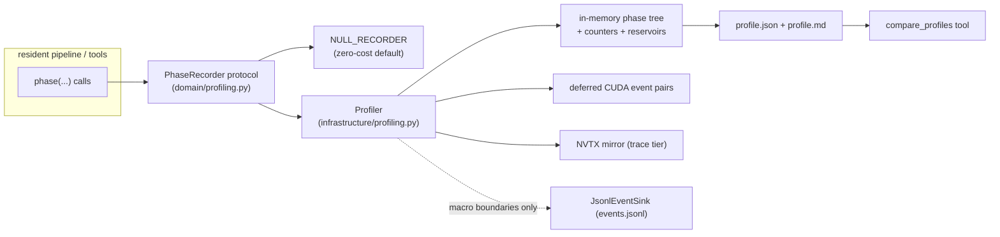

# Performance Profiling and Micro-Profiling

This document designs the profiling framework used to find and close the performance gap in the rewrite. It
implements the timed-span requirements of [Observability, Diagnostics, and Run Reporting](07-observability-and-reporting.md)
(section 3) and feeds the performance-test and CI-lane requirements of
[Testing and Quality Gates](09-testing-and-quality.md) (sections 11–12).

## 1. Purpose and motivation

The resident pipeline is approximately 30% slower than the legacy reference on the comparable Gemma workload
(see the agent guide, "Performance work after parity"). Today the codebase records only coarse ad-hoc timing:
scattered `time.perf_counter()` start/stop pairs that surface as `elapsed_seconds` or `wall_seconds` fields in
result dataclasses and `report.json`. There is no hierarchy, no aggregation across repeated phases, no GPU
timing, and no way to compare two runs phase by phase.

The framework must let us:

1. account for at least 90% of run wall time with named, aggregated phases before choosing optimizations
   (the same discipline Milestone 7 task M7.3 imposes on the inference runtime);
2. attribute time inside hot loops (ADMM factorization, tuning steps, block forwards) to sub-phase
   granularity — the "micro" tier;
3. distinguish host-bound from device-bound time under CUDA's asynchronous execution model;
4. compare candidate runs against baselines with noise-aware thresholds so optimizations are provable and
   regressions are caught;
5. do all of this without perturbing numerical parity or adding measurable overhead to ordinary runs.

## 2. Scope and non-goals

In scope:

- the research/training-side pipeline: resident quantization, resident calibration, factorization slices,
  replay, global distillation, and the tiny pipeline;
- always-on macro timing, opt-in micro timing, and integration hooks for external deep-dive profilers;
- profile artifacts, human-readable summaries, and baseline comparison tooling.

Non-goals:

- inference-runtime kernel benchmarking and optimization — Milestone 7 owns that, including the llama.cpp
  comparison protocol; this framework's phase model and artifacts should be reusable there, but runtime
  kernels are not instrumented by this work;
- distributed tracing across processes or hosts (the pipeline is single-process today; see open questions);
- replacing external profilers — `torch.profiler`, Nsight Systems/Compute, and py-spy are integrated, not
  reimplemented;
- optimizing anything. This framework produces evidence; optimization work is scheduled separately and
  gated on parity.

## 3. Requirements

Functional:

- **F1** Hierarchical wall-clock phases covering every span listed in
  [07-observability-and-reporting.md](07-observability-and-reporting.md) section 3, aggregated by phase
  path with count, total, self-time, and distribution statistics.
- **F2** Explicit unattributed-time accounting: every span reports the gap between its inclusive time and
  the sum of its children, so coverage claims are checkable.
- **F3** Micro tier: per-iteration sub-phases inside ADMM, tuning, calibration accumulation, and block
  forwards, cheap enough to leave enabled for full parity-scale runs.
- **F4** Optional CUDA device timing per phase via event pairs, with deferred resolution — never a
  synchronization inside a hot loop (hard requirement carried from 07, section 3).
- **F5** Counters (bytes transferred, iterations, early stops, tokens, attempts) and derived rates
  (ADMM iterations/s by shape, tuning tokens/s), grouped by declared attributes such as layer shape and rank.
- **F6** Versioned `profile.json` artifact per run plus a rendered `profile.md` summary; pointers from the
  existing run report.
- **F7** Baseline comparison: a tool that diffs two profiles by phase path and flags statistically
  meaningful deltas, matching the raw-sample and environment-fingerprint requirements of 09, section 11.
- **F8** External-profiler windows: NVTX ranges mirroring phase names, and scoped `torch.profiler` capture
  for a configured block/layer subset.

Constraints:

- **C1 Parity safety.** Profiling must not change numerics: no extra `.item()` or `torch.cuda.synchronize()`
  on ordinary paths, no RNG consumption, no dtype/layout changes. A replay test proves committed artifacts
  are identical with profiling fully enabled.
- **C2 Overhead budgets.** Macro tier ≤ 0.5% wall overhead; micro tier ≤ 3% target / 5% ceiling on the
  parity workload; both measured by test (section 14).
- **C3 Layering.** Placement must satisfy the dependency rules of
  [02-architecture.md](02-architecture.md) section 7 and `tests/contract/test_architecture.py`.
- **C4 Resume friendliness.** Runs resume across processes; profiles are per-process and clearly labeled,
  and comparison tooling prefers uninterrupted runs (section 11).
- **C5 Windows first.** The development host is Windows/CUDA; timer choices, external-tool recipes, and
  environment capture must work there (`time.perf_counter` is QPC-backed; Nsight Systems and py-spy support
  Windows).
- **C6 Strictness.** `mypy --strict`, ruff, frozen `slots` dataclasses, and the existing config idioms apply.

## 4. Design overview

Three tiers, one phase model:

| Tier | Name  | Default | Mechanism | Question it answers |
|------|-------|---------|-----------|---------------------|
| 0 | macro | on | wall-clock spans around stage/block/layer phases, in-memory aggregation | where do the minutes go? |
| 1 | micro | opt-in | sub-phase accumulators inside hot loops, optional CUDA event pairs, counters | where inside the hot loop, and is it host- or device-bound? |
| 2 | trace | opt-in, windowed | NVTX + `torch.profiler` + Nsight/py-spy capture recipes | which kernel/line, exactly? |



Key decision: **the profiler aggregates in memory and is separate from the event log.** `JsonlEventSink`
durably flushes every event, which is exactly right for the audit trail and wrong for anything called per
iteration. Macro phase boundaries are optionally mirrored to `events.jsonl` (they coincide with the spans 07
already requires), so the console renderer and post-mortem tooling keep working; micro measurements never
touch the sink. Alternatives are discussed in section 17.

## 5. Phase model and naming

A *phase* is a named region with static identity plus dynamic attributes. Aggregation groups by the static
path so repeated executions accumulate; attributes provide optional sub-grouping.

- Path: slash-joined static names reflecting nesting, e.g. `run/blocks/block/layer/factorize/attempt`.
- Names: lowercase, dot-free, stable — they become schema surface and comparison keys.
- Attributes: small scalars only (`block=7`, `layer="mlp.down_proj"`, `rank=256`, `shape="1152x6912"`,
  `attempt=2`). Each instrumentation site declares which attributes participate in grouping (e.g.
  factorization groups by `shape` and `rank`; tuning groups by nothing). Ungrouped attributes are recorded
  only in trace-tier NVTX messages.
- Standard leaf statistics: `count`, `wall_seconds` (inclusive), `self_seconds` (inclusive minus children),
  `min`, `p50`, `p90`, `max` (from a bounded reservoir), and optional `cuda_seconds`.
- Every interior node also reports `unattributed_seconds = inclusive − Σ(children inclusive)`; the run root's
  attributed fraction is the coverage number reported against the 90% requirement.

## 6. Recorder API and layering

The dependency rules ([02-architecture.md](02-architecture.md) section 7) say domain imports only the
standard library, tensor abstractions, and domain modules — so the protocol the hot loops see must live in
`domain`, not `ports`. This mirrors existing precedent: `domain/factorization.py` already returns structured
telemetry (`ADMMTracePoint`).

New module `src/nanoquant/domain/profiling.py` (stdlib only):

```python
class PhaseRecorder(Protocol):
    def phase(self, name: str, /, **attributes: object) -> AbstractContextManager[None]: ...
    def add(self, counter: str, value: float, /, **attributes: object) -> None: ...
    def mark(self, name: str, /, **attributes: object) -> None: ...   # zero-duration annotations

NULL_RECORDER: PhaseRecorder  # module-level no-op singleton; the default everywhere
```

New module `src/nanoquant/infrastructure/profiling.py`:

```python
class Profiler:  # implements PhaseRecorder
    """Thread-confined phase stack; O(1) dict updates per phase close."""

class CudaPhaseTiming:
    """Per-phase torch.cuda.Event pairs in a ring buffer; resolved lazily (section 7)."""

class ProfileWriter:
    """Serializes the aggregate tree to profile.json and renders profile.md."""

@contextmanager
def profiled_run(
    config: ProfilingConfig,
    output: Path,
    events: EventSink | None,
) -> Iterator[PhaseRecorder]:
    """Composition-root entry: builds the tier-appropriate recorder, writes artifacts on exit."""
```

Wiring:

- Domain and application functions that need interior instrumentation gain an optional trailing parameter
  `recorder: PhaseRecorder = NULL_RECORDER` (`factorize_admm`, `tune`, `calibrate_causal_model`,
  `_run_block_batched`). Existing callers and tests are untouched.
- `_run_resident_quantization` constructs the profiler next to its existing `JsonlEventSink` and threads it
  down. Same for `resident_calibration`, `resident_replay`, `global_distillation`, and `tiny_pipeline`.
- The stage executor (`application/stages.py::execute_stage`) wraps `stage.execute` in a phase named after
  the stage, so stage-based flows are covered without per-stage edits.
- `NULL_RECORDER.phase()` returns a cached reusable null context manager: the disabled cost is one attribute
  lookup and one `with` — no allocation, no branching at call sites.

## 7. GPU timing under asynchronous execution

This is the core micro-profiling subtlety and drives most of the design:

- **Wall spans measure host time.** For asynchronous CUDA work, a wall span around a launch measures Python
  and launch overhead, not kernel execution — unless a synchronizing operation (`.item()`, D2H copy,
  allocator stall) lands inside it. That is not a defect: much of the suspected 30% gap is plausibly
  host-side (Python loop overhead, per-step allocator churn, transfer stalls), and wall self-time is exactly
  the right probe for it.
- **CUDA event pairs measure device time.** When `cuda_timing` is enabled, a phase additionally records a
  `torch.cuda.Event(enable_timing=True)` pair into a ring buffer keyed by phase path. Resolution is
  deferred: at natural synchronization points (the periodic ADMM convergence check that already reads a
  loss, block-commit D2H serialization, run end) the profiler drains pairs whose `query()` reports
  completion. Only run finalization forces a full synchronize. No hot-loop `elapsed_time` calls, honoring
  the constraint in 07 section 3.
- **Divergence is a diagnostic.** Per phase, `wall_self_seconds` ≫ `cuda_seconds` indicates launch-/
  host-bound; the reverse indicates the host is ahead and queueing. `profile.md` flags phases where the
  ratio exceeds a threshold.
- **Event overhead is bounded by sampling.** Event records cost microseconds; at phase granularity that is
  negligible, but per-ADMM-iteration sub-phases (up to 800 outer iterations × 5 sub-phases per attempt) use
  `cuda_sample_every` (default 16) so only every Nth iteration carries events. Wall accumulation remains
  unsampled — `perf_counter` pairs and dict updates are ~1–2 µs and the outer loops run at iteration costs
  of milliseconds.
- **Memory counters without sync.** At micro tier, phase boundaries snapshot
  `torch.cuda.memory_stats()` deltas (host-side, no sync) for `allocated.peak` and allocator
  alloc/free counts — allocator churn is a prime suspect for host-bound gaps.
- Streams: the pipeline is effectively single-stream today; event pairs assume the default stream. If the
  streaming executor introduces side streams, each phase records on the stream it was entered under (open
  question 4).

## 8. Counters and derived metrics

Counter namespaces (extending the metric namespaces of 07, section 4):

- `transfer.h2d_bytes`, `transfer.d2h_bytes` — recorded at the explicit `.to(...)` call sites in tuning,
  prefix capture, block forwards, and activation-store load/retire;
- `admm.iterations`, `admm.early_stops`, `factorize.attempts`;
- `tuning.tokens`, `tuning.steps`, `tuning.best_state_clones`;
- `io.activation_bytes_written`, `io.activation_bytes_read`, `io.commit_bytes`.

Derived in the writer, not at runtime: ADMM iterations/s grouped by `shape×rank`, tuning tokens/s,
seconds/attempt by shape, transfer bandwidth per phase. Shape-keyed grouping matters because attempts across
ranks dominate the run and per-shape regressions are otherwise invisible in aggregate.

## 9. Instrumentation map

Macro phases (tier 0), mapped to today's code:

| Phase path | Location |
|---|---|
| `run` | `resident_quantization.py::_run_resident_quantization` (absorbs existing `elapsed_seconds`) |
| `run/setup/model_load` | checkpoint/config load and `_decoder_layers` setup |
| `run/setup/prefix_capture` | `capture_prefix_invocations` + `_run_prefix_batched` |
| `run/calibrate` | `calibrate_causal_model` / `calibrate_block` branches (per-block attribute for forward-only) |
| `run/calibrate/persist` | `persist_calibration` |
| `run/plan/objectives` | `build_objectives` |
| `run/plan/ranks` | plan construction / `_load_precomputed_preprocessing` |
| `run/resume/discover` | `ProgressJournal.discover`, committed-block reload, auxiliary restore |
| `run/blocks/block` | per-block loop body (absorbs existing `block_started`, attribute `block=i`) |
| `run/blocks/block/teacher_forward` | `_run_block_batched` (teacher outputs) |
| `run/blocks/block/nonfactorized_tuning` | `tune_non_factorized` call site |
| `run/blocks/block/layer` | per-layer body (attribute `layer=path`) |
| `run/blocks/block/layer/factorize/attempt` | `_run_resident_factorization_attempts::execute_attempt` (attributes `rank`, `attempt`, `shape`) |
| `run/blocks/block/layer/outliers` | `OutlierSelectionStage.execute` |
| `run/blocks/block/layer/scale_fit` | `ScaleFitStage.execute` |
| `run/blocks/block/layer/factorized_tuning` | `tune_factorized` call site |
| `run/blocks/block/layer/commit` | `commit_layer` + journal append |
| `run/blocks/block/refit` | `post_block_refit` |
| `run/blocks/block/propagate` | `_run_block_batched` (compressed outputs) |
| `run/blocks/block/commit` | `freeze_block_auxiliary_parameters` + `commit_block` + retention retirement |
| `run/finalize/assemble` | `assemble_frozen_model` |
| `run/finalize/quality` | inline NLL/MSE/argmax evaluation |
| `run/finalize/report` | report/reconstruction writing |

Equivalent macro sets cover `resident_calibration.py` (chunk loop), `resident_replay.py`,
`global_distillation.py` (step loop; its `cut-cross-entropy` Triton kernels are timed as opaque phases at
this tier), and evaluation tools.

Micro sub-phases (tier 1):

| Parent | Sub-phases | Location |
|---|---|---|
| `factorize/attempt` | `solve_left`, `solve_right`, `projection`, `dual_update`, `convergence_check` | `domain/factorization.py::factorize_admm` loop body (`_solve`, `_rank_one_sign_projection`) |
| `factorized_tuning` / `nonfactorized_tuning` / `refit` | `h2d`, `forward`, `loss`, `backward`, `step`, `eval`, `best_state_clone` | `application/tuning.py::tune` (microbatch loop and `_evaluate_loss`) |
| `teacher_forward` / `propagate` | `h2d`, `forward`, `d2h` | `resident_quantization.py::_run_block_batched` |
| `calibrate` | `forward`, `accumulate`, `shrinkage` | `application/calibration.py` accumulation path |
| `commit` phases | `serialize`, `hash`, `write` | `infrastructure/commits.py` / tensor store writes |

The micro map deliberately includes `convergence_check` and `best_state_clone`: the first is a suspected
periodic synchronization point, the second a suspected repeated full-parameter device copy. Confirming or
clearing named suspects is the point of the tier.

## 10. Configuration and invocation

Following the config idioms of [03-configuration-reference.md](03-configuration-reference.md) and
`config/schema.py` (frozen slots dataclasses, `StringEnum`):

```python
class ProfilingLevel(StringEnum):
    OFF = "off"
    MACRO = "macro"      # default
    MICRO = "micro"
    TRACE = "trace"      # micro + NVTX + torch.profiler windows

@dataclass(frozen=True, slots=True)
class ProfilingConfig:
    level: ProfilingLevel = ProfilingLevel.MACRO
    cuda_timing: bool = False
    cuda_sample_every: int = 16
    memory_counters: bool = False
    raw_samples_per_phase: int = 64          # reservoir size for percentile estimates
    trace_blocks: tuple[int, ...] = ()       # torch.profiler / NVTX capture window
    trace_layers: tuple[str, ...] = ()
    emit_span_events: bool = False           # opt-in mirror; durable flushes exceed the tiny-run overhead budget
```

- `ResidentQuantizationRequest` (and the calibration/distillation/replay requests) gain
  `profiling: ProfilingConfig = ProfilingConfig()`. The field participates in request hashing
  (`_resident_config_hash`) **excluded**, like other non-numerical toggles, so profiled and unprofiled runs
  share cache/commit identity — justified by the parity-safety test (section 15).
- `tools/run_gemma_parity.py` gains `--profile {off,macro,micro,trace}`, `--profile-cuda-timing`,
  `--profile-trace-block N`.
- Environment override `NANOQUANT_PROFILE=micro` for quick use on existing runfiles without editing them
  (resolved in the composition root only, respecting the configuration-resolution rules).

## 11. Artifacts and schemas

Per process, written into the run output directory next to `events.jsonl`:

- `profile.json` — versioned, machine-readable:

```json
{
  "schema_version": 1,
  "run_id": "resident-quantization",
  "process_started": "2026-07-12T05:29:26Z",
  "level": "micro",
  "environment": { "hostname": "...", "gpu": "...", "driver": "...", "cuda": "...",
                   "torch": "2.6.0", "python": "3.10.11", "power_mode": "...",
                   "runtime_fingerprint": "sha256:..." },
  "coverage": { "wall_total_seconds": 5231.4, "attributed_seconds": 4986.1, "fraction": 0.953 },
  "phases": [
    { "path": "run/blocks/block/layer/factorize/attempt",
      "count": 616, "wall_seconds": 2410.8, "self_seconds": 31.2, "cuda_seconds": 2214.9,
      "min": 1.9, "p50": 3.6, "p90": 5.8, "self_p50": 0.04, "self_p90": 0.09,
      "max": 11.2,
      "groups": { "shape=1152x6912|rank=256": { "count": 88, "wall_seconds": 512.3 } } }
  ],
  "counters": [ { "name": "transfer.h2d_bytes", "total": 91234567890,
                  "by_phase": { "run/blocks/block/layer/factorized_tuning": 55123456789 } } ]
}
```

- `profile.md` — human summary: top-N phases by self-time and by inclusive time, coverage line,
  host-vs-device divergence flags, per-shape attempt table. This is the artifact a person reads before
  choosing what to optimize.
- `report.json` gains a small `profile` object: artifact pointer, level, coverage fraction, and the top
  three self-time phases. Existing fields (`elapsed_seconds`, `factorization_wall_seconds`,
  per-block `wall_seconds`) are kept and must agree with the profile within tolerance — a cheap internal
  consistency check.
- The `environment` block reuses the runtime fingerprint already computed into resident identity, plus GPU
  clock/power state sampled at start and end (via `nvidia-smi` fields on Windows), as 09 section 11 requires.
- Resumed runs: each process writes `profile.json` (later processes `profile.2.json`, …). Artifacts record
  which block/layer range the process covered, but no automatic cross-process merge is attempted in v1
  (open question 1). Baseline capture uses uninterrupted runs.
- New diagnostics registered in `infrastructure/diagnostics.py` per the conventions of 07 section 6:
  `PERF001` (profile coverage below 90%), `PERF002` (measured profiling overhead exceeded budget),
  `PERF003` (CUDA event pairs unresolved/dropped at run end).

## 12. External profiler integration (tier 2)

Tier 2 answers kernel- and line-level questions the in-tree tiers cannot, on a bounded window so traces stay
tractable:

- **NVTX mirror.** At `trace` level the recorder pushes `torch.cuda.nvtx.range_push/pop` with the phase path
  for every phase inside the configured window. Nsight Systems timelines then align exactly with
  `profile.json` names, so macro numbers and trace views cross-reference.
- **`torch.profiler` windows.** For `trace_blocks`/`trace_layers`, the profiler wraps the matching phases
  with `torch.profiler.profile(activities=[CPU, CUDA], with_stack=True)` and exports
  `trace-block{i}.json` (Chrome trace) into the run directory. Windowed capture — never whole runs.
- **Nsight Compute** for individual kernels surfaced by tier 1 (e.g. the `_solve` batched least squares, or
  the `cut-cross-entropy` Triton kernels in global distillation): documented command recipes keyed to NVTX
  range names, stored alongside the evidence layout used by `evidence/m0`.
- **py-spy** (Windows-supported) for sampling pure-Python overhead when wall self-time is high but neither
  CUDA time nor named sub-phases explain it: `py-spy record --format speedscope` recipe against a running
  parity slice.
- Constraint: phases must not sit inside compiled/`torch.compile` regions if those appear later; NVTX and
  Python-level timing are unreliable inside compiled graphs. Compiled regions are profiled as opaque phases
  plus tier-2 kernel tooling.

## 13. Baseline and regression workflow

1. **Baseline capture.** After parity is signed off, run the pinned parity workload
   (`tools/run_gemma_parity.py`, identical model/calibration/ADMM/tuning/batch/device/retention settings as
   the legacy comparison, per the agent guide) at `micro` + `cuda_timing`, N ≥ 3 repetitions, uninterrupted,
   on the designated host. Store profiles under `evidence/perf/<UTC-timestamp>/` with a manifest mirroring
   the `evidence/m0` layout.
2. **Legacy alignment.** Extract stage-level timings for the same protocol from the legacy reference's logs
   (Phase 0 evidence) and map them onto the macro phase names, producing the first gap-analysis table:
   phase, rewrite seconds, legacy seconds, delta, share of the 30% gap explained. Where legacy boundaries
   don't align, the table says so rather than inventing a delta (the comparison-report rule of 07,
   section 11).
3. **Optimization loop.** Each optimization PR cites the phase it targets, lands with before/after
   `profile.json` on the parity workload, and passes the parity gates. `tools/compare_profiles.py`
   renders the delta.
4. **Regression guard.** `compare_profiles` takes `--baseline`, `--candidate`, `--min-seconds`,
   `--threshold-pct`, uses the reservoir percentiles for a robust noise test, and exits non-zero on
   regression — the building block for the performance CI lane of 09 section 12 once a designated host
   exists. Environment fingerprint mismatches (driver, clocks, torch version) downgrade the comparison to
   informational, and a major environment change starts a new baseline series.

## 14. Overhead and parity-safety budgets

- Macro tier: ≤ 0.5% wall overhead versus `NULL_RECORDER` on the tiny pipeline. Phase count is small
  (hundreds to low thousands of closes per run), so the real budget guard is the events mirror — macro
  boundaries mirrored to `events.jsonl` stay bounded to phase (not iteration) frequency by construction.
- Micro tier: ≤ 3% target, 5% hard ceiling on a parity factorization slice. Cost drivers and mitigations:
  per-iteration `perf_counter` pairs (µs-scale, accepted), CUDA event records (sampled via
  `cuda_sample_every`), reservoir updates (bounded, integer-indexed), attribute grouping (pre-interned
  group keys, no string formatting on the hot path). Micro spans are never mirrored to `events.jsonl`,
  even when event mirroring is enabled for the run, because the durable flush on every hot-loop boundary
  would dominate the measurement. Macro spans remain the event-mirroring boundary.
- The profiler measures itself: cumulative recorder time is tracked and reported in `profile.json`;
  exceeding budget raises `PERF002` as a run warning rather than failing the run.
- Parity safety (C1) is enforced by construction — no sync, no RNG, no allocation on tensors — and verified
  by test (section 15). `cuda_timing` inserts events into the stream; that is execution-schedule-visible but
  numerics-invisible, which the replay test confirms. Parity *evidence* runs (the ones cited for numerical
  sign-off) still run with `cuda_timing` off, out of caution; `macro` wall timing stays on everywhere.

## 15. Testing plan

Unit (`tests/unit/test_profiling.py`):

- aggregation math: nesting, self vs inclusive, unattributed accounting, reservoir percentiles, counter
  grouping, exception propagation out of `phase()` (time still recorded, phase marked failed);
- `NULL_RECORDER` is allocation-free per call and the disabled path stays O(1);
- schema round-trip and versioning of `profile.json`; renderer snapshot for `profile.md`;
- deferred CUDA resolution logic with a fake event clock (no GPU needed).

Contract:

- `tests/contract/test_architecture.py` continues to pass: `domain/profiling.py` imports stdlib only;
  `infrastructure/profiling.py` implements it; no application → infrastructure import is introduced;
- profiled-versus-unprofiled identity: the fixture replay path (`tests/integration/test_fixture_replay.py`
  pattern) runs with `level=micro, cuda_timing=on` and asserts committed artifact hashes are identical to
  the unprofiled control.

Integration:

- tiny pipeline at `macro` produces `profile.json` containing every required span of 07 section 3 that the
  tiny flow exercises, with coverage ≥ 90%;
- resident quantization interrupted/resumed run produces per-process profiles that partition the block range;
- overhead tests: tiny pipeline (macro budget) and a one-layer parity slice (micro budget), marked for the
  performance lane rather than the PR CPU lane, with generous ceilings on noisy hosts.

## 16. Rollout plan

- **P0 — framework.** `domain/profiling.py`, `infrastructure/profiling.py`, `ProfilingConfig`, writer,
  macro instrumentation of resident quantization/calibration/replay, tiny pipeline, global distillation,
  stage executor; tests; docs cross-reference from 07. Exit: tiny + parity runs emit `profile.json` with
  ≥ 90% coverage.
- **P1 — baseline and gap table.** Baseline capture per section 13; legacy alignment table; first ranked
  list of suspect phases. Exit: the 30% gap is decomposed into named phases with measured shares.
- **P2 — micro.** Sub-phase instrumentation of `factorize_admm`, `tune`, `_run_block_batched`, calibration
  accumulation, commit I/O; CUDA timing; shape-keyed grouping; counters. Exit: for each top-gap phase,
  host-bound versus device-bound is established with sub-phase evidence.
- **P3 — deep dive and guard.** NVTX mirror, windowed `torch.profiler`, Nsight/py-spy recipes,
  `compare_profiles`, evidence layout, performance-lane wiring. Exit: optimization PRs are provable and
  regression-guarded end to end.

### Implementation status (2026-07-13)

The P0 aggregate framework, canonical configuration, stable diagnostics, resident macro instrumentation,
per-process resume files, and Gemma parity-launcher controls are implemented. A CPU tiny-Gemma
interrupt/resume integration run records 45 phase paths, **94.12%** leaf-phase wall coverage, and **0.23%**
recorder time with span-event mirroring disabled. The same test compares a profiling-off control with the
profiled resume and preserves frozen numerical results; profiling is excluded from resident commit identity.
Span-event mirroring measured roughly 2.9% recorder time on the same short workload and is therefore opt-in.
The profile comparison CLI now checks stable phase paths, identical invocation counts, runtime fingerprints,
aggregate deltas, and the matching reservoir median; aggregate-only movement without median confirmation is
reported as noise, and environment-mismatched regressions are informational rather than actionable.
Resident calibration, replay, global distillation, the stage executor, and the tiny-pipeline composition roots
still need equivalent P0 wiring before the framework-wide rollout item is complete. The resident tuning path
supports opt-in micro phases for staging, forward, loss, backward, optimizer steps, evaluation, synchronization,
and best-state cloning, with token/step/clone/transfer counters and exact profiled/control parity coverage.
The resident ADMM path now adds opt-in micro phases for setup, both linear solves, SVID projections, dual updates,
convergence checks, export balancing/SVID, reconstruction, and result materialization, with iteration/check/rank/
weight-size counters and an exact profiled/control tensor comparison. Macro profiles continue to see only the
bounded attempt-level `admm` span. The default `NULL_RECORDER` takes a separate context-free hot-loop branch:
an initial 100-iteration CPU slice showed a roughly 7--15% regression when no-op contexts remained inside every
iteration, while the corrected branch was within benchmark noise of the pre-instrumentation implementation and
retained bit-exact output.
Micro spans suppress durable span events and use the documented 5% recorder-time warning ceiling; macro
profiling retains its stricter 0.5% ceiling and optional span-event mirror.
Deferred CUDA timing is now implemented for macro and micro profiles: event pairs are sampled and bounded per
stable phase path, recorded without hot-loop synchronization, resolved once at profile finalization, and
reported as estimated aggregate `cuda_seconds` with sample counts and percentiles. Resolution failures produce
`PERF003` without replacing a pipeline result or exception. The comparison CLI accepts `--metric cuda`, and the
Gemma launcher exposes CUDA timing and sampling controls. Fake-event tests prove sampling, estimation,
single-resolution, and failure behavior without touching the active GPU; the real profiled-versus-unprofiled
CUDA replay and overhead measurement remain pending device availability. Other micro paths and trace level
remain incomplete; trace requests still fail explicitly rather than emitting partial data under that label.

P0 and P2 are pure instrumentation and can land before parity sign-off (they are parity-neutral by C1 and
cheap to review); P1 blocks on parity per the agreed sequencing, because baselines captured before parity
would be invalidated.

## 17. Alternatives considered

1. **Post-process `events.jsonl` only.** Reuse the existing span events and compute timing offline.
   Rejected as the primary mechanism: the sink durably flushes per event (unacceptable per iteration), span
   pairing is fragile across crashes, and there is no GPU/async awareness. Retained as the mirror target for
   macro boundaries.
2. **External profilers only.** `torch.profiler`/Nsight per investigation. Rejected as primary: not
   always-on, heavy traces, no stable cross-run diffing surface, and kernel names don't map to domain
   phases without the NVTX bridge this design adds anyway.
3. **`cProfile`/py-spy as the framework.** Function-level attribution without domain semantics, blind to
   CUDA asynchrony (a fast-returning launch looks cheap), and `cProfile`'s tracing overhead distorts hot
   loops. Kept as a tier-2 tool only.
4. **Extend result contracts with more timing fields** (the current `elapsed_seconds` pattern,
   `ADMMTracePoint` style). Preserves purity but scales badly: every new measurement is a schema change,
   there is no hierarchy or aggregation, and hot-loop granularity would bloat results. The recorder
   parameter keeps domain functions pure-by-default while allowing interior observation.

## 18. Risks

| Risk | Mitigation |
|---|---|
| Observer effect distorts the numbers we act on | overhead self-measurement + `PERF002`; sampling for event timing; budgets enforced by test |
| Wall timing misread under async CUDA (launch time mistaken for compute) | explicit host/device split (section 7); divergence flags in `profile.md`; reviewer guidance in doc |
| Workstation noise produces false regressions | repetitions + robust percentile comparison; environment fingerprint gating; designated-host requirement from 09 §11 |
| Deferred event buffers grow on long runs | ring buffer with drop-oldest + `PERF003` accounting; drain at natural sync points |
| Instrumentation churn in `resident_quantization.py` conflicts with parity work in flight | macro phases wrap existing timing sites (no numerical code moves); land P0 as a small, mechanical diff |
| Windows tooling gaps (no `resource` module, Nsight quirks) | `perf_counter`/QPC is fine; memory via existing `resource_usage.py` pattern; recipes tested on the actual dev host |
| Two observability systems drift (events vs profiles) | macro mirror keeps span names identical; report cross-checks `elapsed_seconds` against profile totals |

## 19. Open questions

1. **Resume-spanning aggregation.** Should a follow-up merge per-process profiles into a run-level view
   keyed by the journal's committed ranges, or is per-process + uninterrupted-baseline policy enough?
2. **Span events as the canonical record.** Once the mirror exists, should 07's span requirements be
   satisfied *by* the profiler (events become derived), or do both remain first-class?
3. **Designated benchmark host.** 09 §11 requires one; is the current parity workstation (fixed clocks,
   recorded power mode) acceptable for the first baseline series?
4. **Streams and workers.** When the streaming executor and multi-worker phases land (roadmap Phase 5),
   per-stream event timing and per-worker profile merge need design; the phase model should hold, the
   collector will not.
5. **Runtime reuse.** Milestone 7 needs the same discipline for inference; adopting this phase model and
   `profile.json` schema there is desirable but unplanned — decide when M7 starts.
