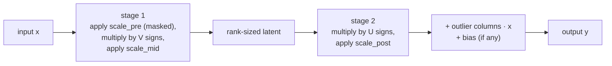
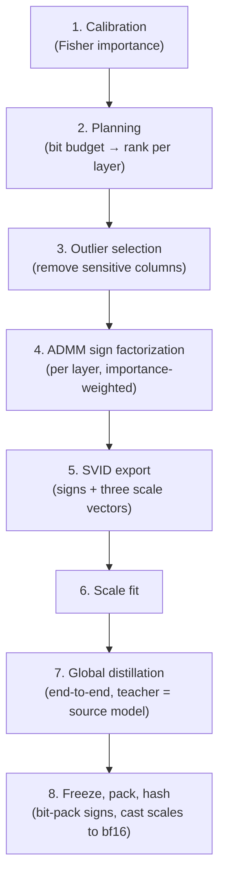

# 21 — How NanoQuant Weights Are Reconstructed, and How They Are Built

This document explains, at a high level, how the runtime turns a packed NanoQuant artifact back
into working weights, and — in a separate section — how the quantization pipeline produced those
values in the first place. It is written for two audiences at once: engineering managers who need
the shape of the system and the reasoning behind its design, and IC engineers who need enough
precision to navigate the code. Deep dives live in the referenced documents; this one explains
the *why*.

Concrete numbers throughout come from the shipped Gemma-3-1B v28 artifact
(`evidence/m6/gemma-pageable-v28-packed-runtime`), audited in July 2026.

---

## The one-paragraph version

Instead of storing each weight as a 16-bit number, NanoQuant stores each linear layer as two
matrices of **pure signs** (+1/−1, one bit each), three small **scale vectors** that restore
magnitude, and a **handful of exactly-preserved columns** for the weights the model is most
sensitive to. Multiplying the pieces back together approximates the original weight matrix. On
Gemma-3-1B this compresses the transformer's 182 linear layers from 1,395 MB (bf16) to 87 MB —
**16× smaller, at an effective 0.998 bits per weight** — while an end-to-end distillation stage
keeps the *model's outputs* faithful even though no individual weight is stored precisely.

---

## Section 1: How weights are reconstructed at runtime

### What is stored per linear layer

| Tensor | Logical shape → packed shape | Stored as | Share of bytes | Why this representation |
|---|---|---|---|---|
| `factor_left_words` (U) | `[out, rank]` → `[out, ceil(rank/32)]` | I32 words | 95.2% (with V) | Signs are one bit each — the densest possible carrier. I32 words match the modified llama.cpp kernel's load width (layout `llama.cpp-i32-lsb-v1`). |
| `factor_right_words` (V) | `[rank, in]` → `[rank, ceil(in/32)]` | I32 words | (see above) | Same as U. |
| `scale_pre` | in | BF16 | 2.1% (all scales) | Per-input-channel magnitude. BF16 is measured to be a non-bottleneck (see precision policy below). |
| `scale_mid` | rank | BF16 | | Per-rank-component magnitude. |
| `scale_post` | out | BF16 | | Per-output-channel magnitude. |
| `outlier_indices` | k (0–7 per layer) | I32 | ~2 KB total | Which input columns are preserved exactly. I32 rather than U16 because a vocab-sized dimension (262,144 for Gemma-3) would overflow U16, and the whole tensor is ~2 KB anyway. |
| `outlier_values` | out × k | BF16 | 2.5% | Verbatim copies of the sensitive weight columns. BF16 is *lossless* here because the tuned master weights are bf16. |

### The reconstruction identity

The effective weight matrix is:

```
Ŵ = (U ⊙ scale_post) · (V ⊙ scale_mid ⊙ scale_pre)   +   exact outlier columns
     └─ out × rank ─┘   └───── rank × in ─────┘
```

where `⊙` broadcasts each scale along its axis: `scale_post` scales U's rows, `scale_mid` scales
V's rows (one value per rank component), and `scale_pre` scales V's columns. At the outlier
column indices, `scale_pre` is stored as exactly zero, so the factorized product contributes
nothing there and the stored column *is* the weight column.

### What rank means for one reconstructed weight

The most concrete way to understand rank is as **the number of signed scale terms added together
to produce each weight**. Rank is not itself a vector and it is not a bit width. For an ordinary
(non-outlier) weight at output row `o` and input column `i`, row `o` of U and column `i` of V each
supply a vector of `rank` sign bits. Pairing those signs tells the reconstruction whether to add
or subtract each `scale_mid` value:

```
rank_sign[r] = U[o, r] * V[r, i]       # +1 or -1

Ŵ[o, i] = scale_post[o] * scale_pre[i]
          * sum(rank_sign[r] * scale_mid[r] for r in 0 .. rank-1)
```

Equivalently, every rank component contributes one signed, continuously valued term:

```
term[r] = rank_sign[r] * scale_post[o] * scale_mid[r] * scale_pre[i]
Ŵ[o, i] = term[0] + term[1] + ... + term[rank-1]
```

For example, if a toy rank-4 layer produced rank signs `[+1, -1, -1, +1]` and `scale_mid` were
`[0.5, 0.2, 0.1, 0.4]`, the inner sum would be `0.5 - 0.2 - 0.1 + 0.4 = 0.6`. The selected
input and output scales would then multiply that result. Real layers use much larger ranks, so
each weight is a sum of many such positive and negative terms.

The two sign vectors matter only through their pairwise products for a single weight, but U and V
are shared across the whole matrix. U row `o` is reused for every input column in that output row,
and V column `i` is reused for every output row in that input column. This sharing is what provides
compression: the artifact stores two reusable collections of signs instead of storing a separate
16-bit value for every weight.

#### Concrete Gemma `self_attn.k_proj` example

For the Gemma projection with 1,152 inputs, 256 outputs, and rank 128, the logical factors are:

```
U: [256, 128]
V: [128, 1152]
```

The artifact does not store those signs as individual numbers. It packs 32 signs into every I32
word, which changes only the physical storage shapes:

```
U words: [256, 128 / 32]  = [256, 4]
V words: [128, 1152 / 32] = [128, 36]
```

The following pseudocode reconstructs zero-based PyTorch weight `Ŵ[3, 4]`. `unpack_sign` returns
`+1` for a zero bit and `-1` for a one bit; words are packed least-significant bit first.

```text
function unpack_sign(words, row, column):
    word_index = floor(column / 32)
    bit_index  = column modulo 32
    bit        = (as_unsigned(words[row, word_index]) >> bit_index) AND 1
    return +1 if bit == 0 else -1

function reconstruct_weight_3_4():
    signed_middle_sum = 0

    for r from 0 through 127:
        u_sign = unpack_sign(factor_left_words,  row=3, column=r)
        v_sign = unpack_sign(factor_right_words, row=r, column=4)
        rank_sign = u_sign * v_sign

        signed_middle_sum += rank_sign * scale_mid[r]

    weight = scale_post[3] * signed_middle_sum * scale_pre[4]

    if input column 4 is an exact outlier column:
        # scale_pre[4] is zero, so the factorized value above is zero.
        weight += stored_outlier_value(output_row=3, input_column=4)

    return weight
```

Repeating this calculation for all 256 output rows and 1,152 input columns conceptually produces
the PyTorch weight matrix `[256, 1152]`. llama.cpp/GGML commonly displays the same matrix in
`[input, output]` order as `[1152, 256]`. The optimized runtime does not actually repeat this
scalar loop or build the matrix; it evaluates the equivalent two factorized matrix operations
described below.

**Why signs plus scales, rather than small integers?** A sign matrix carries only direction;
all magnitude lives in the three scale vectors. This split is what gets storage to ~1 bit per
weight: the signs are the bulk (one bit each) and the scales are a rounding error (921K values,
1.8 MB, 2.1% of the artifact). It is also kernel-friendly — multiplying by ±1 is an add or
subtract, and the packed I32 rows feed the modified llama.cpp kernels directly.

**Why three scales and not one?** Real weight matrices have structure along every axis: some
input channels are systematically larger (pre), some output channels are (post), and the rank
components the factorization discovers have different strengths (mid). Giving each axis its own
vector lets a pure-sign product recover realistic magnitudes at negligible storage cost.

**Why exact outlier columns?** Sign factorization spreads its error roughly evenly across the
matrix, but LLM quality is disproportionately sensitive to a few input channels (the well-known
activation-outlier effect). Preserving those columns verbatim removes the worst failure mode at
almost no cost: the v28 artifact keeps only 494 columns across the whole model (2.5% of bytes).

### The runtime never materializes Ŵ

Backends compute `y = x·Ŵᵀ` directly from the packed pieces in two stages, without ever building
the dense matrix. The literal interpretation below is useful for understanding the result, but it
is deliberately inefficient pseudocode and is **not** how inference executes:

```text
# Conceptual only: reconstruct every weight separately.
for each output row o:
    output[o] = 0

    for each input column i:
        reconstructed_weight = 0

        # One signed term for every rank component.
        for each rank component r:
            u_sign = U[o, r]                 # +1 or -1
            v_sign = V[r, i]                 # +1 or -1
            rank_sign = u_sign * v_sign      # +1 or -1

            reconstructed_weight += rank_sign * scale_mid[r]

        reconstructed_weight *= scale_post[o] * scale_pre[i]
        output[o] += input[i] * reconstructed_weight

    add exact-outlier contributions and bias to output[o]
```

That version appears to require a rank loop for every weight. The important simplification is
that all of its multiplications and additions can be regrouped without changing the result. The
sum involving V, the input, and `scale_pre` does not depend on output row `o`, so it is calculated
once per rank component and reused by every output row:

```text
# Actual factorized organization: never construct an individual weight.

# Stage 1: reduce the input dimension into one value per rank component.
for each rank component r:
    latent[r] = 0

    for each input column i:
        v_sign = V[r, i]
        latent[r] += v_sign * input[i] * scale_pre[i]

    latent[r] *= scale_mid[r]

# Stage 2: reduce the shared rank vector into every output value.
for each output row o:
    output[o] = 0

    for each rank component r:
        u_sign = U[o, r]
        output[o] += u_sign * latent[r]

    output[o] *= scale_post[o]

    for each exact outlier k:
        i = outlier_indices[k]
        output[o] += input[i] * outlier_value[o, k]

    if the layer has a bias:
        output[o] += bias[o]
```

The two snippets contain the same contributions. Only the loop order has changed. In particular,
the runtime does not combine a U sign and a V sign separately for every conceptual weight. It
first uses all V signs to create a small shared latent vector, then uses all U signs to turn that
latent vector into the output.

For the rank-128 Gemma `k_proj`, the difference in conceptual work for one token is:

```text
inputs  = 1152
outputs = 256
rank    = 128

separate weight reconstruction:
    outputs * inputs * rank
    = 256 * 1152 * 128
    = 37,748,736 rank contributions, before applying the weights

two-stage factorized inference:
    rank * inputs              # stage 1
    + outputs * rank           # stage 2
    = 128 * 1152 + 256 * 128
    = 180,224 signed contributions

ordinary dense inference:
    outputs * inputs
    = 256 * 1152
    = 294,912 multiply-accumulate contributions
```

Thus, this layer's two-stage path has about 61% as many accumulation terms as an ordinary dense
projection, while loading far less weight data: the packed U and V signs occupy 22,528 bytes and
the BF16 scales occupy 3,072 bytes, compared with 589,824 bytes for the dense BF16 weight. That
memory-traffic reduction is especially valuable during one-token decoding. The CUDA kernels also
perform the reductions in parallel, extract signs directly from packed words, and fuse the scale
applications; the loops above describe dependencies, not serial GPU execution.

Factorization is not automatically faster for every layer. The rank must be small enough that
`rank * inputs + outputs * rank` is cheaper than `outputs * inputs`, and the implementation must
control the extra intermediate storage and kernel-launch overhead.

The same execution can be pictured as this two-stage data flow:



Both stages **accumulate in F32** and return F32 (`Docs/19`, kernel contract). This is
deliberate: 16-bit accumulation over thousands of terms would drift, and F32 accumulation is the
operation boundary the modified llama.cpp implementation uses — keeping the two consumption
paths (native torch runtime and GGUF/llama.cpp) numerically comparable. The runtime re-applies
the outlier mask to `scale_pre` defensively (`reference.py:_masked_scale_pre`) even though
shipped artifacts already store zeros there; the invariant is verified to hold in all 182 layers
of v28.

### Why large per-weight error is fine — the parity contract

Measured on v28, the reconstructed matrices differ from the source checkpoint by roughly **50%
relative Frobenius error**. That is by design, and it is the most important thing to understand
about this system: **the artifact does not promise faithful weights; it promises faithful
outputs.** The construction pipeline (Section 2) fine-tunes the quantized model end-to-end
against the original model's outputs, so the network learns to be accurate *as a function* with
the signs it has. Correctness is then enforced where it matters: parity protocols compare
generated outputs under a declared tolerance (0.03125 for the BF16 shell, `Docs/06`), and every
artifact carries hashes of its exact producer for provenance.

This is why weight-level dtype micro-optimizations rarely pay off here: the factorization
residual dominates every other error source by two to three orders of magnitude (see precision
policy below).

---

## Section 2: How these values are constructed

The pipeline runs as explicit, deterministic, resumable stages. Order matters, and each stage
exists to solve a specific problem the previous one leaves behind:



**1. Calibration — learn what matters.** The source model runs on calibration data to collect
per-channel sensitivity statistics (diagonal-Fisher-style importance: how much the loss reacts
to perturbations in each channel). *Why:* every later stage makes lossy choices, and uniform
loss treatment would spend accuracy on channels the model barely uses. Importance vectors let
the pipeline aim its error at the cheap places.

**2. Planning — decide the budget before spending it.** Given a target bits-per-weight, the
planner chooses each layer's factorization rank and outlier count up front
(`application/planning.py`). Ranks are aligned to a configurable multiple (32 in practice — v28
ranks range from 0.44× to 0.92× of each layer's smaller dimension). *Why plan globally:* layers
differ in sensitivity, so a fixed global budget allocated per-layer beats a uniform rank; *why
multiples of 32:* packed sign rows then fill whole I32 words with no wasted lanes. Outlier
storage is charged against the same budget so the total size is honest.

**3. Outlier selection — take the hardest columns off the table first.** Fisher scores
(`weight² × input importance`, summed per column) rank the input columns; the top-k are copied
out verbatim and zeroed in the matrix (`domain/outliers.py`). *Why before factorization:* the
factorizer then never wastes rank capacity fighting the few extreme columns, and the removed
columns are exact forever after.

**4. ADMM factorization — fit signs to the residual.** Each layer's remaining matrix is
approximated by the U·V sign product using ADMM (~400 alternating iterations of a continuous
relaxation, dual updates, and rank-one sign projection), with the objective weighted by the
calibration importance (`domain/factorization.py`). *Why ADMM rather than rounding an SVD:*
sign constraints are discrete and non-convex; alternating projection with dual variables finds
markedly better sign assignments than any one-shot method. The stage is deterministic and
side-effect-free by contract — seeds are part of the recipe, because bit-identical factors are
required for parity across reruns.

**5. SVID export — split direction from magnitude.** The optimized continuous factors are
decomposed into pure signs plus the three scale vectors, with a balancing step that equalizes
factor norms for numeric health. The pipeline also exports continuous *latent* factors that
record each sign's margin to zero. *Why latents:* stage 7 keeps optimizing with a
straight-through estimator, and the margins carry the state that tells it which signs are close
to flipping.

**6. Scale fit — refit magnitudes against frozen signs.** With signs fixed, the scale vectors
are re-solved to minimize reconstruction error. *Why a separate stage:* the best scales for the
exported signs are not the ones inherited from the relaxation; a direct fit is cheap and
strictly better.

**7. Global distillation — make the outputs right, not the weights.** The full quantized model
is fine-tuned end-to-end to match the source model's output distribution (top-k teacher logits,
cached per epoch for efficiency; `global_distillation.py`). Trainable pieces are the scales,
latent-driven signs, and remaining continuous parameters. The optimizer is an AdamW variant with
Kahan-compensated updates (`application/parity_adamw.py`) so 16-bit parameters can accumulate
updates smaller than their own rounding step. *Why distill:* this is the stage that converts
"50% weight error" into "output parity" — the network redistributes its remaining capacity to
behave like the teacher. *Why top-k caching:* full-vocabulary teacher targets are enormous;
top-k captures nearly all the signal at a fraction of the storage.

**8. Freeze, pack, hash.** The tuned model is frozen and converted to the packed layout: signs
bit-packed LSB-first into I32 words (padding bits zero), scales cast to bf16, outlier columns
stored bf16, and a manifest written with content hashes of the exact producer code and model
revision. *Why hashes everywhere:* parity claims are only meaningful if the artifact pins what
produced it.

### Precision policy — what each cast costs (measured)

Because the scales are cast to bf16 *before* the reconstruction that later stages see
(`domain/factorization.py`, export step), the cost of that cast was measured directly on v28:

| Error source (relative to ‖W‖, median over sampled layers) | Magnitude |
|---|---|
| Sign-factorization residual (by design; compensated by distillation) | ~0.54 |
| bf16 rounding of the three scale vectors | 0.0017 |
| (hypothetical) fp16 rounding of the scales | 0.0003 |
| bf16 storage of outlier columns | 0 (lossless — masters are bf16) |
| Sign packing, indices | 0 (exact) |

The scale-rounding term combines with the residual in quadrature, so replacing bf16 scales with
fp16 — or even exact fp32 — changes total weight error by well under 0.01%. That is the *why*
behind the artifact's dtype choices: every tensor is either exact (signs, indices, outlier
columns) or its rounding is provably negligible (scales). The GGUF converter now preserves the
frozen BF16 scale values instead of widening them to F32, avoiding ~1.8 MB of storage on an
87 MB artifact without changing any represented value.

---

## Where to go deeper

- `Docs/06-inference-runtime.md` — backends, capabilities, parity tolerances
- `Docs/19-nanoquant-packed-layout-v1.md` — exact packed layout and kernel contract
- `Docs/20-inference-performance-protocol.md` — how performance claims are validated
- Code: `domain/factorization.py` (ADMM + SVID), `domain/outliers.py` (salient selection),
  `application/planning.py` (bit budget), `global_distillation.py` (end-to-end tuning),
  `runtime/packed.py` / `runtime/reference.py` (reconstruction semantics)
