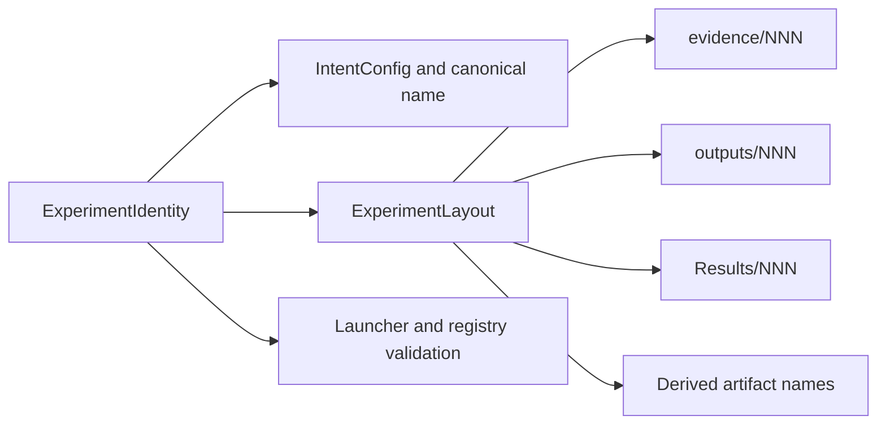

# Standardized Experiment Definitions and Output Layout

Status: proposed
Date: 2026-07-17

## 1. Summary

Every active numbered recipe should be represented by one required `ExperimentDefinition`. The definition owns the
experiment's identity, resolved `RunConfig`, workflow-specific settings, and a layout derived from the identity.
Recipe modules should no longer construct `IntentConfig` directly or spell repository-owned output paths.

The required identity is:

- an active-chronology experiment number;
- an unnumbered descriptive name;
- a purpose;
- a falsifiable hypothesis;
- an explicit baseline reference (including an explicit "no baseline" reason when appropriate);
- at least one tag.

The definition derives all of the following:

- the three-digit number token, such as `009`;
- the canonical name, such as `009-gemma-3-1b-int8-outliers`;
- `IntentConfig` in the resolved `RunConfig`;
- the experiment run root, `evidence/009`;
- the working-output root, `outputs/009`;
- the publication root, `Results/009`;
- standard logical, packed, checkpoint, log, summary, quality, benchmark, and expansion-report names;
- the default GGUF name from a release/model name;
- launcher-number and launcher-name validation;
- publication destinations and manifest entries.

`Results` remains capitalized. That is the existing repository contract in the publication implementation,
documentation, tests, `.gitignore`, and retained evidence. The requested `results/009` concept therefore maps to
`Results/009`. A case-only rename would be a separate repository-wide migration and must not be introduced
accidentally on Windows only to fail on a case-sensitive filesystem.

This is a definition and layout refactor. It must not change numerical settings, move retained evidence, invalidate
resumable state, or rewrite publication history for Experiments 001 through 008.

## 2. Why the current shape is repetitive

The active recipe package contains two unnumbered compression bases, eight numbered recipes, a delta helper, and one
retained legacy short-decode fixture. Five different workflow wrapper types carry their own output-path fields.

The same facts are currently repeated in several forms:

1. The number appears in the launcher filename, `IntentConfig`, export factory call, directory names, result
   filenames, and publication calls.
2. The intent name already contains the formatted number even though the number is a separate field.
3. `run_root` uses milestone directories (`evidence/m10` through `evidence/m15`) that must be manually coordinated
   with experiment numbers and names.
4. Compression exports use `outputs/NNN-model-slug`, while reports use separate `evidence/mXX` paths and publication
   code independently reconstructs `Results/NNN`.
5. Compression-quality recipes repeat three report paths (`summary`, quality JSON, and quality Markdown).
6. Rank-expansion recipes repeat the working root, packed/checkpoint/GGUF paths, four report paths, and three paths
   back to their parent experiment.
7. Standalone evaluation requests repeat model source/revision/snapshot values that resolution later replaces from
   `RunConfig`.
8. The base compression config contains a descriptive intent even though it is a template and has no experiment
   number.

The result is fail-open convention: a recipe can say Experiment 007 in its intent, use `outputs/006`, write a report
under `evidence/m14`, and still import successfully. Existing number validation checks only the launcher filename
against `config.intent.experiment_number`; it cannot catch the other mismatches.

### 2.1 Complete current-recipe inventory

| Definition | Workflow | Current derived data written by hand | Data that must remain explicit |
| --- | --- | --- | --- |
| `BASE_COMPRESSION_CONFIG` | unnumbered template | base intent name/purpose/hypothesis/tags; output artifact-root policy | pinned model/dataset revisions and numerical policy |
| `LARGE_MODEL_COMPRESSION_CONFIG` | unnumbered template | another base intent | CPU-offload, calibration, activation-cache, evaluation, and distillation policy |
| Experiment 001 | compression + export + benchmark | numbered intent, export number/model slug, benchmark path | its numerical delta, baseline, protocol, and optional release name |
| Experiment 002 | quality only | numbered intent, JSON path, Markdown path, repeated model pin fields | accepted candidate run, backend, and quality protocol |
| Experiment 003 | compression + export + quality | numbered intent, `evidence/m10`, export paths, summary path, quality paths | 4B model pin, tuning/resource deltas, expected blocks, quality backend |
| Experiment 004 | rank expansion | numbered intent, work root, packed/checkpoint/GGUF outputs, four report paths, parent run, parent packed output, parent quality result | parent experiment 003, target layer, bit multiplier, evaluation/resource policy, release name if needed |
| Experiment 005 | rank expansion | the same path set as 004 | parent experiment 003, doubled bit request, evaluation/resource policy, release name if needed |
| Experiment 006 | compression + export + quality | numbered intent, `evidence/m13`, export paths, three report paths | inherited numerical policy and expected blocks |
| Experiment 007 | compression + export + quality | numbered intent, `evidence/m14`, export paths, three report paths | 270M model pin and expected blocks |
| Experiment 008 | compression + export + quality | numbered intent, `evidence/m15`, export paths, three report paths | 12B provenance, large-model guards, model/runtime deltas, expected blocks |
| legacy short decode | short-decode benchmark | colliding legacy number/name and result path; repeated model pin fields | historical candidate run, runtime bundle, prompt/protocol, and frozen legacy measurements |

The external inputs in the last column are semantic experiment choices. They must not be guessed from a directory
convention. The paths in the third column are consequences of an identity or a typed parent reference and should not
be configurable per recipe.

### 2.2 Existing inconsistencies discovered during the audit

The current `experiments/recipes/__init__.py` and some tests still import legacy Experiment 008/011/013/018 symbols
that were removed in commit `43bdcba`; `experiments/recipes/legacy/__init__.py` now exposes only short decode. This is
pre-existing package-surface drift, not a reason to restore those definitions. It should be cleaned up before adding
a registry test that imports every current definition.

The active names also demonstrate why identity and layout need one owner:

- Experiment 001's launcher stem omits `and-benchmark` from the intent name.
- Experiment 003's intent has a `-v5` suffix that is absent from its launcher and export root.
- Experiment 005 says `double-request` in its intent/output directory but `maxrank` in its result filenames.
- Experiment 008's intent has `forward-only-v4`, while its launcher and export directory do not.

Those historical names are provenance and must remain readable. New definitions should not be able to create such
divergence.

## 3. Goals and non-goals

### 3.1 Goals

- Make complete experiment intent mandatory at the numbered-recipe boundary.
- State an experiment number and descriptive name exactly once.
- Automatically prefix the name with the zero-padded experiment number.
- Derive every repository-owned root and filename from one validated layout.
- Give `evidence`, `outputs`, and `Results` distinct, documented retention roles.
- Guarantee that every quality Markdown report is published under `Results/NNN` without a recipe path field.
- Preserve the zero-argument launcher and config/launcher provenance contracts.
- Preserve `config_delta` as the fail-closed way to state numerical differences.
- Keep workflow-specific semantic inputs visible.
- Support active and legacy numbering without collisions.
- Allow one implementation to validate all workflow kinds.

### 3.2 Non-goals

- Moving or renaming existing `evidence/m*`, `outputs/NNN-*`, or `Results/NNN` material.
- Changing the compression, evaluation, tuning, rank-expansion, packing, or publication algorithms.
- Hiding model pins, dataset pins, expected block counts, evaluation protocols, baselines, or resource guards.
- Deriving an external candidate or parent from whichever directory happens to exist.
- Making every ad hoc CLI, tiny fixture, or library `RunConfig` a numbered experiment.
- Replacing Python recipes with YAML.
- Changing Hugging Face repository names or user-facing release filenames without an explicit release-name choice.

## 4. Proposed object model

### 4.1 Required experiment identity

Introduce an experiment-side value object. The field called `name` at construction is deliberately unnumbered; the
qualified name is derived.

```python
@dataclass(frozen=True, slots=True)
class ExperimentIdentity:
    number: int
    name: str
    purpose: str
    hypothesis: str
    baseline: BaselineRef
    tags: tuple[str, ...]
    owner: str | None = None
    series: ExperimentSeries = ExperimentSeries.ACTIVE

    @property
    def number_token(self) -> str:
        return f"{self.number:03d}"

    @property
    def canonical_name(self) -> str:
        return f"{self.number_token}-{self.name}"
```

Validation is fail-closed:

- active numbers are integers from 1 through 999;
- `name` is one lowercase, safe, kebab-case component and must not already start with `NNN-`;
- purpose and hypothesis are non-empty after trimming;
- baseline is explicit;
- tags are non-empty, unique, normalized strings;
- the active canonical name is at most a documented filesystem-safe length;
- a legacy identity must use the legacy series rather than occupying the active namespace.

`BaselineRef` should distinguish:

- `ExperimentRef(number, series="active")` for another numbered experiment;
- `ExternalBaseline(label)` for BF16, legacy, or repository/revision/file baselines;
- `NoBaseline(reason)` when no meaningful comparison exists.

This avoids an optional `baseline_run=None` silently meaning either "not decided" or "not applicable". It can still
serialize to the current `IntentConfig.baseline_run` string during the compatibility phase.

### 4.2 `ExperimentDefinition`

Every concrete numbered recipe exports one object:

```python
WorkflowSpecT = TypeVar("WorkflowSpecT")

@dataclass(frozen=True, slots=True)
class ExperimentDefinition(Generic[WorkflowSpecT]):
    identity: ExperimentIdentity
    config: RunConfig
    workflow: WorkflowSpecT
    layout: ExperimentLayout
```

Callers supply an identity, an unnumbered config template or parent definition, a workflow kind, and only semantic
workflow settings. The builder performs these steps in order:

1. Validate the identity.
2. Derive the layout.
3. Convert the identity to the existing serialized `IntentConfig`, using `canonical_name` as `IntentConfig.name`.
4. Inject the derived `output.run_root` while preserving the template's other output policies.
5. Materialize workflow output destinations from the layout.
6. Validate that all owned destinations are inside the expected root.
7. Return the immutable definition.

The data flow has one source of truth:



Compatibility properties may temporarily preserve current imports:

```python
EXPERIMENT_009_CONFIG = EXPERIMENT_009.config
EXPERIMENT_009_WORKFLOW = EXPERIMENT_009.workflow
```

New launchers should import the one definition. A later, small launcher cleanup can add a shared tagged-union
dispatcher, but output standardization does not depend on that dispatcher.

### 4.3 Templates are not experiments

Rename the concepts, with compatibility aliases during migration:

```text
BASE_COMPRESSION_CONFIG        -> BASE_COMPRESSION_TEMPLATE
LARGE_MODEL_COMPRESSION_CONFIG -> LARGE_MODEL_COMPRESSION_TEMPLATE
```

Templates carry numerical, model, dataset, runtime, and artifact-store policy. They do not carry an experiment
number, experiment name, purpose, hypothesis, baseline, tags, or numbered root.

This resolves the current contradiction where the base has a detailed intent but no number. It also removes the
need for every child recipe to replace six inherited intent fields.

Derived experiments such as 004 and 005 may use a concrete parent definition as a numerical template. The builder
copies the parent's config, deliberately removes experiment-owned identity/layout fields, applies the requested
numerical delta, and injects the child's identity/layout. This operation must be a named helper rather than raw
`dataclasses.replace`, so the existing fail-closed delta rule remains enforceable.

### 4.4 Scope of required intent

Do not make `RunConfig.intent` globally constructor-required in the first implementation. The repository still has
unnumbered parity tools, tiny fixtures, generic Python/CLI calls, and reusable templates. Making the schema itself
number-only would conflate those with promoted experiments and force fake numbers into provenance.

Instead:

- raw `RunConfig` retains its current generic defaults;
- every object exported as a canonical numbered recipe must be an `ExperimentDefinition`;
- every numbered launcher accepts only an `ExperimentDefinition`;
- experiment validation requires the complete identity and materializes a complete `IntentConfig`.

This makes intent required exactly where the repository knows it is required. A future schema version may split
`RunIntent` and `ExperimentIntent`, but that is not necessary to remove the current boilerplate.

### 4.5 Dependency ownership

The concrete convention remains experiment content, consistent with ADR-0009:

- `experiments/recipes/_definition.py` owns active/legacy series, `NNN` formatting, the literal root names, concrete
  identities, and workflow builders;
- the installable library may define a root-agnostic `ExperimentArtifactPlan`/`PublicationTarget` value type for
  workflow inputs, but it does not define a concrete Experiment 009 or import `recipes`;
- workflow composition receives the resolved config and root-agnostic artifact plan from the launcher side;
- infrastructure publication consumes resolved source/destination targets and performs the atomic link/manifest
  transaction.

This keeps `src/nanoquant` independent of the concrete recipe package. In the first phase, builders can simply fill
the existing pathful workflow dataclasses. When those fields are removed, builders convert `ExperimentLayout` to the
generic library artifact plan; library workflows still never import experiment definitions.

## 5. Canonical layout

For active Experiment 009 with name `gemma-3-1b-int8-outliers`, the layout is:

```text
evidence/009/                                      # config.output.run_root
  009-gemma-3-1b-int8-outliers/                   # durable resident run output
    manifest.json
    events.jsonl
    state/
    artifacts/
    reports/

outputs/009/                                       # rebuildable/intermediate material
  logical/
  packed/
  llamacpp-checkpoint/
  logs/
  reports/
    009-gemma-3-1b-int8-outliers-quality.md        # optional publication source
  009-gemma-3-1b-int8-outliers-summary.json
  009-gemma-3-1b-int8-outliers-quality.json
  gemma-3-1b-it-nanoquant.gguf
  gemma-3-1b-it-nanoquant.gguf.export.json
  gemma-3-1b-it-nanoquant.export-summary.json

Results/009/                                       # public release view
  009-gemma-3-1b-int8-outliers-summary.json
  009-gemma-3-1b-int8-outliers-quality.json
  009-gemma-3-1b-int8-outliers-quality.md
  gemma-3-1b-it-nanoquant.gguf
  gemma-3-1b-it-nanoquant.gguf.export.json
  gemma-3-1b-it-nanoquant.export-summary.json
  publication.json
```

Not every workflow creates every entry. A quality-only experiment has no logical/packed/checkpoint output; a rank
expansion has packed/checkpoint/GGUF output but no logical output. Empty directories need not be created.

### 5.1 Root responsibilities

| Root | Responsibility | Retention/publication rule |
| --- | --- | --- |
| `evidence/NNN` | authoritative run state: manifest, journal, structured events, durable run-local artifacts, resume state, reports needed to explain the attempt | never treated as scratch; existing evidence is not relocated automatically |
| `outputs/NNN` | derived and rebuildable working material: logical/packed export, converter checkpoint, staged release files, converter stdout/stderr, rendered disposable logs | may be reclaimed only through artifact-aware tooling and never while a run is active |
| `Results/NNN` | stable public view: GGUF/mmproj, receipts, final statistics, final reports, publication manifest | populated atomically by the publication service, normally with hard links to validated sources |

Structured `events.jsonl` stays in evidence because it is authoritative. Rendered `run.log`, `memory.log`, converter
stdout/stderr, and similar disposable views belong under `outputs/NNN/logs` when they are not already run-local.
This preserves the observability contract while satisfying the intended role of `outputs` for log-like intermediates.

### 5.2 Run root versus run output

`config.output.run_root` is `evidence/NNN`. The current resident resolver appends `config.intent.name`, producing the
durable run output shown above. Both values are derived; recipes configure neither.

This proposal deliberately does not redesign attempt IDs or resume selection. If the run subsystem later adopts
`evidence/NNN/runs/<run-id>`, that is an internal layout version change behind `ExperimentLayout`, not another field
added to every recipe.

### 5.3 Standard filenames

| Semantic output | Derived working name | Required publication |
| --- | --- | --- |
| compression summary | `<canonical-name>-summary.json` | yes |
| quality statistics | `<canonical-name>-quality.json` | yes |
| quality report | `<canonical-name>-quality.md` | **yes, always under `Results/NNN`** |
| benchmark statistics | `<canonical-name>-benchmark.json` | yes |
| rank-expansion statistics | `<canonical-name>-expansion.json` | yes |
| logical runtime artifact | `logical/` | no |
| packed runtime artifact | `packed/` | no, unless separately packaged |
| llama.cpp checkpoint | `llamacpp-checkpoint/` | no |
| language GGUF | `<release-name>-nanoquant.gguf` | yes |
| GGUF export receipt | derived from the GGUF name | yes |
| export summary | derived from the GGUF name | yes |
| multimodal projector | `mmproj-BF16.gguf` plus receipt | yes when the source is multimodal |
| live reconstruction report | `weight-errors.md` in the run output | immediate hard link to `Results/NNN/weight-errors.md` |

The old `quality_markdown_output` path field is removed from recipe-facing workflow specs. The workflow asks for the
semantic `quality_report` target, and the layout/publication service guarantees its final `Results/NNN` location.
An implementation may first write an atomic staging file under `outputs/NNN/reports` and hard-link it, but the
returned/public contract is the Results path.

`release_name` is semantic rather than a filesystem path. By default it is safely derived from the pinned model
source's final component. A derivative such as Experiment 005 may explicitly set
`release_name="gemma-3-4b-it-vproj-maxrank"`; it still cannot choose a directory or omit the experiment's standard
root. This retains useful distribution names without reintroducing path boilerplate.

## 6. Workflow-specific builders

One core definition/layout implementation should serve small workflow-specific builders. Builders may initially
materialize the existing pathful workflow dataclasses; the dataclasses can then shed derived path fields without a
flag day.

### 6.1 Compression, export, and quality

```python
EXPERIMENT_009 = define_compression_quality_experiment(
    number=9,
    name="compress-and-benchmark-gemma-3-1b-it-int8-outliers",
    purpose="Measure selective budgeted INT8 residual outliers.",
    hypothesis=(
        "Selective INT8 residual outliers improve matched quality at the same effective BPW."
    ),
    baseline=ExperimentRef(6),
    tags=("gemma-3-1b-it", "outliers", "int8", "quality"),
    template=config_delta(
        BASE_COMPRESSION_TEMPLATE,
        outliers=config_delta(
            BASE_COMPRESSION_TEMPLATE.outliers,
            storage_dtype=DType.INT8,
            charge_to_bit_budget=True,
            layer_patterns=("self_attn.v_proj", "self_attn.o_proj", "mlp.down_proj"),
        ),
    ),
    expected_blocks=26,
)
```

There is no explicit `IntentConfig`, `output.run_root`, `Path`, export number, output directory, summary name, quality
name, or quality Markdown name. The numerical delta and evaluation semantics remain reviewable.

Replace `compression_export_recipe(experiment_number, model_slug, ...)` with an export policy that has no layout
arguments:

```python
CompressionExportPolicy(
    release_name=None,              # derive from model source
    token_embedding_type="q8_0",
    llama_cpp=WorkspaceToolRef("llama.cpp"),
    huggingface=None,
)
```

The workspace-level llama.cpp checkout should eventually be resolved from a tool/workspace setting rather than
repeated in rank-expansion recipes. Until that setting exists, the shared base export policy may keep the current
path in one place.

### 6.2 Quality-only evaluation

The output JSON/Markdown paths are derived. The candidate is not:

```python
EXPERIMENT_002 = define_quality_experiment(
    identity=...,
    template=GEMMA_3_1B_EVALUATION_TEMPLATE,
    candidate=ExternalRunRef("evidence/m4/gemma-pageable-v28-four-block-canary"),
    backend="factorized",
    protocol=LEGACY_MATCHED_QUALITY_PROTOCOL,
)
```

Model snapshot/source/revision/device fields already present in `RunConfig` should be filled during resolution, not
repeated in the request merely so that `resolve_model_from_config=True` can replace them.

### 6.3 Rank expansion

Use a typed parent reference:

```python
EXPERIMENT_004 = define_rank_expansion_experiment(
    number=4,
    name="gemma-3-4b-it-vproj-plus30",
    purpose=...,
    hypothesis=...,
    baseline=ExperimentRef(3),
    tags=(...),
    parent=ExperimentRef(3),
    config_parent=EXPERIMENT_003,
    layer_suffix="self_attn.v_proj",
    bit_multiplier=1.30,
    release_name="gemma-3-4b-it-vproj-plus30",
)
```

For a standard parent definition, resolution derives:

- parent run output from `evidence/003` plus the parent's canonical name;
- source packed artifact from `outputs/003/packed`;
- baseline quality from `Results/003/<parent-canonical-name>-quality.json`;
- all child work and publication paths from Experiment 004's layout.

A typed `ExternalRunRef` remains available for historical parents that predate the standard layout. A bare `Path`
should not be accepted where an `ExperimentRef` is possible.

### 6.4 Legacy short decode

The retained short-decode fixture uses legacy number 002, which collides with active Experiment 002. It therefore
cannot use active `evidence/002`, `outputs/002`, or `Results/002` without mixing two chronologies.

Use `series=LEGACY`, with a collision-free derived namespace such as:

```text
evidence/legacy/002/
outputs/legacy/002/
Results/legacy/002/
```

Its historical run output, runtime bundle, prompt, and legacy measurement rows remain explicit. Its own result path
is derived. Existing retained `evidence/m9/002-gemma-3-1b-it-short-decode.json` and `Results/002` links are not moved;
the legacy namespace applies to new executions after migration.

## 7. Enforcement

Validation should occur at construction, launcher resolution, and publication.

### 7.1 Definition validation

- required identity fields are present and normalized;
- the identity number and series form a unique registry key;
- the config's materialized intent exactly matches the identity;
- `config.output.run_root` exactly matches the layout;
- every workflow-owned path is repository-relative before resolution and contained in its assigned root afterward;
- a quality-producing workflow has a quality JSON target and a Results Markdown target;
- publishable names are unique within one experiment;
- parent references do not point to the child itself;
- a model-producing workflow has one safe release name;
- legacy definitions cannot leak into the active roots.

### 7.2 Launcher validation

For newly standardized experiments, require:

```text
launcher number == identity number
launcher stem   == identity canonical name
launcher args   == ()
```

Experiments 001, 003, and 008 need explicit historical launcher-name aliases during migration because their current
launcher stems differ from their intent names. The alias belongs in centralized compatibility metadata, not each
recipe. Number matching remains mandatory.

### 7.3 Static architecture checks

Extend the recipe architecture test to reject, in active standardized recipe modules:

- direct construction of `IntentConfig` or an `intent=` config delta;
- `Path("evidence/...`)`, `Path("outputs/...`)`, or `Path("Results/...`)` for owned outputs;
- calls to the old numbered `compression_export_recipe`;
- duplicate active experiment numbers;
- definitions not exported through the canonical registry.

Typed external inputs are allowed and distinguishable in the AST/API from owned output destinations.

Add a registry test that imports every active recipe and checks the identity, layout, launcher, workflow kind, and
publication plan. Clean the stale removed-legacy imports noted in section 2.2 before enabling that test.

## 8. Migration and compatibility

### Phase 1: introduce identity, layout, and builders

1. Add `ExperimentIdentity`, `BaselineRef`, `ExperimentRef`, `ExperimentLayout`, and
   `ExperimentDefinition` under `experiments/recipes`; these are campaign conventions and remain outside the
   installable library per ADR-0009.
2. Add workflow-specific builders that materialize the current library workflow types.
3. Add layout and validation tests for all five workflow kinds.
4. Clean stale root-package/test imports of the deleted legacy recipe modules.

No current recipe or evidence path changes in this phase.

### Phase 2: prove the standard with the next experiment

Author Experiment 009 only through the new builder. Its assertions should prove:

```text
intent.name                == 009-<name>
config.output.run_root     == evidence/009
working root               == outputs/009
publication root           == Results/009
quality Markdown published == Results/009/009-<name>-quality.md
```

This provides evidence that the convention works before historical recipes are mechanically rewritten.

### Phase 3: migrate current definitions without changing behavior

Migrate 001 through 008 to `ExperimentDefinition` one workflow family at a time. During this phase a centralized
`HistoricalLayout` compatibility map may reproduce their exact existing resolved paths. Required constraints:

- the resolved numerical config is unchanged;
- existing intent strings and launcher hashes remain historical provenance;
- concrete Experiment 001–008 config hashes remain unchanged;
- an in-progress or resumable resident run continues to resolve to its original directory;
- no retained file is renamed, copied, deleted, or rewritten;
- compatibility aliases preserve `EXPERIMENT_NNN_CONFIG` and current workflow-object imports until consumers move.

Experiment 008 must not be redirected while its large-model run or resumable state may still be active. The journal,
descriptor hashes, and current output directory remain authoritative.

The unnumbered base/large template hashes are allowed to change when their inherited pseudo-intents are removed;
tests should then pin the new templates and continue pinning every concrete historical experiment separately. A
temporary `BASE_COMPRESSION_CONFIG` compatibility alias may retain the old object if a consumer needs its exact
historical hash, while new builders consume `BASE_COMPRESSION_TEMPLATE`.

### Phase 4: remove path fields from workflow-facing specs

After all builders are in use, replace derived path fields with semantic artifact roles:

- `CompressionQualityExperiment.summary_output/quality_output/quality_markdown_output`;
- `CompressionBenchmarkExperiment.benchmark_output`;
- `QualityEvaluationExperiment.result_path/markdown_path`;
- the owned-output fields on `RankExpansionExperiment`;
- `ShortDecodeBenchmarkExperiment.result_path`;
- the four material output paths on `CompressionExportRecipe`.

Workflow resolution receives the definition's resolved layout/artifact plan. External input references remain fields.
This is the point where direct construction of the old pathful wrappers can be deprecated and then removed.

### Phase 5: optional historical publication backfill

If desired, backfill missing `Results/NNN` links with the existing publication tool. Do not move canonical source
files and do not change a publication filename that downstream reports already reference. Historical and standard
names may coexist in a Results directory when the publication manifest owns both.

## 9. Hashing, resume, and artifact safety

Identity and layout are provenance. Numerical stage keys should continue to derive from numerical/model/dataset
settings rather than presentation paths. The complete resolved-config hash may change for a genuinely new numbered
experiment, while compatible calibration/factorization artifacts remain reusable through their stage-specific
semantic identities.

For existing experiments, changing `intent.name` or `output.run_root` can change current resident request/config
identity and orphan discovery behavior. Therefore the migration must not simply recompute a new standard layout for
001 through 008. It must either preserve their resolved values through compatibility metadata or leave them on the
old definition until their evidence is frozen.

This refactor alone does not change the resident numerical algorithm and therefore does not require an increment to
`RESIDENT_ALGORITHM_VERSION`. Any later implementation change that alters request semantics or resident execution
must follow the normal algorithm-version rule independently.

Publication remains zero-copy and fail-closed:

1. write and validate the canonical source;
2. atomically hard-link (or supported symlink fallback) to the derived `Results/NNN` name;
3. merge the entry into `publication.json`;
4. return the public Results path from the high-level experiment workflow.

No workflow should report completion merely because a staging file exists under `outputs`.

## 10. Alternatives considered

### Make `IntentConfig` globally required

Rejected for the first implementation. It would force fake experiment numbers into unnumbered templates, tools,
fixtures, and API runs. Requiring complete identity on `ExperimentDefinition` gives the desired guarantee without
weakening provenance.

### Derive identity only from the launcher filename

Rejected. The launcher filename cannot carry purpose, hypothesis, baseline, tags, or legacy series. Treating the
filename as the sole source also makes a rename silently change semantic identity. The definition is authoritative;
the launcher is validated against it.

### Keep `outputs/NNN-<slug>`

Rejected for new experiments. The number already gives the collision-free namespace, and adding the slug to the
directory is another repeated fact that can drift. Descriptive filenames inside `outputs/NNN` retain usability.

### Put final artifacts only in `outputs`

Rejected. `Results/NNN` is already the public, zero-copy publication contract. Working conversion products and
public release membership have different lifecycle and ownership rules.

### Write all final files directly into `Results`

Rejected as the general rule. GGUF conversion, validation, and resumable staging should not expose partial public
files. The publication service should publish validated sources atomically. Quality Markdown is guaranteed in
Results by the semantic publication target, regardless of whether its implementation uses a staging hard link.

### Rename `Results` to lowercase `results`

Deferred. It offers little behavioral value, risks a Windows-only case rename, and breaks existing links, docs,
tests, and tooling on case-sensitive systems. The standardized API hides the literal root, so a deliberate future
migration would be localized.

## 11. Acceptance criteria

The design is implemented when:

- every active numbered recipe exports one valid `ExperimentDefinition`;
- base and large-model compression objects are clearly unnumbered templates;
- a new recipe states its number and unnumbered name once;
- the canonical name automatically contains exactly one three-digit prefix;
- new active roots are exactly `evidence/NNN`, `outputs/NNN`, and `Results/NNN`;
- no standardized active recipe contains an owned `evidence`, `outputs`, or `Results` path literal;
- all quality-producing workflows publish Markdown under their derived `Results/NNN` directory;
- rank-expansion parent run, packed artifact, and baseline-quality paths derive from a typed parent reference when the
  parent uses the standard layout;
- external historical inputs remain explicit and auditable;
- launcher number/name mismatches fail before expensive work starts;
- active and legacy numbering cannot collide;
- existing Experiment 001–008 evidence and resume behavior remain unchanged during migration;
- publication manifests still own and merge every public link;
- focused definition/layout tests, the full pytest suite, Ruff, and strict mypy pass.
