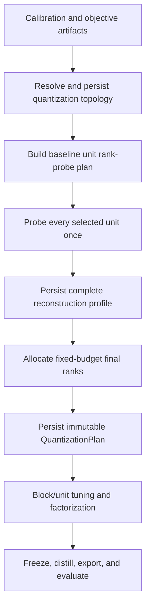

# Reconstruction-Informed Rank Planning

**Status:** Implemented; architecture-protected Gemma-3-270M validation in progress

**Primary evidence:** [Reconstruction Headroom](ImprovementSuggestions/ReconstructionHeadroom.md) and
[Stacked Factorization](ImprovementSuggestions/StackedFactorization.md)

**Companion design:** [Stacked Shared-Input Factorization](31-stacked-shared-input-factorization.md)

**Scope:** Resolve the selected independent-layer/shared-input-group topology, add a resumable full-model
reconstruction-probe pass before fitting, then use measured per-unit errors and calibrated rank-response models to
produce one immutable, fixed-budget rank plan. The initial target is pinned `google/gemma-3-1b-it`.

## 1. Decision summary

Add a new `reconstruction_aware` allocation strategy implemented as a two-phase planner:

1. Resolve and persist the quantization topology. A planning unit is either one ordinary matrix or one selected
   shared-input group; the initial Gemma plan selects Q/K/V groups in all 26 blocks.
2. Build aligned per-unit baseline ranks and the exact physical bit budget without loading weight values.
3. Before non-factorized tuning or production factorization starts, visit every unit once and run one baseline ADMM
   reconstruction probe. A group probe reads its members together and factorizes their row concatenation once.
4. Persist the completed probe profile.
5. Allocate aligned rank quanta by predicted reduction in sensitivity-weighted squared reconstruction error per bit,
   using the measured baseline error and the exponential response model from `ReconstructionHeadroom.md`.
6. Persist the final `QuantizationPlan`; only then enter the resident unit fitting flow.

For the first Gemma experiment, use the measured per-layer-type slopes from the headroom study and the measured
piecewise Q/K/V-stack response from the stacked-factorization study. Do not estimate rank utility from SVD tails, do
not run reduced-iteration diagnostics as planning evidence, and do not start fitting a block until the profile covers
all 130 selected units (covering all 182 logical matrices) and the final plan is durable.

The new policy will protect the most sensitive cohort from rank cuts and target a small aggregate reconstruction
improvement for that cohort. Group membership cannot weaken protection for a sensitive member. The policy still
optimizes the entire model under the exact nominal physical bit budget. This gives
"slightly lower error in sensitive layers" a concrete meaning rather than relying only on a large utility scalar.

## 2. Why this is the next allocation change

The headroom study establishes three facts that determine this design:

- Production ADMM is already within roughly 0.3% relative Frobenius error of the best fit found for the current
  binary-factor format. Longer fitting, extra seeds, STE, and basin hopping are therefore poor allocation levers.
- Independent binary-factorization relative error is locally well modelled by
  `E_i(r) = E_i,u * exp(-beta_i * (r - r_i,u))` over approximately `0.6x` to `1.4x` baseline rank.
- A measured all-layer allocation using one baseline error per matrix and a per-type slope reduced global relative
  reconstruction error by 8.2% at equal bits. SVD-tail allocation was not a safe proxy.
- Q/K/V row stacking improved every Gemma-1B attention block at equal combined factor bits, and stacking plus global
  allocation improved global reconstruction by roughly 8.5-9%. The stack's fitted response is piecewise: the retained
  slopes are `1.105e-3` below baseline and `9.03e-4` above it over the tested `0.5x`-`2.0x` range.

The current planner cannot express either result. `application/planning.py` assigns one scalar utility to a layer and
reuses it for every additional rank quantum. It has no measured starting distortion and no diminishing-return
curve, and it assumes every logical layer owns an independent factorization. The resident path's
`_legacy_sensitivity_profile` is useful as a cross-layer sensitivity signal, but by itself
it cannot distinguish an easy matrix from a hard matrix or determine the marginal value of the next 32 ranks.

The existing retry loop is also the wrong place to make this decision. Retry sees layers sequentially, after prior
model mutation, and spends a small extra budget without the future layers' measured alternatives. The requested
behavior requires a complete, immutable decision before fitting begins.

## 3. Goals and non-goals

### Goals

- Resolve topology, then probe every selected unit before any non-factorized tuning, production factorization
  attempt, scale fit, or block
  tuning mutates the model.
- Keep only scalar planning evidence; do not retain a second full set of factors or reconstructions.
- Produce deterministic ranks aligned to the runtime rank multiple and never exceed the nominal allocation budget.
- Give the most sensitive logical layers a small reconstruction advantage without allowing group aggregation to
  conceal a sensitive member.
- Make the expensive probe pass resumable and reusable when all semantic inputs match.
- Preserve the current architecture direction: response-curve and allocation math in `domain`, orchestration in
  `application`, source/tensor/artifact access in the resident/infrastructure shell.
- Make the profile, rank decisions, predicted gains, actual gains, wall time, memory, and bits auditable.

### Non-goals

- Choosing group topology automatically. Version 1 consumes the explicit topology designed in
  `31-stacked-shared-input-factorization.md`.
- Adding sign-flip refinement, per-layer STE, multi-stage residual factors, rotations, or new scale kinds.
- Replacing the production diagonal importance objective or implementing model-level top-k KD.
- Dynamically changing ranks after fitting has started.
- Reusing probe factors as production factors. Production targets may be changed by the existing non-factorized
  tuning step, so only the probe metrics are reusable.
- Claiming parity or quality improvement from tiny fixtures or the planning model alone. Promotion still requires a
  complete pinned-Gemma run and matched evaluation.

## 4. Current flow and required flow

Today the resident preprocessing path calibrates, builds objectives, computes the legacy sensitivity profile, and
immediately persists a `QuantizationPlan`. Blocks are then processed sequentially under an independent-layer
assumption; each layer can be non-factorized tuned before its production ADMM target is materialized.

The proposed order is:



There must be no edge from an individual probe result directly to block fitting. The final plan is released only when
the complete profile validates.

## 5. Configuration design

Add `AllocationStrategy.RECONSTRUCTION_AWARE = "reconstruction_aware"` and a nested configuration owned by
`RankAllocationConfig`:

```python
@dataclass(frozen=True, slots=True)
class RankResponseSegmentConfig:
    maximum_rank_fraction: float
    beta_per_rank: float


@dataclass(frozen=True, slots=True)
class RankResponseCurveConfig:
    unit_pattern: str
    calibrated_rank_floor_fraction: float
    calibrated_rank_ceiling_fraction: float
    segments: tuple[RankResponseSegmentConfig, ...]


@dataclass(frozen=True, slots=True)
class ReconstructionImportanceConfig:
    layer_multipliers: tuple[LayerRankBudgetConfig, ...] = ()
    protected_layer_patterns: tuple[str, ...] = ()
    edge_block_multiplier: float = 1.0
    protected_edge_block_count: int = 0


@dataclass(frozen=True, slots=True)
class ReconstructionRankPlanningConfig:
    enabled: bool = False
    objective_mode: str = "unit_frobenius"
    probe_admm: ADMMConfig | None = None
    response_curves: tuple[RankResponseCurveConfig, ...] = ()
    response_profile_provenance: str = ""
    importance: ReconstructionImportanceConfig = field(
        default_factory=ReconstructionImportanceConfig
    )
    sensitivity_strength: float = 0.75
    protected_sensitivity_quantile: float = 0.80
    protected_rank_floor_fraction: float = 1.0
    target_protected_error_reduction_fraction: float = 0.01


@dataclass(frozen=True, slots=True)
class RankAllocationConfig:
    # existing fields...
    reconstruction: ReconstructionRankPlanningConfig = field(
        default_factory=ReconstructionRankPlanningConfig
    )
```

The strategy enum is authoritative; `enabled` exists to make sparse configuration and validation explicit. Validation
must require the enum and `enabled` to agree.

For the initial Gemma-3-1B recipe, independent units use the measured table from
`ReconstructionHeadroom.md`. Each becomes a one-segment curve over `0.60x`-`1.40x` baseline rank:

| Canonical layer pattern | `beta_per_rank` |
| --- | ---: |
| `mlp.down_proj` | `6.22e-4` |
| `mlp.gate_proj` | `6.32e-4` |
| `mlp.up_proj` | `6.29e-4` |
| `self_attn.o_proj` | `1.09e-3` |
| `self_attn.q_proj` | `1.14e-3` |
| `self_attn.k_proj` | `3.18e-3` |
| `self_attn.v_proj` | `2.87e-3` |

These values must live in the explicit recipe/experiment definition with a provenance string, not as universal
defaults in domain code. Each selected ordinary unit must match exactly one rule.

The selected Q/K/V group uses the piecewise curve retained by `StackedFactorization.md`:

| Canonical unit pattern | Rank interval | `beta_per_rank` |
| --- | --- | ---: |
| `self_attn.attn_qkv` | `0.50x` to `1.00x` baseline | `1.105e-3` |
| `self_attn.attn_qkv` | `1.00x` to `2.00x` baseline | `9.03e-4` |

Represent all curves with ordered segments, including the one-segment independent curves. Prediction integrates the
appropriate slopes across an interval and is continuous at the baseline and every segment boundary. A future model,
topology, or objective mode must
supply its own measured profile or add an automatic slope-calibration stage; silently borrowing Gemma slopes is an
error.

`probe_admm=None` means inherit `factorization.admm`, but the first Gemma recipe must set it explicitly to the study
protocol: 400 outer iterations, 5 inner iterations, cubic schedule, and `transpose_wide=True`. The current canonical
schema defaults (800 outer iterations and `transpose_wide=False`) are not the protocol that produced the retained
response tables. The resolved topology, probe configuration, and response curves are hashed together, so changing
any of them invalidates the profile. A response table measured under a different ADMM, topology, or objective protocol
must be a new explicit profile.

Initial validation rules:

- `0 <= sensitivity_strength <= 1`;
- every curve has `0 < calibrated_rank_floor_fraction <= 1 <= calibrated_rank_ceiling_fraction`;
- unit allocation bounds may be narrower than, but not wider than, that unit's calibrated response range;
- `0 <= protected_sensitivity_quantile <= 1`;
- `protected_rank_floor_fraction >= 1` and finite;
- `0 <= target_protected_error_reduction_fraction < 1`;
- importance and protection patterns are non-empty, unique, and match at least one logical member;
- a logical member matches at most one importance multiplier;
- importance and edge-block multipliers are finite and at least one;
- `protected_edge_block_count >= 0`;
- every segment boundary is finite and strictly increasing and every slope is finite and positive;
- curve patterns are non-empty, unique, cover every selected unit exactly once, and do not overlap;
- a group curve matches the complete canonical group identity, never one of its member paths;
- `objective_mode == "unit_frobenius"` for the first implementation;
- a non-empty slope provenance and fully resolved probe ADMM configuration are present for evidence-bearing runs.

The last rule ensures the planning pass is not justified by a tiny or reduced-iteration solve. An explicit exploratory
override may be added later, but its artifact must be labelled diagnostic and must not satisfy the real-model gate.

## 6. Probe semantics

### 6.1 Baseline ranks and budget

Extract the current shape/outlier accounting into a pure baseline-plan function. For each selected unit it computes:

- the shape-specific rank `r_i,u` funded by that layer's target BPW;
- aligned floor and ceiling ranks;
- factor cost, charged outlier cost, and total target bits;
- any additive override that will be applied after fixed-budget allocation.

For an ordinary unit, `r_i,u` means the ordinary shape-specific target-BPW rank. For a selected group, first compute
the exact bits that its members would receive under the separate target-BPW baseline, then choose the greatest aligned
group rank whose group factor cost fits that combined funding. This includes scales, alignment, and group outlier cost;
do not use the study's scale-free rank formula as production accounting. Any alignment residue remains in the global
pool.

The rank-probe plan must be persisted before the first probe so an interruption can resume against an immutable list
of unit identities, topology/member order, ranks, source hashes, response curves, seeds, and ADMM settings.

### 6.2 Source and objective

The first implementation probes immutable checkpoint weights, before outlier removal and before any tuning. An
ordinary unit opens one matrix; a group unit opens all members and concatenates them in the topology's canonical row
order. This
matches the evidence that produced the response slopes and avoids a circular dependency with residual-based outlier
selection, which itself performs a factorization probe.

For `unit_frobenius`, call `factorize_admm` with all-one input and output importance tensors and measure:

- raw squared error and target norm;
- raw normalized squared error;
- relative Frobenius error, defined as `sqrt(raw_normalized_squared_error)`;
- the production diagonal-weighted error of the same reconstruction, for diagnostics only.

While source weights and production importance vectors are already open, also compute the unnormalized member
calibration sensitivity energies used in Section 7. A group result stores every member energy and derives its unit
score only after normalization. The aggregate profile performs the block/type median normalization only after every
unit result exists. The new strategy must not call `_legacy_sensitivity_profile` as a
separate second source-weight pass; existing allocation strategies keep their current path.

Allocation uses the raw squared error because the measured beta describes relative Frobenius error under the unit
objective. Cross-layer sensitivity is introduced separately in Section 7. This separation prevents calibration
scale from changing the fitted format-response curve.

Do not run scale ALS, sign-flip refinement, tuning, retries, or outlier selection in this pass. The response study's
allocation result was based on exported ADMM error, and adding different post-processing to only the baseline point
would make the stored beta inconsistent.

### 6.3 ADMM and seeds

The probe uses the fully resolved `reconstruction.probe_admm` settings, including transpose policy, schedule,
regularization, outer/inner iterations, and convergence behavior. When the field is omitted, resolution copies the
production `factorization.admm` value into the persisted probe plan rather than leaving an implicit `None`. It uses a
separate stable seed namespace:

```python
logical_seed(run_seed, "rank-reconstruction-probe", block, unit_id, 0)
```

This makes probe order and resume irrelevant and ensures the pass cannot consume or perturb production attempt RNG.
The probe artifact records the seed and complete ADMM semantic identity.

### 6.4 Resource behavior

Run sequentially by default. At most one unit's source weights, importance vectors, ADMM workspace, reconstruction,
and metrics are live. A group may require all member weights concurrently; release them and all factor/reconstruction
tensors after extracting scalar group and member-slice metrics. Use the existing device lease and resource telemetry;
do not launch a second CUDA worker.

The pass is not free: one full ADMM solve for every selected unit is close to an additional factorization pass. It is called
"cheap" only relative to multiple rank sweeps or a complete tuning/distillation run. Reports must show its wall time
separately as `rank_probe_seconds`.

## 7. Allocation model

For selected unit `i`, let:

- `r_i,u` be its baseline rank;
- `D_i,u` be measured raw squared error at that rank;
- `B_i(r)` be the cumulative integral of the unit's matched piecewise per-rank response curve from `r_i,u` to `r`;
- `s_i` be the positive cross-layer sensitivity score;
- `gamma` be `sensitivity_strength`.

The headroom model is for relative Frobenius error. Its squared-error form is:

```text
D_i(r) = D_i,u * exp(-2 * B_i(r))
```

For a one-segment curve, `B_i(r) = beta_i * (r - r_i,u)`. For a piecewise curve, integrate signed rank distance
through each crossed segment. This keeps prediction continuous and uses the stack's different below- and
above-baseline slopes without discontinuity.

Normalize sensitivity by its baseline-factor-bit-weighted geometric mean, then temper it so sensitivity is a
preference rather than the whole allocation. The normalization constant does not affect the optimum, but defining it
exactly makes profiles and reports reproducible:

```text
w_i = baseline factor bits for unit i
log_s_bar = sum_i w_i * log(s_i) / sum_i w_i
a_i = exp(gamma * (log(s_i) - log_s_bar))
J(ranks) = sum_i a_i * D_i(r_i)
```

Generate member sensitivities from the existing calibration-aware analysis with an explicit formula. For each logical
layer, compute `energy_j = sqrt(mean(W_j^2 * output_importance * input_importance))`, divide by its block median,
divide that result by the median for the same canonical layer path across blocks, and multiply once by the existing
`_layer_type_multiplier(path)`. Do not apply the legacy alpha inside this calculation; `gamma` above tempers the
complete score exactly once. The legacy `sensitivity` strategy must retain its current exact formula and outputs.

For an ordinary unit, `s_i` is its member score. For a group, use the member-weight-energy-weighted geometric mean:

```text
log(s_group) = sum_j ||W_j||_F^2 * log(s_j) / sum_j ||W_j||_F^2
```

The geometric aggregation matches the later log tempering and prevents a small member from dominating the entire
group's marginal utility. Sensitive-layer protection is deliberately stricter and is applied per member in Section 8.
Response slopes are not another set of sensitivity multipliers.

For an aligned rank quantum `delta`, the predicted gain is:

```text
gain_i(r, delta) = a_i * (D_i(r) - D_i(r + delta))
cost_i(delta) = unit_factor_bit_cost(unit_i, r + delta) - unit_factor_bit_cost(unit_i, r)
priority_i = gain_i / cost_i
```

Implement the response curve and gain calculation as pure functions in `domain/planning.py`. Allocate from legal
floors with a deterministic max-priority queue, recomputing a unit's diminishing gain after every awarded quantum.
The tie-break is canonical `(block index, unit id)`. Never award a quantum whose exact `BitCost` would cross the
target.

The greedy discrete result may leave less than one affordable aligned quantum unused. Record that remainder; do not
hide it by relaxing alignment or exceeding target BPW. A later exact integer optimizer is unnecessary unless measured
evidence shows the deterministic marginal allocator leaves material value unused.

## 8. Sensitive-layer protection

Sensitivity weighting alone does not guarantee that a logical layer called sensitive receives lower error. Add a
small, explicit protection rule:

1. Define the protected cohort over logical member sensitivities, before group aggregation.
2. A unit is protected if its ordinary member is protected or **any** group member is protected. Give that complete
   unit an allocation floor of at least `align_up(r_i,u * protected_rank_floor_fraction)` (capped at physical rank).
   A shared factor cannot raise one member rank independently.
3. Require the profile model's aggregate protected-unit objective to improve by
   `target_protected_error_reduction_fraction` versus baseline.
4. If the floors exceed the budget or the requested improvement is infeasible within caps, fail planning before
   fitting rather than silently weakening the requirement.

With the proposed initial values, no unit containing a top-quintile sensitive layer loses rank, and the protected
units must have at least a 1% predicted aggregate squared-error improvement. The whole group is protected even if this
spends more than a hypothetical independently adjustable member; preserving shared ownership takes precedence. The
remaining budget is allocated globally, so spectrally difficult but less sensitive units can still win rank when
their measured marginal gain is high.

The final report must show logical-member cohort membership, its owning unit, baseline/planned ranks, and predicted
unit baseline/planned error. Group member-slice errors are reported as measured baseline diagnostics; version 1 does
not invent an unsupported per-member rank-response curve.
The full-run report must later show actual final reconstruction metrics for the same cohort. Promotion is based on
actual metrics, not the predicted 1% gate.

### 8.1 Architectural importance priors

Measured calibration sensitivity is useful but is not the complete functional-importance policy. In particular, the
first Gemma-3-270M reconstruction-aware run allowed every `down_proj` to fall from its baseline rank to 288 and
regressed WikiText-2 perplexity from Experiment 013's 1409.14 to 2018.48. The planner therefore also accepts explicit,
versioned architectural priors rather than hiding type preferences in resident code.

For the model-agnostic transformer policy:

- `q_proj`, `k_proj`, `v_proj`, `o_proj`, and `down_proj` logical members receive a 1.25 importance multiplier and
  are always members of the protected cohort;
- every unit in the first and last transformer block receives a further 1.25 multiplier and is protected;
- a selected Q/K/V shared-input group is protected when any member matches, because its physical rank cannot be
  changed per member;
- architecture protection is unioned with the measured top-sensitivity cohort;
- the architecture multiplier is applied to the normalized member sensitivity exactly once, before group geometric
  aggregation; the allocator's existing `sensitivity_strength` then tempers the combined score;
- protected units retain the baseline-rank floor and participate in the aggregate predicted-error-improvement gate.

The rank profile persists the resolved policy, exact edge-block indices, and effective per-member multipliers. Pattern
rules that match no logical member or overlap ambiguously fail before production fitting. The legacy
`_layer_type_multiplier` remains confined to the legacy sensitivity allocator; reconstruction-aware planning no longer
inherits its former Q/K downweighting.

Experiment 015 confirmed that the first protected policy did not hit the down-projection response ceiling: all
`down_proj` units remained at protected baseline rank 448 while their aligned legal ceiling was 608. The follow-up
policy therefore does not widen a non-binding limit. It increases only the `down_proj` importance multiplier from
1.25 to 1.50 and nudges the edge-block multiplier from 1.25 to 1.30. These remain fixed-budget marginal-utility
weights; they move rank from competing units rather than silently adding physical BPW.

That weight-only refinement retained the exact Experiment 015 aligned rank plan at `sensitivity_strength=0.25`:
neither change crossed a 32-rank priority boundary. Exact replay of the completed 90-unit profile showed no down-rank
change through strength 0.60; 0.75 was the first tested value to move down projections above baseline while also
raising the underfunded last-block QKV/O ranks. Strength 1.00 was materially more aggressive. The generic policy now
uses 0.75, while historical experiments retain their original explicit 0.25 for reproducibility. There are no
per-layer or edge minimum-rank configuration fields: the configured importance multipliers and the single tempered
sensitivity strength remain the only architectural-prior adjustment to marginal allocation value.

## 9. Overrides, outliers, and retries

### Additive rank overrides

Preserve current semantics for ordinary units: `layer_budget_multipliers` and `maximum_rank_layer_patterns` run after
the fixed-budget allocation and may increase physical BPW. A pattern matching a member of a selected group is invalid;
group promotions require an explicit group-unit pattern and change the group's rank once. Added bits are not funded by
cuts elsewhere. The plan and report must
separate:

- nominal reconstruction-aware allocation cost;
- additive promotion cost;
- retry reserve and actual retry spend;
- final physical BPW.

For the first equal-budget Gemma experiment, clear the existing `k_proj`/`v_proj` maximum-rank overrides and the
`q_proj` 1.25x multiplier. Otherwise the experiment would conflate measured allocation with the current additive
attention policy and would not reproduce the fixed-budget claim.

### Outliers

Continue to plan outlier counts and charge configured outlier storage before allocating rank. Ordinary units use the
existing layer cost. Selected groups charge one group residual with a stacked `M x k` outlier-value matrix and one
shared input-index vector as specified in the stacked-factorization design. The reconstruction
probe intentionally measures the original matrix without selected outliers. This is an approximation that matches
the retained evidence; actual post-outlier reconstruction is the adoption gate.

Do not invoke the residual outlier probe during rank planning. Doing so would duplicate work, create rank/outlier
selection feedback, and persist large intermediate state. A later joint allocator should be a separate design.

### Retry

The existing retry policy remains a post-plan safety mechanism with its separately declared extra-bit reserve. It
must not feed decisions back into unprocessed units. A selected group retries atomically and can change only the group
rank/outlier policy. For the cleanest fixed-budget allocation experiment, disable retry or report nominal and actual
BPW independently. If retries remain enabled, compare quality only against a control with the same retry policy and
reserve.

## 10. Persisted contracts and resume

Add these versioned domain contracts:

```python
@dataclass(frozen=True, slots=True)
class RankProbePlan:
    schema_version: int
    producer: ComponentRef
    model: ModelIdentity
    calibration: ArtifactRef
    topology: ArtifactRef
    objective_mode: str
    admm_semantic_hash: str
    units: tuple[RankProbeUnitPlan, ...]


@dataclass(frozen=True, slots=True)
class RankProbeResult:
    schema_version: int
    producer: ComponentRef
    unit: QuantizationUnitId
    members: tuple[RankProbeMember, ...]
    source_weight_hashes: tuple[str, ...]
    baseline_rank: int
    response_curve: RankResponseCurve
    member_sensitivity_energies: tuple[float, ...]
    metrics: ReconstructionMetrics
    member_metrics: tuple[ReconstructionMetrics, ...]
    relative_frobenius_error: float
    logical_seed: int
    wall_seconds: float
    peak_workspace_bytes: int


@dataclass(frozen=True, slots=True)
class ReconstructionRankProfileUnit:
    result: ArtifactRef
    unit: QuantizationUnitId
    members: tuple[LayerId, ...]
    sensitivity: float
    protected_members: tuple[LayerId, ...]


@dataclass(frozen=True, slots=True)
class ReconstructionRankProfile:
    schema_version: int
    producer: ComponentRef
    probe_plan: ArtifactRef
    unit_results: tuple[ArtifactRef, ...]
    units: tuple[ReconstructionRankProfileUnit, ...]
```

Use artifact types `rank-probe-plan`, `rank-probe-result`, and `reconstruction-rank-profile`. Per-unit result
artifacts contain JSON scalars only; ADMM factor tensors are not persisted.

Maintain a small append-only planning journal under the run's state directory. On resume, a result is reusable only
when its model/member source hashes, topology, calibration/sensitivity identity, baseline rank, response curve,
objective mode, ADMM hash, seed, and component version match. Validate the content-addressed result before adoption.
After all expected units exist exactly once and their member sets exactly partition the logical layers, assemble and
persist the complete profile.

Upgrade `QuantizationPlan` to schema 2 with an optional/required-for-this-strategy profile reference and a compact
allocation summary. Readers must continue to accept schema-1 plans for the three existing strategies; a
`reconstruction_aware` plan must be schema 2 and must carry the topology and profile. Each unit's decision evidence
should include members, baseline rank, final nominal rank, predicted baseline/final distortion, protected members, and
matched response curve. The plan hash therefore commits every downstream layer/group/block/tuning artifact to the
topology, profile, and ranks.

The existing precomputed preprocessing triple can remain calibration/objectives/plan. The plan transitively owns the
rank profile. `_load_precomputed_preprocessing` must freshly validate the plan's profile and all referenced layer
unit-probe results before accepting it. Active preprocessing state and journal recovery continue to point at the final
plan, not a partially completed profile.

Garbage collection must treat a retained final plan or in-progress probe journal as a root for its probe plan,
profile, topology, and unit results.

## 11. Code changes by boundary

### Domain

- `src/nanoquant/domain/models.py`: add topology-aware unit probe/profile/decision DTOs and the new plan linkage.
- `src/nanoquant/domain/planning.py`: add continuous piecewise-exponential distortion, ordinary/group exact marginal
  cost and gain, protected-unit floor construction, and deterministic reconstruction-aware allocation functions.
- Keep all functions free of filesystem, model adapter, event, and CUDA dependencies.

### Configuration

- `src/nanoquant/config/schema.py`: add the strategy, piecewise response curves, and nested reconstruction
  configuration.
- `src/nanoquant/config/validation.py`: add numeric, cross-field, and strategy/enablement checks.
- `src/nanoquant/config/help.py` and the configuration docs: explain that slope profiles are objective/model specific.
- Preserve canonical codec round trips and semantic hashing. No legacy migration field is required unless a legacy
  equivalent is later identified.

### Application

- Refactor `application/planning.py` into topology-aware baseline and final-plan operations while preserving existing
  uniform/sensitivity/utility-profile outputs for independent topology.
- Add `application/rank_probe.py` for typed ordinary/group probe requests, scalar result persistence,
  member-partition/profile validation, and final allocation orchestration.
- Do not import concrete infrastructure implementations from the application module.

### Resident composition

- `resident_workflow.py`: map the nested config into `ResidentQuantizationRequest`; remove the current rejection only
  for the implemented strategy/profile shape.
- `resident_quantization.py`: resolve topology, then insert the probe/profile phase between objective construction and
  final plan persistence. Group probes materialize and concatenate source members only for the duration of that unit.
  Emit distinct progress, timing, and reuse events.
- Include the reconstruction planning config and component version in `_resident_config_hash`.
- Increment `RESIDENT_ALGORITHM_VERSION` when the semantic path is implemented. Even though plan hashes change, this
  is required to prevent shared-store orphan discovery from adopting commits made by an incompatible resident path.

### Artifacts and validation

- Extend resident-run validation to traverse and hash the final plan's topology, profile, probe plan, and every unit
  result.
- Extend cleanup reachability for the new transitive artifact types.
- Add profile and decision summaries to the reconstruction/reporting output without making reports the source of
  truth.

## 12. Events and reporting

At minimum emit:

- `rank_probe.plan_committed`;
- `rank_probe.unit_started` with unit kind and member paths;
- `rank_probe.unit_completed` with rank, group/member raw relative errors, response curve, time, and peak bytes;
- `rank_probe.unit_reused`;
- `rank_probe.profile_committed` with coverage and aggregate baseline error;
- `rank_allocation.completed` with nominal bits, remaining bits, protected-cohort predicted change, global predicted
  change, rank multiplier distribution, and clamp counts.

The Markdown/JSON report should include:

- one owner row per unit: kind, members, unit sensitivity, protected members, baseline/final rank, multiplier, measured
  baseline error, response curve, predicted final error, actual final error, and prediction residual;
- one diagnostic row per logical member, including its owner unit and member-slice measured errors;
- summaries by unit/member path, topology kind, and sensitivity cohort;
- nominal and additive/retry/final bits;
- probe, production factorization, tuning, and total wall time;
- peak GPU/host memory and probe artifact bytes.

Use `sqrt(raw_normalized_error)` when presenting relative Frobenius error. Existing
`ReconstructionMetrics.raw_normalized_error` is a squared-error ratio; labelling it directly as relative Frobenius
would overstate or confuse the comparison with `ReconstructionHeadroom.md`.

## 13. Testing strategy

### Unit and property tests

- Piecewise exponential prediction equals the measured point at baseline rank, is continuous at segment boundaries,
  and is monotone with rank.
- Squared-error prediction integrates `2 * beta`; relative-error prediction integrates `beta`.
- Marginal gain is positive and diminishing.
- Exact `BitCost`, alignment, floors, caps, and deterministic tie breaks are honored.
- Units containing protected members never fall below their configured baseline floor.
- Infeasible protected floors/reduction fail before any fitting call.
- The allocator never exceeds target bits and reports any unspendable remainder.
- Response-curve patterns reject missing, duplicate, and overlapping matches and reject member-only matches for groups.
- Group costs charge the shared right/scales/outlier index once and use the exact physical owner shape.
- Config and all new artifacts round-trip canonically.

### Stage and workflow tests

- A tiny ordinary probe and a tiny row-stacked group probe match direct `factorize_admm` calls for seed, rank, metrics,
  member slices, and iterations.
- The probe persists no factor or reconstruction tensors.
- Injected interruption after several unit results resumes by reusing those validated results exactly.
- Changing topology, any member source hash, member order, baseline rank, response curve, ADMM settings, objective mode,
  sensitivity artifact, or seed invalidates
  only the affected probe/profile lineage.
- The final plan is not written and block processing is not called until profile coverage is complete.
- A precomputed plan with a missing or corrupt transitive profile is rejected.
- Existing uniform, sensitivity, utility-profile, additive override, retry, and architecture tests remain exact.

### Real-model validation

The pinned Gemma gate is required before adoption:

1. Resolve the 26 Q/K/V groups and run all 130 full baseline unit probes with the pinned revision, covering all 182
   logical matrices, and record a complete validated profile.
2. Verify nominal planned bits do not exceed the equal-BPW control and rank bounds stay within the slope-calibrated
   range unless separately re-probed.
3. Run the complete factorization, layer/block tuning, post-block refit, global tuning policy, export, and matched
   evaluation. A probe-only or reduced-iteration run is not completion evidence.
4. Compare against both a separate-topology control and the current allocation control with identical calibration,
   ADMM, tuning, outlier, retry, target bits, and evaluation settings.

Initial promotion gates should be:

- actual aggregate protected-cohort weighted squared reconstruction error improves by at least 1%;
- no protected logical member has a material error regression without an explained target drift from non-factorized
  tuning;
- global raw relative reconstruction error improves materially, with the retained 8.2% study result as the reference
  expectation rather than a guaranteed threshold;
- nominal BPW is no greater than control, and all additive/retry bytes are separately reconciled;
- matched WikiText-2 and task quality do not regress outside the repository's declared comparison tolerance;
- resume, artifact validation, peak memory, and export contracts pass.

If weight reconstruction improves but end quality regresses, retain the artifacts and diagnose layer sensitivity,
outlier interaction, and tuned-target drift. Do not weaken the real-model gate or conclude that the allocator is
correct from reconstruction alone.

## 14. Implementation sequence

1. Implement and persist the explicit topology and group ownership contracts from
   `31-stacked-shared-input-factorization.md`.
2. Add pure piecewise response-curve and ordinary/group allocation math with exhaustive small synthetic tests.
3. Add configuration and typed unit probe/profile contracts with codec and validation tests.
4. Add ordinary and stacked-group probe stages that return scalar evidence only.
5. Add per-unit commits, planning journal resume, aggregate profile persistence, and transitive validation.
6. Split current planning into baseline-plan and final-plan phases; keep legacy strategies behaviorally unchanged.
7. Compose topology and the new phase into resident preprocessing before `_restore_committed_state` and block
   processing.
8. Add reporting, cleanup reachability, config identity, and algorithm-version changes.
9. Complete the group logical/packed/GGUF/runtime support before allowing a stacked deployment plan.
10. Run focused tests, then full pytest, Ruff, mypy, and the architecture contract.
11. Create an equal-budget numbered Gemma experiment with additive attention promotions removed, run the complete
   parity/quality protocol, and update evidence only after all gates pass.

## 15. Open follow-up questions

These do not block the first Gemma implementation, but the design keeps them visible:

- Whether per-matrix beta probes are worth a second all-layer pass after the per-type policy is validated.
- Whether the response curve remains accurate after residual outlier removal and non-factorized target drift.
- Whether a block-boundary loss response eventually outperforms weight reconstruction as the allocation objective.
- Whether protected sensitivity should be defined by the current calibration profile or by measured leave-one-layer
  quality loss.
- Whether unchanged-rank probe factors can ever be reused safely in a no-pre-factorization-tuning recipe. They must
  not be reused in the current base recipe.

The first implementation should answer these with retained evidence rather than expand scope before the fixed-budget
reconstruction-aware pass has been tested end to end.
