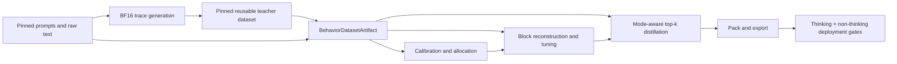

# Qwen3 Thinking-Mode Quality Recovery

Status: implemented; real-model promotion gates pending

Audience: compression researchers, dataset/evaluation owners, runtime engineers, and release reviewers

## 0. Implementation status

The mode-aware recovery slice is implemented in the rewrite:

- `ReasoningMode`, `ChatReasoningMode`, and `BehaviorSliceConfig` make training, evaluation, and runtime mode
  selection explicit.
- The Qwen3 chat behavior adapter renders the pinned template with an explicit `enable_thinking` value and rejects
  empty thinking traces, non-empty non-thinking spans, missing answers, and prompt-prefix drift.
- Schema-2 calibration artifacts persist aligned token roles, mode IDs, response-target masks, weights, ordered
  record hashes, per-slice summaries, and rendering-policy identity. Schema-1 artifacts remain readable and
  mode-unaware.
- Conversational records are packed without splitting; over-length records are rejected. Hash-partitioned `train`,
  `quick`, and `final` selections prevent the prepared evaluation slice from overlapping training by content.
- `tools/build_teacher_dataset.py` now moves teacher response generation out of individual compression runs. It
  creates a small pinned subset (512 accepted records per mode by default), publishes separate thinking and
  non-thinking Hugging Face configurations, resumes from the existing per-attempt journal, and uses promoted
  Unsloth BF16 GGUF teachers such as `unsloth/Qwen3-8B-GGUF`. A larger Qwen family member can be the explicit
  teacher. See
  [Reusable Teacher-Response Dataset Builder](38-reusable-teacher-dataset-builder.md).
- A consuming Qwen recipe reads the uploaded complete `messages` turn directly and has no
  `teacher_trace_generation` setting. The uploaded dataset revision, teacher source/revision, prompt source/revision,
  and mode remain identity-bearing. Existing inline-generation recipes remain reproducible until their replacement
  dataset has been generated, reviewed, uploaded, and pinned.
- Teacher generation is deterministic greedy decoding and separately resumable. Every attempted prompt is durably
  journaled; accepted prompt/response hashes and complete turns are committed in an immutable
  `teacher-trace-dataset` artifact. Train, quick, and final partitions have distinct identities.
- Top-k teacher caches, resumable checkpoints, and global-tuning identities include the response-target policy.
  Weighted KD consumes the prepared assistant-response mask while legacy recipes retain their original objective.
- PyTorch and llama.cpp quality paths score held-out thinking and non-thinking response tokens independently and
  enforce the configured cross-mode NLL degradation guard.
- Runtime benchmarks accept `source_default`, `thinking`, or `non_thinking`; explicit modes fail closed on an
  unsupported model family.
- `tools/audit_qwen3_behavior.py` records the exact pinned prompt tokens and audits role/mode counts in a prepared
  calibration artifact before CUDA work.
- Experiment 030's retained teacher-generated UltraChat result remains immutable historical evidence. Experiment 031
  was never run. A future confirmation should consume a reviewed, pinned reusable dataset instead of regenerating
  teacher turns inside the compression run.
- Experiments 030 and 031 retain 1,024-token held-out reasoning windows to admit more complete generated responses.
  PyTorch scores these long, vocabulary-wide records one sample at a time independently of the WikiText batch size,
  bounding the logits and FP32 cross-entropy workspace on 12 GiB devices.

The archived pre-change Experiment 030 attempt used `open-r1/OpenR1-Math-220k` at revision
`e4e141ec9dea9f8326f4d347be56105859b2bd68`. It remains only for reproducibility because its math-only selection
caused the observed specialization. The completed Experiment 030 used
`HuggingFaceH4/ultrachat_200k` at revision `8049631c405ae6576f93f445c6b8166f76f5505a` and generated both modes
inline. The selected forward path builds and pins that teacher-response corpus once for reuse.

This implementation does not close the issue by itself. A paired BF16/control diagnostic, generated mode-compliance
and objective-task suites, teacher-trace 0.6B canary, 8B confirmation, artifact audit, and publication review remain
real-model gates under Sections 9, 10, and 14.

## 1. Decision summary

Qwen3 compression runs must become explicitly aware of the model's two chat behaviors. A Qwen3 artifact may be
advertised as dual-mode only after it has been calibrated and tuned on a token-balanced mixture containing:

- raw language tokens;
- Qwen3-formatted non-thinking conversations with the empty thinking preamble;
- Qwen3-formatted thinking conversations with non-empty reasoning traces generated by, or otherwise aligned with,
  the pinned BF16 source model.

The same mode distinction must be represented in dataset identities, model-level distillation targets, runtime prompt
rendering, and evaluation results. Thinking and non-thinking quality are separate release gates; they must not be
averaged into one score.

Existing Qwen3 artifacts trained on the current empty-thinking mixture are not repaired by changing a runtime flag.
Until replacement artifacts pass both gates, their documentation should explicitly recommend non-thinking mode and
state that thinking mode is unsupported. Replacement runs must receive new experiment numbers and rebuild every
data-dependent compression stage.

## 2. Problem

Qwen3 is a hybrid reasoning model. Its source chat template supports two generation prefixes:

```text
thinking:
<|im_start|>assistant\n

non-thinking:
<|im_start|>assistant\n<think>\n\n</think>\n\n
```

Thinking is the source model's default. In a completed thinking conversation, the assistant sequence contains a
non-empty `<think> ... </think>` span before the final answer. In a completed non-thinking conversation, that span
is empty.

The completed-chat behavior has an additional consequence for data preparation: Qwen3 preserves reasoning content
only for the assistant response after the final user turn. Earlier assistant reasoning is intentionally omitted when
a multi-turn record is rendered. A generic multi-turn reasoning dataset can therefore contain valid source fields
while still producing no reasoning tokens in the prepared sequence. The formatter must validate rendered tokens,
not infer success from source fields.

The current Qwen3 recipes inherit the Gemma-era 50/50 UltraChat and WikiText preparation path in
[hf_calibration_dataset.py](../src/nanoquant/infrastructure/hf_calibration_dataset.py). UltraChat records do not
provide `reasoning_content`. When the pinned Qwen3 tokenizer formats those completed assistant messages, it emits an
empty thinking span. WikiText contributes raw text and no chat-mode behavior. Consequently the compression input
contains no representative Qwen3 reasoning trajectories.

That one token tensor is used to shape several behaviors:

1. activation statistics and rank/allocation decisions;
2. layer and block reconstruction/tuning;
3. model-level top-k distillation when that stage runs.

The model can therefore have acceptable reconstruction on raw and non-thinking tokens while accumulating error on
the longer activation trajectory entered in thinking mode. Autoregressive error then compounds inside the reasoning
span. The existing WikiText and multiple-choice quality protocol does not generate from Qwen3's chat template in
both modes, so it cannot detect this failure before publication.

[Experiment 028](../Results/028/028-compress-and-benchmark-qwen3-0-6b-quality.md) illustrates both blind spots: its
retained calibration receipt names only UltraChat and WikiText, and its completed report contains WikiText perplexity
plus continuation-scored multiple-choice tasks but no mode-aware generation result. A `completed` report therefore
does not prove usable thinking behavior.

## 3. Goals

This design must:

- preserve the pinned BF16 Qwen3 model's ability to switch modes without producing two unrelated artifacts;
- recover thinking quality without silently regressing non-thinking and raw-language quality;
- make the behavioral data and chat-template policy content-addressed and reproducible;
- keep model-family behavior out of generic calibration, factorization, and tuning math;
- evaluate the actual exported GGUF as well as the source and frozen PyTorch representations;
- fail closed when a template, mode policy, trace corpus, or generation protocol changes;
- leave non-hybrid model recipes, prepared inputs, and evaluation cache identities byte-identical unless their
  configuration explicitly opts into the new behavior contract;
- support bounded, resumable preparation and training for the 8B workload.

## 4. Non-goals

This work does not:

- change Qwen3's source default from thinking to non-thinking;
- invent reasoning traces by wrapping ordinary answers in `<think>` tags;
- expose or require hidden reasoning for model families that do not define it;
- treat a general perplexity improvement as proof of reasoning recovery;
- change NanoQuant's factorization format or GGUF tensor layout;
- reuse Experiment 028/029 data-dependent artifacts under a new behavioral recipe.

## 5. Required invariants

The implementation must enforce these invariants before any CUDA work starts:

1. `thinking` samples contain at least one assistant turn with a non-empty reasoning span.
2. `non_thinking` samples contain the Qwen3 empty reasoning preamble and no non-empty reasoning span.
3. `raw` samples contain neither an injected chat prefix nor a claimed reasoning mode.
4. The rendered prefix for each mode matches the pinned tokenizer byte-for-byte.
5. Every assistant target position is attributable to prompt, reasoning, final-answer, delimiter, or end-of-turn
   content.
6. Train, quick-decision, and final-evaluation prompts and traces have distinct partition identities and no content
   overlap.
7. A cached dataset or teacher-target artifact is reusable only under the same source-model revision, tokenizer
   revision and content, chat-template arguments, behavior profile, trace-generation protocol, and ordered samples.
8. A dual-mode release passes independent thinking and non-thinking gates through the deployment runtime.
9. A rendered conversational training unit is never split across fixed-length windows. A thinking unit contains its
   prompt, opening delimiter, non-empty reasoning, closing delimiter, final answer, and end-of-turn token.
10. Adding thinking data does not silently reduce the current absolute raw-text or non-thinking valid-token budget.

## 6. Behavioral data design

### 6.1 Explicit modes

Add a model-integration concept rather than scattering Qwen checks through the pipeline:

```python
class ReasoningMode(StringEnum):
    RAW = "raw"
    THINKING = "thinking"
    NON_THINKING = "non_thinking"


@dataclass(frozen=True, slots=True)
class BehaviorSliceConfig:
    name: str
    mode: ReasoningMode
    source: DatasetSourceConfig
    record_format: str
    target_valid_token_fraction: float
    assistant_target_weight: float = 1.0
    prompt_target_weight: float = 0.0
    partition: str = "train"
    minimum_valid_tokens: int | None = None
    teacher_trace_generation: TeacherTraceGenerationConfig | None = None
```

`BehaviorSliceConfig` belongs with dataset preparation configuration. Generic numerical stages consume prepared
tensors and masks; they do not branch on `qwen3`.

The Qwen adapter supplies a `ChatBehaviorPort` that:

- declares whether the model supports switchable reasoning;
- renders messages with an explicit mode;
- identifies reasoning delimiters and assistant boundaries;
- validates completed conversations;
- returns a stable rendering-policy identity.

For unsupported families, only `raw` or the family's ordinary chat behavior is valid. Selecting a reasoning mode for
such a model is a configuration error.

Evaluation configuration uses an explicit tuple of requested modes, for example
`evaluation.reasoning_modes=(THINKING, NON_THINKING)`, rather than a Qwen-specific boolean. The empty/default value
preserves the existing evaluator and cache identity for non-hybrid recipes. A requested mode is validated against
the adapter before task preparation.

### 6.2 Initial Qwen3 mixture

The first recovery experiment should use the following valid-token targets:

| Slice | Target share | Purpose |
| --- | ---: | --- |
| Raw pinned WikiText/general text | 25% | Preserve language modeling and broad activation coverage |
| Qwen3 non-thinking conversations | 25% | Preserve concise instruction following and the empty-span transition |
| Qwen3 thinking conversations | 50% | Cover reasoning delimiters, long reasoning trajectories, and final answers |

These are token fractions, not record fractions. Thinking responses are longer, so record-count weighting would let
their variable lengths determine the effective recipe accidentally. The materializer should select and pack records
until each slice reaches its valid-token budget, then deterministically interleave windows.

The mixture is additive to the current control workload. Let `C_raw` and `C_non_thinking` be the valid-token counts
in the retained control and `f_raw` and `f_non_thinking` their fractions in the proposed mixture. The new total token
budget must satisfy:

```text
new_total >= max(C_raw / f_raw, C_non_thinking / f_non_thinking)
```

For the initial 25/25/50 proposal, preserving both halves of the current 256-by-2048 control implies approximately
twice the total valid-token budget. Experiment 030 reserves 528 windows so indivisible-record packing can meet
explicit 262,144-token floors for both raw and non-thinking slices; preparation fails if either floor is missed.
The 0.6B canary should establish whether a smaller budget preserves the same
quality, but a lower-cost run must be labeled as an ablation rather than described as additive coverage. The accepted
8B recipe records both target fractions and absolute per-slice token counts.

The 25/25/50 mixture is an initial recipe, not a permanent universal constant. Ablations may move it, but every
change creates a new dataset and run/experiment identity. Promotion must show the quality tradeoff in all three
slices.

### 6.3 Teacher-generated chat responses

A thinking prompt alone is not thinking training data. The prepared sequence must contain the source model's
reasoning rollout and final answer.

The selected source is responses generated by an explicitly pinned BF16 teacher from pinned UltraChat prompts. The
teacher may be the exact source checkpoint when the goal is source-model matching, or a larger member of the same
model family when the goal is deliberate teacher transfer. Those are different experimental claims and must retain
different dataset identities, names, and quality baselines. External reasoning corpora remain useful for explicit
ablations, but are not the default: OpenR1 demonstrated that a structurally valid, math-heavy trace corpus can still
specialize the compressed model to a narrow task family.

Generate these turns once with `tools/build_teacher_dataset.py`, review the bounded corpus, upload it as a Hugging
Face dataset, and pin the resulting dataset commit in compression recipes. The default 512 accepted records per mode
is a small deterministic subset of UltraChat rather than a 200,000-response generation job. Separate `thinking` and
`non_thinking` configurations preserve the mode boundary while allowing the same uploaded corpus to be shared by
multiple compression runs.

For each UltraChat record, preserve the conversation prefix through its final user turn and discard the dataset's
final assistant response. Render that prefix with `enable_thinking=True`, then generate until the source model emits
its recognized end-of-turn token. The accepted assistant turn must come wholly from that one generation. Never
combine a generated thinking span with UltraChat's original answer; that creates a transition the teacher never
produced and can make the reasoning and answer contradict one another.

For BF16-generated traces, persist a manifest and per-run receipt containing:

- source model and revision;
- tokenizer files, revision, and chat-template hash;
- explicit `enable_thinking=True`;
- prompt dataset revision, partition, ordered IDs, and content hashes;
- system prompt and tool declarations, if any;
- generation configuration, stop tokens, maximum prompt/response lengths, seed, and implementation version;
- rendered prompt-token hash and generated response-token hash per record;
- termination reason and validation result.

Use the declared BF16 teacher, not candidate-model self-generated traces. Candidate traces would make early
quantization errors part of the target distribution. When a larger family member is selected, reports must compare
against that larger teacher in addition to the uncompressed student-sized source. Sampling may be added in a future
separately identified ablation, with all parameters and per-record seeds explicit. The implemented default is
deterministic greedy decoding with one beam and no sampling.

Teacher generation has two explicit, identity-bearing implementations. The retained
`hf-greedy-qwen3-v1` path loads the pinned checkpoint through Transformers and generates one prompt at a time so
existing receipts remain reproducible. New Qwen 0.6B interactive runs use
`llamacpp-server-greedy-qwen3-v1`: convert the same pinned checkpoint once to a BF16 GGUF in the ignored local
teacher-model cache, start the pinned local `llama-server` with four continuously batched slots, and issue concurrent
greedy completions. Requests pass the Hugging Face-rendered prompt as raw token IDs and require raw generated token
IDs in return. Prompt caching and every sampling or repetition penalty are disabled. Startup compares representative
llama.cpp and Hugging Face tokenizer results; every response still passes the complete-token template round trip,
EOS, mode-delimiter, and sequence-length checks below. The backend name participates in trace and experiment
identity, so switching runtimes cannot silently reuse or overwrite evidence from the serial implementation.

The llama.cpp server owns the normal cross-process device lease for its complete lifetime. Conversion and server
startup emit progress events, the converted BF16 GGUF is reused only when its snapshot/converter signature and size
match, requests reject context truncation or changed prompt-token counts, and accepted/rejected attempts are flushed
to the existing source-ordered journal. A batch may finish concurrently, but journal and artifact order remains the
deterministic UltraChat source order. A crash can repeat an uncommitted in-flight batch; it cannot skip a source
record or commit a partial assistant response.

Reject traces with missing or empty thinking spans, missing final answers, non-finite source logits, truncation before
the final answer, repeated delimiter loops, or an unrecognized termination. Retain rejection counts and reasons.
Do not silently replace rejected thinking records with ordinary answers.

Generated tokens are parsed into one structured final assistant response and immediately rendered again through the
pinned adapter. A record is accepted only if that round trip preserves the generated token sequence, apart from
template-added trailing structural whitespace. This prevents double-wrapping and proves that calibration consumes
the complete reasoning and answer emitted by the teacher.

The resumable state is append-only:

1. Hash the full UltraChat source record and rendered generation prompt.
2. Skip source hashes already present in the matching journal.
3. Generate one complete source-model assistant response.
4. Validate EOS termination, one non-empty thinking span, a non-empty final answer, sequence-length fit, and template
   round-trip identity.
5. Flush and `fsync` the accepted or rejected attempt before moving to another prompt.
6. Once the requested partition count is complete, commit the accepted records and ordered hashes as a
   content-addressed artifact and write a small active receipt.

The journal identity includes teacher source and revision, prompt dataset source/revision/split/partition, mode,
chat-policy hash, sequence length, seed, generation implementation, and token limits. Record count is deliberately
not semantic: preparation may extend the same deterministic ordered corpus when complete-record packing has not yet
met its token floor. Each committed artifact and active receipt records its actual count. A crash or count extension
resumes the same identity; any semantic change starts a different journal and invalidates downstream calibration.

Changing a numbered experiment after its resident run has completed also changes the run configuration hash. The
old resident manifest must not be combined with the new calibration identity. Before starting expensive preparation,
resolution fails with an instruction to run `tools/rollover_completed_experiment.py`. The tool is dry-run by
default, archives the old run plus its `outputs/NNN` and `Results/NNN` trees, and creates a fresh canonical run
directory. If a complete calibration receipt already matches the new configuration, as can happen when upgrading a
mixed directory created by older code, the tool validates and retains only that receipt's transitive artifact graph
and teacher-trace journal. Otherwise the fresh run starts without calibration and prepares it normally. The archived
resident evidence is never deleted or treated as resumable under the new configuration.

### 6.4 Record-aware packing

Conversation records are rendered independently and then packed as indivisible units. Deterministic bin packing may
place multiple complete short teacher conversations in a window with explicit end-of-turn boundaries, but it never
splits or splices a teacher response. Empty bins receive one record before best-fit filling, and generation expands
resumably until packing meets the slice's absolute valid-token floor. Thus concise non-thinking teacher answers do
not silently reduce the retained non-thinking token budget. Raw-text slices continue to use ordinary deterministic
stream windows.

A conversational record longer than `model.sequence_length` is not truncated mid-reasoning. For generated traces,
the generation protocol should reserve space for the prompt, delimiters, final answer, and end-of-turn token and stop
or reject the record when that complete form cannot fit. For external traces, select a complete bounded record or
reject it. This is stricter than activation-only cropping because the same artifact also supplies next-token
distillation targets and final-answer transition coverage.

Preparation reports include accepted/rejected length distributions, packing utilization, complete-record count, and
the number of windows containing each delimiter and token role. These measurements expose a corpus that meets its
record ratio while losing most useful reasoning tokens to length filtering.

### 6.5 Non-thinking records

Non-thinking records use the same pinned UltraChat prompt distribution, rendered with `enable_thinking=False`.
Their generation prefix includes Qwen3's empty `<think></think>` preamble, and the complete final answer is generated
by the same pinned BF16 source model used as the distillation teacher. UltraChat's original final assistant response
is discarded rather than mixed with the teacher's behavior. The accepted record must terminate normally, contain a
non-empty answer, emit no additional thinking delimiters, and round-trip through the adapter's empty-span invariant.

Using matched prompts for thinking and non-thinking slices makes mode-specific activation and quality differences
measurable without conflating them with prompt selection.

### 6.6 Prepared artifact

Replace the implicit “one tensor means one behavior” contract with a versioned prepared artifact:

```text
BehaviorDatasetArtifact
  input_ids
  attention_mask
  token_role_ids          # prompt, reasoning, answer, delimiter, raw, padding
  reasoning_mode_ids      # raw, thinking, non-thinking
  distillation_target_mask
  distillation_weights
  ordered_record_receipts
  slice summaries
  identity
```

Activation calibration and reconstruction may consume all valid tokens. Model-level distillation uses the explicit
target mask and weights. By default it trains on assistant response targets, including the first generated token,
reasoning delimiters, reasoning tokens, final-answer tokens, and end-of-turn token. Prompt-token distillation is
disabled initially because it spends capacity predicting user text rather than preserving response behavior; an
ablation may enable it with a lower weight.

Reports must show valid tokens and target tokens by slice and role. A nominal 50% thinking slice that loses most of
its response tokens to truncation must fail preparation rather than pass based on record count.

The existing schema-1 `calibration-dataset-manifest` remains readable but is classified as `mode_unaware`. It cannot
satisfy a Qwen3 dual-mode run. Do not reinterpret or mutate old receipts.

## 7. Pipeline integration



### 7.1 Calibration and allocation

Calibration statistics should be accumulated over the complete token-balanced mixture. In addition to the canonical
aggregate statistics, diagnostics should report per-mode activation range, clipping, zero fraction, and layer
sensitivity. Planning still consumes one canonical `CalibrationStats`, but a large mode disparity becomes an
actionable warning rather than an invisible average.

If thinking activations require materially different ranks in particular layers, compare:

- aggregate planning on the mixed corpus;
- worst-mode planning, where layer sensitivity is the maximum normalized sensitivity across modes;
- a constrained allocator that prevents either chat mode from exceeding its reconstruction-error budget.

Start with aggregate planning to isolate the data fix. Promote a mode-aware allocator only if the 0.6B ablation shows
that mixed data plus distillation is insufficient.

### 7.2 Block tuning

Logical batches must be deterministically stratified so a batch or epoch cannot accidentally contain only raw or
non-thinking samples. Physical microbatch changes made by adaptive memory planning must preserve the logical sample
order and mode proportions.

Block snapshot metrics should be emitted both in aggregate and by mode. Best-state selection uses the configured
worst allowed mode regression, not aggregate loss alone; otherwise the larger or easier slice can hide a thinking
regression.

### 7.3 Model-level distillation

Top-k teacher targets must be regenerated over the new behavior artifact. Existing target caches are incompatible.
The cache identity must include the target mask and weights in addition to token IDs.

Report teacher/student loss separately for:

- the transition into thinking or the empty non-thinking preamble;
- reasoning tokens;
- final-answer tokens after a reasoning span;
- non-thinking answer tokens;
- raw-language tokens when enabled as targets.

Global tuning is required for a dual-mode release unless an experiment demonstrates that disabling it passes the
same gates. A configured-but-absent global-tuning result is not sufficient.

### 7.4 Resume and invalidation

Changing from the current mode-unaware dataset invalidates:

- calibration tokens and statistics;
- objectives and quantization plan;
- rank probes and factorization results;
- block tuning and global distillation;
- logical, packed, checkpoint, and GGUF exports;
- all model-bound quality results.

The source snapshot and model-independent evaluation task inputs may be reused after identity validation. New Qwen3
runs must not adopt old block commits from a shared artifact store. If implementation adds mode-weighted resident
loss or best-state semantics, increment `RESIDENT_ALGORITHM_VERSION`; a data-only recipe change must still produce a
new preparation/config identity.

## 8. Runtime contract

Every user-facing chat renderer should accept:

```python
class ChatReasoningMode(StringEnum):
    SOURCE_DEFAULT = "source_default"
    THINKING = "thinking"
    NON_THINKING = "non_thinking"
```

For Qwen3, `SOURCE_DEFAULT` resolves to thinking, preserving source behavior. Transformers and llama.cpp adapters must
produce identical prompt token IDs for the same messages and explicit mode. A backend that cannot express the
selected mode must fail with an unsupported-mode diagnostic rather than silently use its default.

The runtime owns prompt rendering; the generation engine continues to consume token IDs and remains model-agnostic.
Mode is recorded in benchmark and evaluation identities. Slash directives such as `/think` and `/no_think` remain
ordinary user content interpreted by Qwen3; the runtime must not rewrite them. Multi-turn tests verify that they do
not leak a prior turn's mode unexpectedly.

Do not modify the tokenizer template embedded in a replacement GGUF merely to hide a weak thinking model. New
dual-mode artifacts retain the source template and default. For existing affected artifacts, documentation is the
safe mitigation: show `enable_thinking=False`, identify thinking mode as unsupported, and avoid a dual-mode claim.

## 9. Evaluation and release gates

### 9.1 Three paired representations

Use identical prepared prompts to evaluate:

1. the pinned BF16 source through Transformers;
2. the frozen NanoQuant model through the reference PyTorch path;
3. the exported GGUF through the pinned llama.cpp runtime.

The deployment result is authoritative for release. The frozen path localizes export/runtime defects when it differs
from GGUF.

### 9.2 Mode-aware suites

Each evaluation tier includes both explicit modes. Before running generated tasks, the cheap evaluator scores
teacher-forced next-token likelihood on disjoint held-out thinking and non-thinking conversations. It reports
delimiter, reasoning, final-answer, and end-of-turn NLL separately. Quick-decision and final-evaluation records come
from partitions that are disjoint from trace generation and calibration; a partition-version change invalidates the
prepared evaluation inputs.

| Dimension | Thinking gate | Non-thinking gate |
| --- | --- | --- |
| Prompt conformance | Exact pinned thinking prefix and token IDs | Exact empty-thinking prefix and token IDs |
| Mode compliance | Non-empty, balanced delimiters; final answer present | No non-empty or visible reasoning; final answer present |
| Objective quality | Math, logic, code, and multi-step exact-answer/pass tests | Concise instruction following and general QA |
| Fidelity | Response-token NLL/KL and top-k agreement, split into reasoning and answer spans | Response-token NLL/KL and top-k agreement |
| Stability | No loops, delimiter corruption, premature truncation, or non-finite logits | No loops, delimiter leakage, or non-finite logits |
| Runtime | TTFT, decode speed, response length, and memory | Same metrics under the non-thinking prefix |

Add matched-prompt switch tests:

- same prompt with hard thinking on and off;
- `/think` and `/no_think` soft switches;
- multi-turn thinking to non-thinking and non-thinking to thinking;
- a final answer after a long thinking span near the supported context limit.

The smoke tier first runs this suite against the existing Experiment 028 artifact and the pinned BF16 source. That
control quantifies the current gap and proves that the evaluator detects it before the new data recipe is allowed to
claim improvement. Captured generations are useful diagnostics, but deterministic compliance and objective task
results—not human inspection alone—gate promotion.

Generation scoring should prefer objective answers, executable code tests, and deterministic format checks. If a
judge model is used for open-ended prompts, pin its model/revision, prompt, decoding, and raw judgments, and keep the
objective subset as the hard gate.

### 9.3 Initial promotion thresholds

First measure the BF16 source before inspecting a candidate, then freeze the exact thresholds in the experiment
definition. Recommended starting gates are:

- 100% prompt-token parity between the two runtime renderers;
- zero malformed thinking delimiters or non-finite generations;
- candidate mode-compliance rate no more than 1 percentage point below BF16;
- thinking reasoning-task aggregate at least 95% of the BF16 aggregate;
- non-thinking instruction/task aggregate at least 95% of the BF16 aggregate;
- no individual critical task more than 10 percentage points below BF16;
- for teacher-forced NLL, the thinking degradation ratio
  `R_thinking = candidate_thinking_nll / bf16_thinking_nll` may not exceed
  `1.10 * R_non_thinking`; the final margin is frozen after the control measurement and before inspecting the fixed
  candidate;
- non-thinking results must also remain within the predeclared paired confidence/noise bound of Experiment 028 so
  the repair does not exchange an existing behavior for thinking quality; Experiment 028 is a regression control,
  never a substitute for the BF16 acceptance baseline;
- generic WikiText and legacy multiple-choice gates remain in force;
- no mode-specific response-token NLL regression hidden by an improved aggregate.

If the BF16 source itself misses a compliance floor, report that separately and use paired retention rather than
claiming the compressed model can exceed the source contract. Threshold revisions after candidate inspection require
a new documented experiment.

## 10. Implementation sequence

### Phase A — Characterize and mitigate

1. Add a small diagnostic that renders the pinned Qwen3 template in both modes and audits the current calibration
   tensor for empty/non-empty thinking spans.
2. Land the held-out per-mode NLL, prompt-conformance, and generation-smoke evaluators before changing the training
   data.
3. Run a paired BF16 versus Experiment 028 evaluation to quantify the observed gap and prove that the new gate fails
   the affected artifact.
4. Update affected publication text to recommend non-thinking mode; do not overwrite retained evidence.

### Phase B — Contracts and preparation

1. Add reasoning-mode enums, behavior-slice configuration, and the `ChatBehaviorPort`.
2. Implement Qwen3 rendering, delimiter parsing, token-role masks, and strict invariants.
3. Implement resumable BF16 trace generation and the versioned behavior artifact.
4. Add semantic hashes and fail-closed reuse rules.

### Phase C — Training integration

1. Feed the mixed artifact into calibration and block tuning.
2. Add deterministic per-mode stratification and per-mode metrics.
3. Extend top-k distillation with role masks/weights and regenerate teacher caches.
4. Validate interruption/resume equivalence at trace, block, and distillation-epoch boundaries.

### Phase D — Evaluation and canary

1. Promote the Phase A smoke evaluators to the standard/full prompt-parity, mode-compliance, paired-logit, and
   generated-task suites.
2. Run the updated Experiment 030 definition as the UltraChat teacher-output 0.6B recovery canary. Retain
   Experiment 028 and the pre-change Experiment 030 artifacts as controls; do not adopt their data-dependent
   commits.
3. Select the smallest recipe that passes both mode gates at the same BPW without reducing the declared control token
   coverage.
4. Use the updated Experiment 031 definition to confirm the accepted UltraChat teacher-output recipe at 8B,
   retaining Experiment 029's serial llama.cpp quality policy where that measured CUDA constraint still applies.
5. Publish a replacement artifact and model card only after the 8B GGUF deployment gates pass.

### Phase E — Publication migration

Retained local Results 028/029 and pre-change Experiment 030 artifacts, receipts, reports, and evidence are immutable
historical records. A fixed artifact receives new configuration and content hashes. In an existing Hugging Face
repository, publish it as a new commit with an explicitly versioned filename or release revision, make the corrected
artifact the model card's recommended download, and label the old file as legacy output. Do not rewrite an old local
receipt or imply that its hash now names corrected bytes.

The replacement keeps the source tokenizer chat template and thinking default. Until it lands, model cards show
`enable_thinking=False` and relevant deployment-runtime controls as a reversible mitigation; they must not rewrite
the embedded GGUF template to force non-thinking behavior.

## 11. Test plan

### Unit tests

- exact thinking and non-thinking rendering against the pinned Qwen3 template;
- completed multi-turn rendering proves that only the assistant response after the final user retains reasoning;
- reasoning-span parsing, including malformed, nested, empty, truncated, and multi-turn cases;
- valid-token fraction allocation independent of response length;
- additive budget resolution preserves the control's absolute raw and non-thinking valid-token counts;
- record-aware packing never splits a conversation and rejects an over-length incomplete trace;
- role masks align with next-token targets and exclude padding;
- content identity changes for mode, template kwarg, trace, mask, weight, or generation change;
- mode-aware logical batching remains invariant under physical microbatch splitting.

### Contract tests

- Qwen3 adapter advertises dual-mode support; other adapters reject unsupported modes;
- generic calibration/tuning modules never import Qwen tokenizer classes;
- a non-hybrid recipe produces byte-identical prepared inputs and evaluation identities before and after the feature;
- schema-1 mode-unaware artifacts remain readable but cannot satisfy dual-mode validation;
- Transformers and llama.cpp prompt token IDs match for both modes.

### Integration tests

- tiny Qwen3 fixture completes mixed calibration, block tuning, distillation, export, and both evaluation modes;
- interrupted trace generation and distillation resume bit-for-bit;
- a changed reasoning trace cannot reuse old calibration or teacher targets;
- an intentionally empty “thinking” corpus fails before model loading;
- a corpus whose reasoning records are all removed by length validation fails its token-budget contract;
- a candidate that passes aggregate loss but fails thinking loss is rejected.

### Real-model gates

- pinned Qwen3 0.6B BF16/source, frozen, and GGUF paired comparison;
- mode-aware ablation at the target BPW;
- pinned Qwen3 8B complete run with artifact validation and serial fallback only where measured CUDA behavior requires
  it;
- retained quality, memory, time, BPW, artifact-byte, and resume evidence for both modes.

Tiny fixtures validate mechanics only. They cannot close the Qwen3 behavioral gate.

## 12. Risks and responses

| Risk | Response |
| --- | --- |
| Thinking traces dominate tokens and regress concise answers | Allocate by valid tokens, gate modes separately, and ablate the mixture |
| Additive thinking coverage substantially increases calibration cost | Prove the mechanism with the budget-preserving 0.6B run, then ablate total tokens without mislabeling reduced-coverage runs |
| Trace generation is expensive | Generate once from pinned BF16, commit bounded shards, and reuse only by exact identity |
| A narrow external trace corpus overfits one task family | Generate responses from pinned BF16 over broad UltraChat prompts and keep external corpora as explicit ablations |
| Long traces truncate before the answer | Reject incomplete records and report completion/token distributions |
| Multi-turn rendering strips earlier reasoning | Treat the final assistant response as the supervised reasoning unit and validate the rendered tokens |
| Empty tags are mistaken for reasoning data | Enforce a non-empty-span invariant for every thinking record |
| Aggregate tuning hides a weak mode | Stratify batches, report per-mode loss, and select best state with mode guards |
| Runtime template behavior drifts | Hash tokenizer/template content and require cross-runtime golden token IDs |
| Candidate self-generation reinforces errors | Build traces and evaluation references only from the pinned source or pinned external data |
| One compressed representation lacks capacity for both modes | Measure per-mode reconstruction; only then consider rank reallocation or, as a last resort, separately labeled artifacts |
| Reasoning data has unclear redistribution rights | Record licenses/provenance and keep generated trace artifacts private when required |

## 13. Rejected shortcuts

- **Set non-thinking as the silent default.** This reduces immediate harm but does not restore the advertised source
  behavior.
- **Add empty `<think></think>` tokens.** The current UltraChat formatting already does this; it supplies no reasoning
  trajectory.
- **Use reasoning questions with ordinary final answers.** The missing distribution is primarily the generated
  reasoning span and transition back to the final answer.
- **Concatenate traces into ordinary fixed windows.** A window that starts mid-reasoning or ends before the answer
  does not represent the source mode transition and cannot supply complete distillation targets.
- **Hold the old total token count while taking half for thinking.** That confounds recovery with removal of the raw
  and non-thinking coverage the current artifact received.
- **Run only more epochs on the current tensor.** It reinforces the same mode-unaware objective.
- **Judge recovery with WikiText perplexity.** Raw-text likelihood does not execute the chat-mode state transition.
- **Train two models immediately.** Separate artifacts may hide a capacity issue, but they should be considered only
  after a mixed-data, mode-aware distillation ablation fails.

## 14. Definition of done

The issue is fixed only when a new numbered Qwen3 experiment proves, on the actual GGUF:

- exact thinking and non-thinking prompt behavior;
- independent quality retention against the pinned BF16 source in both modes;
- correct switching in matched and multi-turn prompts;
- no malformed reasoning spans, non-finite logits, or catastrophic generation loops;
- acceptable raw-language and legacy task quality at the declared BPW;
- complete artifact validation, bounded memory, deterministic resume, and reproducible receipts.

Passing local tests, formatting a few sample prompts, or recommending `enable_thinking=False` is not completion.
