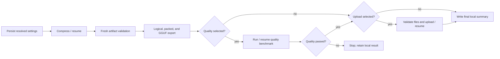

# Interactive Compression Launcher

Status: proposed

Audience: model publishers, compression operators, researchers, and maintainers

## 0. Decision summary

Add a zero-argument interactive launcher:

```powershell
.\.venv\Scripts\python.exe tools\compress_model.py
```

The launcher asks for only the choices that normally vary between production runs:

1. model;
2. target bits per parameter;
3. whether to run the quality benchmark;
4. whether to upload the validated result to Hugging Face.

Everything else comes from a versioned, promoted `RecommendedProfile` selected from the resolved model family and
capabilities. Pressing Enter always accepts the current recommended value. The launcher shows the complete resolved
summary and writes an immutable `settings.yaml` before loading calibration data or starting CUDA work.

On later invocations, the first screen offers to continue the most recent interactive run. Continuing loads the
persisted resolved configuration and workflow settings rather than applying today's defaults. Existing numerical
journals, exports, evaluation results, and upload receipts remain the authoritative resume boundaries.

This is an operator workflow, not a replacement for numbered experiments. A normal compression or publication no
longer needs a new experiment number. A new algorithm, ablation, research hypothesis, or promotion decision still
uses a numbered zero-argument experiment.

## 1. Problem

The current supported path requires a numbered launcher even when the operator is not conducting an experiment.
Changing only the model, bit target, quality choice, or Hugging Face destination requires copying a Python file,
inventing a hypothesis and experiment number, and reviewing a large resolved definition. This mixes two different
activities:

- research runs, where chronology, hypothesis, and a fixed baseline are essential;
- production-style compression runs, where the operator wants the best promoted recipe and a few explicit choices.

A generic collection of command-line flags would remove the numbered file but create a different reproducibility
problem. Shell history is not a durable recipe, omitted flags silently inherit changing defaults, and a second
invocation cannot reliably know whether it should resume or start something different.

The launcher therefore needs both interactive ergonomics and the existing immutable configuration, content identity,
artifact validation, and resume contracts.

## 2. Goals

The design must:

- make a normal compression run possible without creating an experiment;
- ask only for model, target BPW, quality, and publication choices in the common path;
- choose the latest promoted compression and execution settings by default;
- pin a floating Hugging Face model to its resolved commit before execution;
- persist both the user's selections and the complete resolved settings before expensive work starts;
- offer the most recent interactive run for continuation on the next invocation;
- resume compression, export, quality, or upload from the first incomplete valid boundary;
- preserve exact numerical settings when a run is resumed after recommended defaults change;
- keep Hugging Face credentials out of settings, manifests, logs, and receipts;
- use the same application services, artifact validation, GGUF export, quality, and upload implementations as
  numbered experiments;
- remain scriptable later without creating a second configuration or orchestration path.

## 3. Non-goals

The first version does not:

- expose every `RunConfig` field as an interactive question;
- allow settings to be edited in place and still call the operation a resume;
- silently use a generic recipe for an unsupported model architecture;
- automatically upload a model that failed a selected quality gate;
- remove or rewrite completed numbered experiment launchers;
- make “current best” a mutable module-level Python constant with no version or evidence;
- store an `HF_TOKEN`, cached login token, or other secret in the run directory;
- claim that requested allocation BPW is identical to final physical BPW.

Advanced research changes continue to use a numbered experiment or a reviewed declarative definition. A later
non-interactive mode may consume the exact same `settings.yaml`; it must not introduce parallel defaults.

## 4. User experience

### 4.1 Command

The launcher has no required arguments:

```powershell
.\.venv\Scripts\python.exe tools\compress_model.py
```

`tools/compress_model.py` is a thin terminal adapter. Prompting, profile resolution, settings persistence, discovery,
and workflow execution live in testable application/configuration services.

### 4.2 Step 0 — Offer the previous run

When at least one interactive run exists, show the most recently created one:

```text
NanoQuant interactive compression

Previous run
  Model:       Qwen/Qwen3-8B @ b968826d...
  Target:      1.00 BPW
  Profile:     qwen3-dual-mode-v1
  Quality:     yes
  Hugging Face:no
  Status:      interrupted — compression block 11 of 36 complete
  Updated:     2026-07-25 14:32 PDT

What would you like to do?
  1. Continue previous run [default]
  2. Start a new run
  3. Show previous settings and progress
  4. Choose another existing run
  5. Exit
Selection [1]:
```

Behavior by state:

- `created`, `running` with a stale lease, `interrupted`, or `failed`: option 1 resumes from the first incomplete
  stage.
- `completed` with a missing or failed requested upload: option 1 continues the publication stage.
- fully `completed`: option 1 validates the terminal receipts and prints the outputs without recompressing.
- live lease owned by another process: do not start a second worker. Replace option 1 with `Follow active progress`
  and show the owning PID/host.
- unreadable settings or corrupt authoritative state: show the diagnostic and disable continuation; never guess.

`Choose another existing run` lists only interactive runs, newest first, with model, status, current stage, and
updated time. Numbered experiments are resumed through their existing launchers or run selectors.

If no interactive run exists, go directly to Step 1.

### 4.3 Step 1 — Choose the model

Show a small catalog generated from promoted profiles, followed by a custom choice:

```text
Choose a model:
  1. Qwen/Qwen3-0.6B
  2. Qwen/Qwen3-8B
  3. google/gemma-3-1b-it
  4. meta-llama/Llama-3.2-1B-Instruct
  5. Enter another Hugging Face model ID or local snapshot
Selection [1]:
```

The entries are data-driven; the terminal code does not hard-code this list. The default is:

1. the model from the last successfully created interactive run, when that model still has a promoted profile;
2. otherwise the catalog's explicitly declared default model.

For option 5, prompt:

```text
Model ID or local snapshot:
```

An optional exact revision may be entered as `owner/model@revision`. Without one, the resolver looks up the current
Hub commit. Before continuing, it resolves and displays:

```text
Resolved model
  Source:       Qwen/Qwen3-8B
  Revision:     b968826d9c46dd6066d109eabc6255188de91218
  Architecture: qwen3
  Blocks:       36
  Context used: 2048
  Profile:      qwen3-dual-mode-v1
```

The full commit, tokenizer revision, source snapshot identity, block count, runtime family, and relevant model
capabilities are persisted. A gated or inaccessible model fails here with an authentication/action message, before
CUDA work.

Profile matching is most-specific-first:

1. exact model/revision rule;
2. supported architecture/family rule;
3. explicitly promoted generic dense-transformer fallback.

If no compatible promoted profile exists, explain why and offer `Return to model selection` or `Exit`. A generic
fallback may be offered only when its capability checks pass and must be explicitly confirmed. It is never described
as the model's best-known profile.

For Qwen3, the promoted default must be the dual thinking/non-thinking behavior profile from the Qwen3 recovery
design. Falling back to the older mode-unaware calibration recipe is not allowed.

### 4.4 Step 2 — Choose target bits per parameter

Prompt:

```text
Target bits per parameter (BPW) [1.00]:
```

The displayed default comes from the selected promoted profile, currently 1.00 for the existing production
templates. Accept a finite positive decimal that passes planning validation. This value maps to
`allocation.target_bpw`.

The confirmation screen must distinguish:

- requested allocation target;
- estimated physical BPW after fixed sidecars and promoted rank policies, when planning can estimate it;
- measured effective BPW, which is reported only after compression.

Maximum-rank layers, embeddings/output quantization, metadata, and uncharged experimental sidecars can make final
physical BPW differ from the requested allocation target. The UI must not relabel the request as a guaranteed final
file-wide bit rate.

### 4.5 Step 3 — Choose whether to run quality

Prompt:

```text
Run the recommended quality benchmark after export? [Y/n]:
```

Default: `yes`.

When enabled:

- use the profile's promoted evaluation protocol;
- evaluate the actual exported GGUF with the pinned llama.cpp implementation when the family supports it;
- retain the BF16/source comparison and machine-readable inputs;
- use serial GGUF scoring automatically for a model/profile where parallel scoring is known to be unstable;
- run both explicit thinking and non-thinking gates for Qwen3;
- prevent Hugging Face upload when the selected gate fails;
- persist and cache evaluation by the existing model, input, scorer, runtime, and protocol identities.

When disabled:

- still run all structural, hash, packing, GGUF, and loadability validation;
- skip the expensive quality dataset preparation and scoring;
- record `quality_requested: false` in settings, summaries, and any model card;
- never imply that quality passed.

Small inline numerical health checks that are part of the promoted compression profile remain enabled. This question
controls the post-export quality benchmark, not internal corruption checks.

### 4.6 Step 4 — Choose whether to upload to Hugging Face

Prompt:

```text
Upload validated outputs to Hugging Face when local stages finish? [y/N]:
```

Default: `no`, because upload changes external state.

When enabled, ask:

```text
Repository [<authenticated-owner>/<model-slug>-nanoquant-GGUF]:
Visibility:
  1. Private [default]
  2. Public
Selection [1]:
Commit message [Publish NanoQuant <model> at <target> BPW]:
```

The repository default is derived from the authenticated account and normalized model slug. The operator may enter
an organization repository. Validate the repository ID and authenticate before starting expensive work, but defer
repository creation and upload until all selected local gates pass. Authentication preflight must not create an
empty repository.

If quality is disabled and upload is enabled, show:

```text
Warning: this artifact will be published without a quality benchmark.
The model card will state that quality was not evaluated.
Continue with upload? [y/N]:
```

This second confirmation defaults to `no`. If accepted, publication still requires complete compression, fresh
artifact validation, successful GGUF export, and a model card that explicitly says `quality not run`.

The settings file stores repository ID, requested visibility, and commit message. It never stores a token.
`HF_TOKEN` or the standard cached Hugging Face login is resolved at execution time. Expired credentials or a failed
Hub commit leave only the upload stage incomplete, so the next invocation can retry without recompression or
reevaluation.

### 4.7 Step 5 — Review and confirm

Show one complete, concise summary:

```text
Ready to create run
  Model:              Qwen/Qwen3-8B
  Revision:           b968826d9c46dd6066d109eabc6255188de91218
  Recommended profile:qwen3-dual-mode-v1
  Profile evidence:   Experiments 030/031
  Target BPW:         1.00
  Calibration:        528 x 2048, raw/non-thinking/thinking
  Executor:           adaptive throughput, logical tuning batch 32
  Quality benchmark:  yes, GGUF, thinking + non-thinking
  Hugging Face upload:no
  Run directory:      evidence/interactive/<run-name>
  Results directory:  Results/interactive/<run-name>

  1. Start [default]
  2. Show full resolved settings
  3. Go back
  4. Cancel
Selection [1]:
```

The advanced configuration is visible but not prompted field by field. `Show full resolved settings` renders the
same canonical object that will be written to disk.

On `Start`, atomically write settings and register the run before dataset preparation, source-model loading, or CUDA
allocation. Print the settings path immediately so an operator can reproduce or inspect the run.

### 4.8 Step 6 — Execute

The selected workflow is:



Every long stage emits the existing progress and heartbeat events. `Ctrl+C` requests interruption and closes the
session when possible. Process death, OOM, or host restart is handled by the durable commit and identity contracts,
not by relying on the prompt process to remain alive.

## 5. Recommended profile catalog

### 5.1 Why a catalog is required

“Use current best settings” cannot mean importing the latest numbered experiment or copying whichever launcher has
the highest number. Some experiments are ablations, some use deliberately reduced settings, and some contain
model-specific evidence that is invalid for another family.

Add a versioned promoted-profile catalog, loaded through the canonical configuration codec. Each profile contains:

```text
RecommendedProfile
  id
  schema_version
  status                   # promoted or retired
  exact_model_matches
  architecture_matches
  required_capabilities
  default_target_bpw
  run_config_patch
  workflow_defaults
  evaluation_defaults
  export_defaults
  evidence_references
  supersedes
```

Profiles contain no experiment number, run name, output path, Hugging Face destination, or secret. They are
environment-independent numerical/workflow policy.

### 5.2 Initial catalog source

The first catalog is extracted from the currently promoted reusable settings, not reconstructed from memory:

- Qwen3 uses the dual-mode behavior preparation and evaluation policy from
  [the Qwen3 recovery design](36-qwen3-thinking-mode-quality.md), plus the adaptive architecture-protected execution
  settings already used by the Qwen3 launchers.
- Llama-family models use the promoted architecture-protected stacked-input/reconstruction and adaptive-memory
  policy represented by the current Llama templates.
- Gemma 3 uses the best promoted Gemma policy for its scale. If the best method requires a same-run measured KL
  profile, that profile-generation stage must first be made reusable and included in the profile workflow; a stale
  profile from another model or BPW is never copied.
- Model-size-specific execution guards, quality parallelism, source formatting, and expected block count are
  capabilities or derived settings, not new interactive questions.

An experimental result becomes an interactive default only through an explicit profile-promotion change with
evidence. Profiles with unfinished real-model gates may be available as `candidate` definitions for numbered
experiments, but the interactive resolver does not select them by default.

### 5.3 Default evolution

For a new run, resolve the latest promoted compatible profile and persist:

- profile ID and schema version;
- hash of the complete profile payload;
- evidence/provenance references;
- fully materialized `RunConfig`;
- fully materialized workflow and export settings.

For a resumed run, load those persisted objects. Do not re-query the catalog for “latest.” This gives both desired
behaviors:

- new runs automatically receive newly promoted best settings;
- existing runs remain exactly resumable after defaults evolve.

Retiring a profile prevents new default selection but does not make old settings unreadable. A security or
correctness incompatibility should fail resume with an explicit migration/fork instruction rather than silently
changing the recipe.

## 6. Persisted settings and identity

### 6.1 File

Each interactive run owns `settings.yaml`:

```yaml
schema_version: 1
kind: interactive_compression
created_at: "2026-07-25T21:45:00Z"

selection:
  model_input: Qwen/Qwen3-8B
  target_bpw: 1.0
  quality_requested: true
  huggingface_upload_requested: false

profile:
  id: qwen3-dual-mode-v1
  schema_version: 1
  sha256: "..."
  evidence:
    - Docs/36-qwen3-thinking-mode-quality.md
    - experiments/030-recover-qwen3-0-6b-thinking-quality.py

resolved_source:
  model: Qwen/Qwen3-8B
  revision: b968826d9c46dd6066d109eabc6255188de91218
  tokenizer_revision: b968826d9c46dd6066d109eabc6255188de91218
  snapshot_identity: "..."
  architecture: qwen3
  expected_blocks: 36

resolved:
  run_config: { ...complete canonical RunConfig... }
  workflow: { ...complete workflow settings... }
  export: { ...complete export settings... }
  paths: { ...absolute or repository-relative owned paths... }
```

When upload is selected, `selection` also contains its non-secret destination settings.

The file is immutable after creation. Its canonical SHA-256 is recorded in the run manifest and interactive-run
index. Manual edits produce a mismatch and fail continuation. To change model, BPW, quality, upload, or any resolved
setting, start a new run. A future explicit `fork` action may reuse compatible upstream artifacts through semantic
identity; it must not rewrite the parent.

### 6.2 Run layout

Interactive runs use a stable, non-numbered namespace:

```text
evidence/interactive/<run-name>/
  settings.yaml
  manifest.json
  events.jsonl
  state/journal.jsonl
  artifacts/
  reports/

outputs/interactive/<run-name>/
  logical/
  packed/
  llamacpp-checkpoint/
  quality.json
  summary.json

Results/interactive/<run-name>/
  <model>-nanoquant.gguf
  <model>-nanoquant.gguf.export.json
  <model>-nanoquant.model-card.md
  quality.md                       # only when requested
  <model>-nanoquant.gguf.huggingface.json  # only after upload
```

`<run-name>` is generated once from UTC time, model slug, and a short random suffix. It becomes
`IntentConfig.name`; `IntentConfig.experiment_number` remains `None`. Purpose and tags identify this as an
interactive production-style compression run.

Do not allocate fake experiment numbers or write interactive results into `Results/NNN`. The existing publisher must
be generalized to accept a validated destination layout while its numbered-experiment adapter retains the current
`Results/NNN` behavior.

### 6.3 Discovery

Extend the rebuildable run registry with `launcher_kind=interactive`. The startup query selects the most recently
created interactive run. A small `latest-interactive.json` pointer may accelerate startup, but it is not
authoritative and must be rebuildable from manifests.

Discovery reads only metadata needed for the menu. Detailed journal and artifact validation begins after the user
selects continuation.

### 6.4 Launcher provenance

The manifest records:

- launcher kind `interactive`;
- repository-relative script path and content hash;
- settings path and hash;
- code revision and dirty patch identity;
- no synthetic command-line arguments containing configuration.

The existing numbered-launcher validation remains unchanged for numbered experiments. The shared workflow receives
an explicit provenance object rather than assuming every compression-quality job has an experiment number.

## 7. Resume semantics

Continuation is an idempotent traversal of the requested workflow:

| Stage | Authoritative reuse boundary |
| --- | --- |
| Dataset preparation | prepared receipt, source revisions, ordered sample hashes, tokenizer/template identity |
| Calibration/planning | content-addressed calibration/objective/plan artifacts |
| Factorization/tuning | validated layer/block commits and algorithm identity |
| Global distillation | teacher cache plus per-epoch checkpoint and target-mask identity |
| Logical/packed export | descriptors and member hashes |
| GGUF/mmproj export | byte count, SHA-256, converter/source receipt, tensor validation |
| Quality | model/input/scorer/runtime/protocol cache identity |
| Hugging Face | local upload receipt containing repository commit and exact uploaded hashes |

On continuation:

1. acquire or safely take over the run lease;
2. verify `settings.yaml` against the manifest hash;
3. decode and validate the persisted schema without applying new defaults;
4. verify source, profile snapshot, configuration, launcher, and algorithm compatibility;
5. inspect the workflow stage ledger and numerical journal;
6. freshly validate any output claimed as complete;
7. continue the first incomplete unit or stage;
8. append `run.resumed` and stage reuse events to the existing event stream.

A configuration change is a new run or fork, never a resume. Execution-only adaptive decisions already allowed by
the runtime contract remain runtime state and do not rewrite settings.

Resume must cover post-compression failures. In particular:

- failed conversion reuses validated compression;
- failed quality reuses the GGUF and prepared evaluation inputs;
- failed upload reuses compression, export, and quality;
- an upload receipt whose commit and file hashes validate makes publication complete without another Hub commit.

## 8. Workflow and architecture changes

### 8.1 Separate generic jobs from experiment identity

`CompressionQualityExperiment` currently assumes a numbered experiment when building report and publication paths.
Extract a generic job contract:

```python
@dataclass(frozen=True, slots=True)
class CompressionJob:
    config: RunConfig
    workflow: CompressionWorkflowOptions
    export: CompressionExportRecipe
    layout: RunOutputLayout
    provenance: LauncherProvenance
```

The shared executor handles compression, validation, export, optional quality, optional upload, and summaries. Two
adapters construct it:

- the existing numbered `ExperimentDefinition`, preserving `evidence/NNN`, `outputs/NNN`, and `Results/NNN`;
- the new interactive settings resolver, using the interactive layout.

The application executor must not branch on “interactive versus experiment” for numerical behavior. Differences are
fully represented by typed settings and layout.

### 8.2 Components

Add or refactor these responsibilities:

| Component | Responsibility |
| --- | --- |
| `tools/compress_model.py` | Terminal input/output and exit codes only |
| recommended-profile loader | Match model capabilities, load promoted settings, validate evidence/version |
| interactive settings service | Resolve selections, pin source, materialize and atomically persist settings |
| interactive run discovery | Find previous runs and render resumable status |
| generic compression job executor | Execute/resume selected compression, export, quality, and upload stages |
| generic publication layout | Publish validated local outputs without requiring an experiment number |

The model/Hugging Face adapters remain infrastructure. Prompt code does not import Transformers model classes,
perform quantization, or call Hub upload functions directly.

### 8.3 Stage ledger

Numerical progress remains in `state/journal.jsonl`; diagnostic history remains in `events.jsonl`. Add a small typed
workflow ledger or equivalent manifest stage records for:

```text
compression
export
quality
huggingface
summary
```

The ledger stores status and identity-bound receipts, not duplicated tensor state. It is updated atomically only
after a stage's existing receipt validates. Logging code never becomes an authority for resume.

## 9. Validation and safety

Before creating a run:

- resolve a pinned source and tokenizer revision;
- validate the selected profile against model capabilities;
- validate target BPW and the complete resolved `RunConfig`;
- derive and check owned output paths;
- confirm sufficient estimated disk and supported execution mode;
- when upload is selected, verify authentication and destination syntax without creating the repository;
- show all external effects on the confirmation screen.

Before upload:

- require complete compression and fresh transitive artifact validation;
- require complete GGUF/mmproj receipts and material tensor validation;
- require selected quality gates to pass;
- generate a model card from the persisted settings and actual measured result;
- reopen each uploaded artifact, verify bytes and SHA-256, and upload from the same handles;
- write the token-free commit receipt and refresh the final summary.

The launcher never prints or persists secret values. Exception rendering must redact authentication headers and
tokens.

## 10. Error behavior

Errors should leave a resumable run whenever settings have been persisted:

- model resolution failure before confirmation creates no run;
- settings write/registration failure starts no expensive work;
- CUDA OOM follows the profile's bounded adaptive policy and then records a resumable failure;
- quality failure retains a valid local GGUF and clearly blocks upload;
- network/upload failure marks only publication incomplete;
- incompatible settings or corrupt artifacts fail closed with the exact path, identity, and recommended action.

Exit codes distinguish cancelled input, configuration failure, local execution failure, quality-gate failure, and
publication failure. The final console message always prints the run directory and continuation command.

## 11. Test plan

### Unit tests

- prompt parser accepts Enter defaults and rejects invalid menu, boolean, BPW, repository, and visibility input;
- profile selection prefers exact-model over architecture over generic matches;
- every promoted profile decodes and validates;
- a Qwen3 model resolves only to a dual-mode promoted profile;
- target BPW is the only numerical override made by the common prompt path;
- settings serialize canonically and exclude tokens;
- manual settings changes invalidate the recorded hash;
- new runs use the latest promoted profile while resumed runs use their persisted profile;
- terminal rendering never labels requested BPW as measured effective BPW.

### Integration tests

- a tiny interactive run writes settings before dataset/model execution;
- a forced interruption resumes the same compression commits and produces the uninterrupted artifact identity;
- startup finds and defaults to the most recent interactive run;
- an active lease cannot start a duplicate worker;
- conversion, quality, and upload failures resume only their incomplete stages;
- quality disabled skips evaluation and is represented in summary/model-card output;
- quality failure prevents upload;
- upload disabled makes no repository call;
- upload enabled persists only non-secret settings and writes a commit receipt;
- numbered experiment outputs and launcher validation remain unchanged.

### Real-model gates

- complete one supported small-model run entirely through the interactive launcher;
- interrupt it during compression and continue it from a new process;
- repeat with quality selected and verify the exported GGUF is the scored artifact;
- simulate or perform an upload retry without recompression;
- verify a Qwen3 run receives the dual-mode dataset and both quality modes by default;
- compare the resolved interactive profile with its promoted numbered reference at the same model and BPW.

Tiny fixtures prove mechanics; they do not promote a recommended profile.

## 12. Implementation sequence

1. Define the versioned recommended-profile catalog and extract current promoted reusable settings into it.
2. Add profile matching, source pinning, and capability validation.
3. Extract the generic compression job and output-layout contracts from numbered experiment assumptions.
4. Add optional quality and optional deferred-upload stages to the generic executor.
5. Define the interactive settings schema, canonical codec, hash, paths, and registry metadata.
6. Implement previous-run discovery and exact continuation.
7. Implement the four common prompts, confirmation screen, and non-secret Hugging Face sub-prompts.
8. Add unit, interruption/resume, no-upload, quality-gate, and upload-retry tests.
9. Run the real small-model continuation gate and document its settings and receipts.
10. Add operator documentation and make the interactive launcher the recommended path for routine compression.

Numbered experiments remain the path used to generate evidence for promoting a new catalog profile.

## 13. Definition of done

The design is complete when an operator can:

1. run `tools/compress_model.py` with no arguments;
2. choose a model, BPW, quality policy, and publication policy while accepting current best defaults with Enter;
3. see and persist the fully resolved pinned settings before expensive work;
4. terminate the process and choose `Continue previous run` on the next invocation;
5. resume from validated compression, export, quality, or upload state without repeating completed work;
6. obtain a validated local GGUF and, when selected and allowed by quality, an identity-bound Hugging Face commit;
7. explain the exact profile, source revision, settings, artifacts, quality result, and publication result from the
   run directory alone.

No new experiment number is required for that workflow. A numbered experiment is required only when the work is
actually an experiment or supplies evidence for changing the recommended profile.
